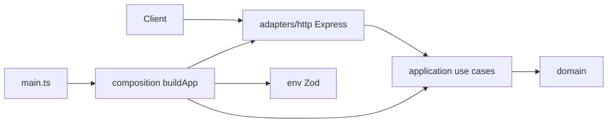

# TypeScript Microservice Skeleton - Plan

## Goal Capsule

**Objective:** Ship a reusable, domain-agnostic TypeScript Node microservice skeleton with slim ports-and-adapters layout, Express HTTP adapter, health + echo exemplar, and an AGENTS.md/README coding harness so humans and coding agents share one "add a feature" path.

**Product authority:** This plan's Product Contract (R1–R14, R7a). No Places/lead-finder product rules apply to this work.

**Open blockers:** None.

**Execution profile:** Greenfield bootstrap on `main`. Treat orphan `node_modules/` and `.env` as contamination — do not inherit them as the stack.

**Stop if:** Scope expands into DB, auth, queues, deploy, Places domain features, `.cursor` rules, or automated cold-start agent eval.

---

## Product Contract

### Summary

A greenfield TypeScript backend microservice starter: ports-and-adapters folders, runnable health and echo routes, Vitest coverage, and a portable agent coding harness in AGENTS.md plus README and a short architecture doc — no Cursor-private rules.

### Problem Frame

Starting a backend (or dropping a coding agent into an empty repo) forces re-deciding layout, boundaries, and "where does new code go?" This skeleton exists so you and agents share one writable, future-proof house style before any product domain lands.

### Actors

- **A1. Human developer** — clones/opens the repo, runs scripts, adds features by following the playbook.
- **A2. Coding agent** — cold session with only repo files; must add a feature correctly from AGENTS.md + README + layout (success bar deferred to a follow-up drill, but the harness must be designed for it).

### Requirements

**Identity / layout**
- **R1.** Skeleton is domain-agnostic reusable TypeScript backend service scaffolding (not Places/lead-finder product code).
- **R2.** Layout is slim ports-and-adapters: `domain/`, `application/`, `adapters/` (HTTP inbound), `composition/` (or equivalent composition root), `main.ts` listen-only entry.
- **R3.** Domain and application layers must not import Express, HTTP types, or other adapter SDKs.
- **R13.** Outbound persistence ports, DB, ORM, and migrations are absent in v1.
- **R14.** Auth, queues/workers/cron, Docker/K8s/deploy pipelines, and runtime LLM client layers are absent in v1.

**Runtime / HTTP**
- **R4.** Service boots with Zod-validated env (fail fast); typed env access only via the env module.
- **R5.** `GET /health` returns a simple always-200 liveness response proving HTTP wiring; it must not call the echo use case (liveness only — no readiness/deps story in v1).
- **R6.** Toy exemplar is **Echo**: `POST /echo` accepts a JSON body with a `message` string, validates input at the HTTP edge, returns the message — pure in-process, **no outbound port**.
- **R7.** Echo path demonstrates the full extension shape agents will copy: domain concepts as needed — application use case — HTTP adapter — composition wiring — tests.
- **R7a.** `buildApp` is the single registration path shared by `main.ts` (listen) and tests (`supertest`); tests must not re-register routes differently.

**Verify / scripts**
- **R8.** Automated tests cover domain/application behavior and HTTP adapter behavior via `supertest` (no real listen required for tests).
- **R9.** Package scripts expose non-interactive verify primitives: at least `typecheck`, `test`, and `dev` (or equivalent start).

**Harness / docs**
- **R10.** Agent coding harness lives in root `AGENTS.md` (protocol) + `README.md` (human entry) with content parity for the "add a feature" path; no load-bearing `.cursor` rules.
- **R11.** Short progressive doc `docs/architecture.md` maps layers and boundaries; AGENTS.md and README link to it.
- **R12.** AGENTS.md includes: exact commands, architecture map / where code goes, Always/Ask/Never boundaries, and a numbered "add a feature" recipe aligned to the echo exemplar.

### Key Flows

- **F1. Boot** — process loads env — builds app with wired use cases — listens; invalid env exits non-zero before listen.
- **F2. Health** — client `GET /health` — 200 healthy payload.
- **F3. Echo** — client `POST /echo` with valid body — use case — 200 echoed message; invalid body — 4xx without calling domain incorrectly.
- **F4. Add a feature (playbook)** — actor follows AGENTS.md recipe to add a parallel in-process feature mirroring echo layering (manual cold-start proof deferred).

### Acceptance Examples

- **AE1.** Fresh install from committed manifests: copy `.env.example` — `.env` (gitignored), then `typecheck` and `test` pass; `dev` serves `GET /health` successfully. Covers R5, R8, R9.
- **AE2.** `POST /echo` with `{ "message": "hi" }` returns the message; missing/invalid body returns 4xx (not 500). Covers R6, R7, R8.
- **AE3.** No source file under `domain/` or `application/` imports `express` or adapter SDKs. Covers R3.
- **AE4.** AGENTS.md names the verify commands and a numbered feature recipe that matches how echo is actually structured. Covers R10–R12.
- **AE5.** Repo has no required `.cursor/rules` for correct feature work. Covers R10.
- **AE6.** Invalid or missing env fails before listen (non-zero exit / failed parse in tests); process does not bind the port. Covers R4, F1.
- **AE7.** Health remains 200 when echo validation fails (independent routes). Covers R5.
- **AE8.** Auth, queues, deploy tooling, and runtime LLM client layers are absent from the shipped skeleton. Covers R14.

### Success Criteria

- Runnable core + architecture layers ship with health and echo exemplar.
- Harness is designed so a cold agent could add a parallel feature from docs + layout; formal sufficiency proof deferred per KTD9.
- Boundaries stay writable: no empty persistence trees, no DI container, no Places domain.

### Scope Boundaries

**In scope:** Node 22+ TypeScript ESM service; Express HTTP adapter; Vitest; Zod env; health; echo; AGENTS.md; README; docs/architecture.md; tests; .env.example; expanded .gitignore.

**Deferred for later:**

- Formal cold-start agent drill / checklist / CI eval (user-directed deferral); optional CLAUDE.md one-liner pointing at AGENTS.md.
- Database / persistence ports when a real store appears.
- Architecture lint automation if drift becomes painful.
- Places/lead-finder product features (separate brainstorm/plan).

**Outside this product's identity:**

- Auth / multi-tenancy, queues/workers/cron, Docker/K8s/deploy.
- Runtime LLM product layer.
- Readiness probes, graceful shutdown orchestration, and a productized uniform error envelope beyond "4xx for bad input; framework defaults OK for unknown routes/500."
- Load-bearing `.cursor` rules or agent-only sidecar trees; workspace rules that cite missing Places docs are non-authoritative for this skeleton.
- Treating orphan `node_modules` / prior branch experiments as architecture.

### Assumptions

- Confirmed scoping call-outs default to: short `docs/architecture.md` alongside AGENTS/README; lock Express as HTTP default.
- Orphan untracked `node_modules/` and `.env` may exist locally; implementer removes or ignores them until a real `package.json` exists.
- No institutional learnings in `docs/solutions/` yet.

### Outstanding Questions

- None blocking.
- **Deferred:** Echo error payload shape (status body fields) — implementer chooses consistently and documents in AGENTS.md. Request field name is `message` per AE2.

---

## Planning Contract

### Product Contract preservation

Product Contract authored in this bootstrap (`product_contract_source: ce-plan-bootstrap`) from session-settled brainstorm decisions; no separate requirements-only file existed.

### Key Technical Decisions

- **KTD1. Slim hexagonal layout** — `src/domain`, `src/application`, `src/adapters/http`, `src/composition`, `src/main.ts`. (session-settled: user-directed — chosen over vertical-slice and playbook-first-only: future-proof boundaries with a copyable toy path)
- **KTD2. Express as HTTP adapter** — Node HTTP via Express; `buildApp` + `supertest` testing. (session-settled: user-directed — chosen over Fastify after initial plan)
- **KTD3. No outbound ports in v1** — echo is in-process; do not invent repository/persistence ports. (session-settled: user-directed — chosen over port-only or real DB starter: no DB until a real need)
- **KTD4. Manual composition / `buildApp(deps)`** — no IoC container; process entry listens only; tests and main share the same `buildApp` registration path (R7a).
- **KTD4a. Validation ownership** — HTTP edge validates echo request shape (schema or Zod at adapter); application/domain may reject business-invalid input; do not put Express types in domain.
- **KTD5. Zod env module + Node `--env-file`** — single parse at boot; ban raw `process.env` outside env module.
- **KTD6. Vitest + supertest tests** — domain/application units; HTTP via supertest.
- **KTD7. Harness home** — AGENTS.md ≤~150–200 lines + README parity + `docs/architecture.md` progressive disclosure; no `.cursor` rules. (session-settled: user-directed — chosen over `.cursor` rules and over runtime LLM harness)
- **KTD7a. Doc authority** — on conflict, code + package scripts win; AGENTS.md must be updated in the same change as layout/command drift; architecture.md must not contradict AGENTS.md.
- **KTD8. Echo exemplar** — `POST /echo` validates and returns message. (session-settled: user-directed — chosen over in-memory note store: simplest full layering demo)
- **KTD9. Cold-start proof deferred** — ship harness designed for cold-start; formal drill/eval is follow-up. (session-settled: user-directed — chosen over manual checklist or automated eval in v1)
- **KTD10. Package identity** — use a domain-agnostic package name (e.g. service skeleton name), not `places-lead-finder`.

### High-Level Technical Design



**Boot sequence:** parse env — construct use cases — `buildApp({ health, echo })` — `listen` in `main.ts` only.

**Test sequence:** `buildApp` with real use cases (no outbound fakes needed for echo) — `supertest` health and echo cases.

### Implementation Constraints

- Node `>=22`, `"type": "module"`, TypeScript strict (include `noUncheckedIndexedAccess` / `verbatimModuleSyntax` or equivalent strict defaults).
- Do not commit secrets; ship `.env.example` with `PORT` / `LOG_LEVEL` only.
- Expand `.gitignore` for `node_modules`, coverage, dist, `.env`.
- Do not recreate Places product docs or workspace rules that invent lead-finder behavior.

### Sequencing

U1 scaffold — U2 composition/env/layout — U3 health — U4 echo — U5 harness docs (harness can draft in parallel after U2 but must finalize after echo exists so the recipe matches code).

### Alternative Approaches Considered

| Approach | Why not |
|----------|---------|
| Vertical-slice folders | Higher day-one writability; weaker shared boundary story for a reusable microservice template |
| Hono default | Better multi-runtime; weaker Node plugin/ops story for this Node-only skeleton |
| In-memory note + port | Good port demo; unnecessary without DB and risks empty-port ceremony |
| Architecture lint in v1 | Useful later; skip until drift hurts (keeps writability) |

### Sources & Research

- Repo research: `main` greenfield; orphan deps are not stack.
- External: Express docs; hexagonal guidance (Cockburn / AWS); agents.md harness practices.
- External research was **load-bearing** for KTD2, KTD4–KTD7.

---

## Output Structure

```
package.json
package-lock.json
tsconfig.json
vitest.config.ts
.env.example
.gitignore
README.md
AGENTS.md
docs/architecture.md
src/main.ts
src/composition/env.ts
src/composition/build-app.ts
src/domain/…          # echo message / errors as needed
src/application/…     # echo use case
src/adapters/http/…   # health + echo routes plugins
tests/…               # Vitest files under tests/ (document in AGENTS.md)
```

---

## Implementation Units

### U1. Project scaffold and toolchain

**Goal:** Commit a real Node/TS package with scripts and ignore rules; stop relying on orphan `node_modules`.

**Requirements:** R1, R9, R14

**Dependencies:** None

**Files:**
- create: `package.json`, `package-lock.json` (after install), `tsconfig.json`, `vitest.config.ts`, `.env.example`
- modify: `.gitignore`, `README.md` (stub replace deferred to U5 if preferred — minimum: note WIP ok)
- test expectation: none — scaffolding only

**Approach:**
1. ESM package, `engines.node >=22`, scripts: `typecheck`, `test`, `dev` using `tsx --env-file=.env`.
2. Dependencies: `express`, `zod`; dev: `typescript`, `tsx`, `vitest`, `@types/node`.
3. Expand gitignore for `node_modules`, `dist`, coverage, `.env`; commit the lockfile generated by install.
4. Document that local orphan installs should be deleted before `npm install`.
5. Document quick-start: copy `.env.example` to `.env` before `npm run dev` (Node `--env-file` fails if the file is missing); `typecheck`/`test` must not require a committed `.env`.

**Execution note:** Prefer install/runtime smoke after U3+; this unit is packaging.

**Test expectation:** none -- pure scaffold

**Verification:** `package.json` scripts exist; `tsc`/`vitest` configs parse; no Places package name.

---

### U2. Composition root, env, and layer folders

**Goal:** Establish hexagonal folders and boot wiring without business routes yet.

**Requirements:** R2, R3, R4, R13

**Dependencies:** U1

**Files:**
- create: `src/composition/env.ts`, `src/composition/build-app.ts`, `src/main.ts`
- create: placeholder folders or barrel-free stubs under `src/domain`, `src/application`, `src/adapters/http`
- create: `tests/composition/env.test.ts` (or equivalent)

**Approach:**
1. Zod schema for `PORT`, `LOG_LEVEL` (and only those unless needed).
2. `buildApp` returns Express app, does not listen; `main.ts` listens.
3. Leave route registration empty or minimal stub until U3.

**Test scenarios:**
- Happy path: valid env object parses to typed config.
- Error path: missing/invalid `PORT` fails parse with clear error.
- Edge: default `PORT`/`LOG_LEVEL` when optional defaults are defined.

**Verification:** Env unit tests pass; `main` can be typechecked; domain/application folders exist and have no framework imports.

---

### U3. Health endpoint

**Goal:** Prove HTTP adapter + composition wiring with `GET /health`.

**Requirements:** R5, R7a, R8, R9

**Dependencies:** U2

**Files:**
- create: `src/adapters/http/health-routes.ts` (name flexible)
- modify: `src/composition/build-app.ts`
- create: `tests/adapters/http/health.test.ts`

**Approach:**
1. Register health plugin/routes inside `buildApp` only (shared with main).
2. Keep health logic trivial and independent of echo (no use-case call).
3. Test exclusively via `supertest`.

**Test scenarios:**
- Happy path: `GET /health` — 200 and agreed payload shape.
- Integration: app built through `buildApp` closes cleanly after inject.
- Independence: after wiring echo (U4), health still succeeds when echo would 4xx (covered jointly with U4 or extended here after U4).

**Verification:** Health test passes; `dev` can serve health locally.

---

### U4. Echo use case (exemplar vertical path)

**Goal:** Ship the copyable exemplar: validate message — use case — HTTP — tests.

**Requirements:** R3, R6, R7, R7a, R8

**Dependencies:** U3

**Files:**
- create: domain types/errors for echo as needed under `src/domain/`
- create: `src/application/echo.ts` (or equivalent use case module)
- create: `src/adapters/http/echo-routes.ts`
- modify: `src/composition/build-app.ts`
- create: `tests/application/echo.test.ts`, `tests/adapters/http/echo.test.ts`

**Approach:**
1. Application use case is pure function/service taking validated input; no Express types.
2. HTTP adapter parses/validates body (Zod at the edge), maps to use case, maps result/errors to status codes.
3. No outbound port interfaces.
4. Keep the path short enough that AGENTS.md can mirror it step-for-step.

**Test scenarios:**
- Happy path (application): echo returns the provided message.
- Edge (application): empty string policy — accept or reject per chosen rule; document it.
- Error (HTTP): missing body / wrong types — 4xx.
- Happy path (HTTP): valid JSON — 200 with echoed message.
- Integration: inject hits real use case wired in `buildApp`.

**Verification:** All echo tests pass; AE2 satisfied; AE3 spot-check imports.

---

### U5. Agent coding harness and docs

**Goal:** Make AGENTS.md + README + architecture doc the portable how-to, aligned to the real echo path.

**Requirements:** R10, R11, R12, R14

**Dependencies:** U4

**Files:**
- create: `AGENTS.md`, `docs/architecture.md`
- modify: `README.md`
- optional: note in AGENTS that `.cursor/rules` are non-authoritative / unused

**Approach:**
1. README: what it is, quick start (`cp .env.example .env`, install, typecheck, test, dev), link to AGENTS.md and architecture doc.
2. AGENTS.md: commands, layer map, Always/Ask/Never, numbered "add a feature" recipe matching U4, link to architecture doc.
3. `docs/architecture.md`: dependency rule, folder meanings, composition root, testing via inject.
4. Keep AGENTS.md curated and short; no `.cursor` rules files.
5. In Always/Ask/Never: default local bind (`127.0.0.1` / documented HOST); do not log request bodies by default; network exposure beyond local use needs a follow-up auth plan (out of v1); ignore Cursor workspace / product-authority rules that cite missing Places docs — this skeleton's AGENTS.md is authoritative.

**Test expectation:** none -- documentation; verify by checklist against AE4/AE5

**Verification:** AE4/AE5 pass by review; every command named in AGENTS.md exists in `package.json`.

---

## Verification Contract

| Gate | Command / check |
|------|-----------------|
| Typecheck | `npm run typecheck` |
| Unit/adapter tests | `npm test` |
| Health smoke | `npm run dev` + `GET /health` (manual) or inject coverage from U3 |
| Boundary | Spot-check: no `express` imports under `src/domain` or `src/application` |
| Harness | AGENTS.md commands match `package.json`; recipe matches echo files |
| Non-goals | Confirm no DB/auth/queue/deploy/.cursor rules shipped as required |

Behavioral skill eval / cold-start agent drill: **out of v1** (KTD9).

---

## Definition of Done

- U1–U5 complete with verifications above.
- AE1–AE8 satisfied (AE4/AE5/AE8 by review).
- Product Contract R1–R14 and R7a addressed or explicitly deferred (cold-start drill deferred per KTD9).
- README is no longer a placeholder stub.
- No Places/lead-finder domain logic in `src/`.

---

## System-Wide Impact

- Replaces empty `main` bootstrap; future Places work should sit *on* this skeleton in a later plan, not fork a second style.
- Cursor workspace rules that still cite missing lead-finder docs are outside this plan; implementers should not invent product behavior from them.

## Risk Analysis & Mitigation

| Risk | Mitigation |
|------|------------|
| Agents inherit orphan leftover installs | U1 delete/reinstall; AGENTS says install only from committed package manifests / lockfile |
| Harness drifts from code | U5 after U4; recipe cites real paths |
| Over-hexagonal empty ports | KTD3 — no outbound ports |
| Split-brain docs | Parity rule R10; architecture is linked not duplicated as conflicting truth |

## Documentation Plan

Delivered in U5: README, AGENTS.md, docs/architecture.md. No separate ops/deploy docs in v1.
