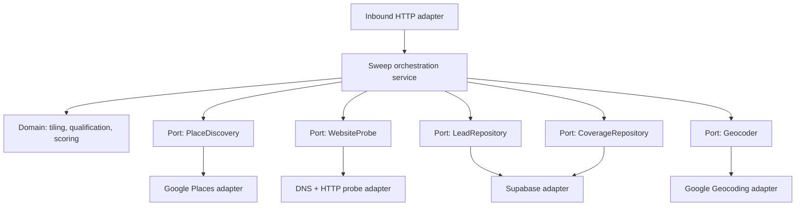
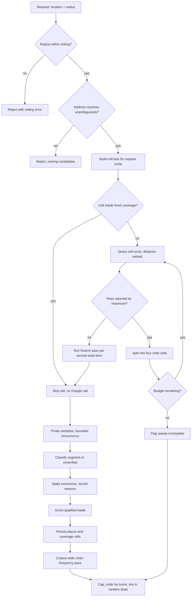

# Websiteless Local Business Lead Finder - Plan

## Goal Capsule

- **Objective:** Ship an HTTP API that takes an address or coordinate pair plus a radius and returns an ordered array of Google place IDs for local businesses that need a website built, persisting each evaluated place and its qualification evidence to Supabase.
- **Product authority:** The Product Contract below. Requirements R1–R25 govern behavior; Key Technical Decisions govern mechanism within those requirements.
- **Execution profile:** Greenfield TypeScript service on Node, hexagonal (ports and adapters). Domain logic stays free of I/O so tiling, qualification, and scoring are testable without network access.
- **Stop conditions:** Stop and ask if a live sweep at the KTD7 radius ceiling exceeds the 45-second wall-clock budget on a realistic Northern Virginia area, if the Places API returns a field shape that contradicts KTD4's field mask, or if the Geocoding API dependency turns out to be unavailable or priced materially differently than assumed.
- **Tail ownership:** This plan ends at a working API with a populated Supabase table. Outreach, pitch, pricing, and any review UI are out of scope.

---

## Product Contract

### Summary

An internal lead-generation service for a one-person web design business. Given a location and radius, it enumerates every local business in that area through the Google Places API, verifies which ones genuinely lack a working website, classifies each into a segment, scores it for likelihood to buy, and returns the qualifying place IDs ordered best-first. Every evaluated place is persisted to Supabase so the operator can work the list in Supabase's table editor and record what happened on each contact.

### Problem Frame

The operator wants to sell websites to local businesses that don't have one, starting in Northern Virginia and selling entirely remotely. Finding those businesses by hand — browsing Google Maps, clicking each listing, checking whether the website field is empty — does not scale past a few dozen and produces no record of what was already checked or contacted.

Three facts from research shape the problem. There is no server-side filter for "has no website" on any Places endpoint, so qualification is always something the caller computes locally. Nearby Search returns at most 20 results with no pagination, so a radius query returns a truncated sample rather than an enumeration. And a business whose Google listing shows an Instagram URL, a dead domain, or a parked page is functionally websiteless while looking qualified to a naive filter — so the listing field alone cannot decide qualification.

Survey evidence also reframes who is worth contacting. Among US small businesses without a website, 43% say they will never get one, rising to 56% for sole proprietors, and only 7% cite cost as the barrier. The binding constraint is the owner's belief that their business doesn't need a website, not their budget. That makes ranking — not finding — the hard problem, and it makes the operator's own contact outcomes the only trustworthy source of ranking signal.

### Requirements

**Discovery and enumeration**

- R1. The endpoint accepts either a free-text address or a latitude/longitude pair, plus a search radius in meters.
- R2. A free-text address is resolved to coordinates before any sweep begins. An unresolvable address and an ambiguous one are both rejected as client errors, and the ambiguous case names the candidate addresses so the caller can retry with coordinates.
- R3. The sweep enumerates the business-like places in the requested area rather than returning a ranked sample of them.
- R4. Discovery covers service-area businesses — plumbers, electricians, mobile groomers, cleaning services — which are absent from the primary discovery endpoint.
- R5. A requested radius above the configured ceiling is rejected with an error naming the ceiling, never silently truncated.
- R6. A sweep stops early when it exhausts its configured request budget or wall-clock budget, returning what it found with an incompleteness warning rather than running unbounded.

**Qualification**

- R7. A place qualifies as needing a website when it matches one of four segments: no website listed, a social or link-aggregator URL in place of a website, a listed domain that is dead or parked, or a working site that fails a basic quality check.
- R8. Each qualifying place carries exactly one segment label, assigned by first match in the R7 order.
- R9. A social or link-aggregator URL in the website field is treated as having no website, not as having one.
- R10. Every listed website URL is checked live before the place is classified; the listing field alone never decides qualification.
- R11. A place whose website check fails for transport reasons — DNS timeout, TLS error, connection reset, fetch timeout — is recorded as unverified rather than assigned a segment, and is excluded from returned leads.
- R12. Chains and franchises are excluded from the lead set.
- R13. Permanently closed businesses are excluded from the lead set.
- R14. Places whose website is supplied centrally by a parent organization are excluded; Catholic parishes are the known instance.
- R15. Places that are not businesses or organizations — transit stops, parking, ATMs, geographic features — are excluded from the lead set.
- R16. A place excluded by R12 through R15 is still persisted, carrying its exclusion reason, so later sweeps do not re-evaluate it.

**Scoring and response**

- R17. Every qualified lead carries a score from 0 to 100 estimating its likelihood to buy.
- R18. The endpoint returns a configured maximum number of leads per call.
- R19. Roughly 15% of the returned leads are drawn at random from qualified leads that the score alone would not have selected.
- R20. Leads that earned their place by score are ordered highest first; each returned lead records whether it arrived by rank or by random draw.
- R21. Each lead records which factors contributed to its score and by how much.
- R22. Social-only presence contributes zero to the score.

**Persistence and reuse**

- R23. Every place the sweep evaluates is persisted to Supabase keyed on its Google place ID, with its address, phone number, business type, email where one was found, website status, segment, score, and coordinates where the API supplies them.
- R24. A sweep reuses persisted results instead of re-querying Google for ground already covered within the discovery-freshness window, and re-runs the website check without any Google call for leads outside the verification-freshness window.
- R25. Each lead carries operator-editable outcome fields — contact status, contact date, and free-text notes — that the sweep never overwrites, plus a snapshot of the score and scoring inputs as they stood when the operator first recorded contact.

### Key Flows

- F1. Sweep a new area
  - **Trigger:** Operator calls the endpoint with an address or coordinates and a radius.
  - **Steps:** Input validated against the radius ceiling; address resolved to coordinates; the request circle is tiled into cells; cells already covered and fresh are skipped; remaining cells are queried through both discovery passes; each discovered place is verified and classified; excluded places are recorded with a reason; qualified leads are scored; everything is persisted; the capped, ordered array of place IDs is returned with the random draw mixed in.
  - **Outcome:** An ordered array of place IDs, and a Supabase table the operator can open and work.
  - **Covered by:** R1–R23

- F2. Re-sweep covered ground
  - **Trigger:** Operator calls the endpoint for an area overlapping a previous sweep.
  - **Steps:** Cells whose query circle falls entirely inside fresh covered ground are skipped without a Google call; partially covered cells are queried normally; persisted leads whose verification is outside the verification-freshness window have their website check re-run from stored place data, with no Google call.
  - **Outcome:** A response assembled mostly or entirely from stored data, at little or no Google cost.
  - **Covered by:** R24

- F3. Work the list
  - **Trigger:** Operator opens the leads table in Supabase's table editor.
  - **Steps:** Operator sorts by score, contacts a lead, and edits its outcome fields inline. The first edit that sets contact status snapshots the lead's score and scoring inputs.
  - **Outcome:** Contact outcomes accumulate against the feature values that were true at contact time, so the score can later be refit against real results.
  - **Covered by:** R21, R25

### Acceptance Examples

- AE1. **Covers R9.** Given a place whose Google listing has `websiteUri` set to `https://instagram.com/joesdiner`, when it is classified, then it is qualified with segment `social_only` — not skipped as having a website.
- AE2. **Covers R10, R7.** Given a place whose listing has `websiteUri` set to a domain whose nameservers belong to a known parking provider, when it is classified, then it is qualified with segment `parked_or_dead`.
- AE3. **Covers R8.** Given a place with no `websiteUri` at all, when it is classified, then it is qualified with segment `no_website` and carries no other segment.
- AE4. **Covers R5.** Given a request with a radius above the configured ceiling, when the endpoint handles it, then it returns a client error naming the ceiling and performs zero Google requests.
- AE5. **Covers R3.** Given a cell whose discovery response returns exactly the per-request maximum, when the tiling engine processes it, then it subdivides that cell and queries the children rather than accepting the truncated result.
- AE6. **Covers R24.** Given a second request whose cells all fall inside previously covered ground within the discovery-freshness window, when the endpoint handles it, then it performs zero Places API requests and answers from Supabase.
- AE7. **Covers R25.** Given a lead whose outcome fields the operator has edited, when a later sweep re-evaluates that place, then the outcome fields and the contact-time snapshot retain their values.
- AE8. **Covers R18, R19.** Given 300 qualified leads in an area and a response cap of 50, when the endpoint returns them, then 50 IDs come back, roughly 43 by score rank and roughly 7 by random draw from the leads rank alone would have excluded.
- AE9. **Covers R11.** Given a place whose listed domain times out at the DNS layer, when it is classified, then it is recorded as unverified and does not appear in the returned leads.
- AE10. **Covers R6.** Given a sweep that exhausts its request budget mid-tree, when it completes, then it returns the leads found so far and flags the sweep as incomplete.

### Key Decisions

- KD1. **Google Places API is the sole data source.** (session-settled: user-directed — chosen over Overture Maps bulk Parquet: the operator wants Google's data quality and accepted the tiling work and terms exposure that come with it.) Governs R3, R4, R23.
- KD2. **Full business records are persisted, and the Google Maps Platform terms risk is accepted.** (session-settled: user-directed — chosen over a place-IDs-only architecture with live hydration: the operator explicitly closed this question.) Google's terms permit storing place IDs indefinitely and little else; the realistic enforcement consequence is API key termination rather than litigation. Recorded here as a consciously accepted risk, not an open question. Governs R23.
- KD3. **Supabase's built-in table editor is the review surface for v1.** (session-settled: user-directed — chosen over a purpose-built review UI: the operator wants to start selling before building an interface.) Outcome capture rides on editable columns instead. Governs R25.
- KD4. **Four qualification segments, including working-but-poor sites.** (session-settled: user-approved — chosen over the three no-site segments alone: the one operator who published reply rates for both got 1–2% on no-website businesses and 6–9% on outdated ones, and the check rides an HTTP fetch the pipeline already performs.) Governs R7, R8.
- KD5. **Social-only presence scores zero rather than positive.** (session-settled: user-approved — chosen over the practitioner convention of scoring it up: 35% of websiteless businesses name social and marketplace traffic as the specific reason they will not launch a site, so an active social presence is a satisfied substitute rather than unmet need. Evidence is directional and the sign is contested, which is why it is zero rather than negative.) Governs R22.
- KD6. **A randomized draw is mixed into every response.** (session-settled: user-approved — chosen over pure score ordering: with no conversion history the weights are hypotheses, and contacting only high-scoring leads would produce outcome data that can only confirm them.) The draw is only meaningful because R18 caps the response; an uncapped response would return every qualified lead and contain no holdout at all. Governs R18, R19, R20.

### Scope Boundaries

**Deferred for later**

- A purpose-built review UI with a lead queue and per-lead status controls.
- Paid email-enrichment services. Email is extracted opportunistically from pages already fetched and left blank otherwise.
- Refitting the score against accumulated outcomes. This plan captures the data that makes refitting possible; it does not perform the fit.
- Ingesting state new-business-registration feeds as a second lead source. Virginia publishes no free bulk feed.
- Business age and review-recency signals. Both need per-review timestamps, which are Atmosphere-tier and excluded by KTD4.
- Scheduled or automatic re-sweeps. Sweeps are operator-triggered.

**Outside this product's identity**

- Anything on the selling side: pitch, pricing, proposals, delivery, or the websites themselves.
- Automated outreach of any kind. Cold email to US businesses is legal under CAN-SPAM's opt-out regime, but autodialing the mobile numbers that dominate this target segment carries TCPA exposure, and this service must never grow a dialer.
- Multi-user access, authentication, and tenancy. Single operator.

### Success Criteria

- A sweep at the KTD7 radius ceiling over a Northern Virginia suburb returns qualified leads within the 45-second wall-clock budget.
- Manual inspection of 20 returned leads labeled `no_website`, `social_only`, or `parked_or_dead` finds no more than one that actually has a working website. Leads labeled `poor_website` are expected to have working sites and are excluded from this check.
- A repeat sweep of the same area performs zero Places API requests.
- The operator can sort the leads table by score, contact a lead, and record the outcome without leaving the table editor.

### Dependencies and Assumptions

- Google Maps Platform project with Places API (New) enabled and billing configured. Nearby Search Enterprise and Text Search Enterprise are separate SKUs with separate 1,000-request monthly free allowances. Because KTD2 re-queries subdivided cells and KTD5 issues several Text Search requests per cell, effective yield is roughly six to seven unique businesses per request rather than twenty — so the free allowance covers a few thousand businesses, not twenty thousand. Set a Google Cloud billing alert before the first live sweep.
- Google Geocoding API for R2's address resolution, on the same project. Separate SKU, immaterial at this volume.
- Supabase project with PostGIS enabled for the coverage geometry in R24.
- **Assumption:** Google omits `websiteUri` from the response rather than returning an empty string when a place has no website. The API reference documents it as an optional string without stating absence behavior. Verify empirically in U4 before relying on it; handle both absent and empty.
- **Assumption:** all score weights are hypotheses. Only the exclusion rules (R12–R15) and the direction of the review-count signal are evidence-grounded. Every numeric weight is a judgment call awaiting outcome data.
- **Assumption:** Google place IDs are stable enough to serve as a primary key. They can change, which would split one business's outcome history across two rows. Accepted for v1.

### Sources

- Places API field tiers and the absence of a website filter: [Nearby Search](https://developers.google.com/maps/documentation/places/web-service/nearby-search), [Place Data Fields](https://developers.google.com/maps/documentation/places/web-service/data-fields)
- Result caps, pagination, radius limits, and the circle-only location restriction: [searchNearby reference](https://developers.google.com/maps/documentation/places/web-service/reference/rest/v1/places/searchNearby)
- Text Search paging and the service-area parameter: [Text Search](https://developers.google.com/maps/documentation/places/web-service/text-search)
- Field-mask billing and SKU tiers: [SKU details](https://developers.google.com/maps/billing-and-pricing/sku-details), [pricing](https://developers.google.com/maps/billing-and-pricing/pricing)
- Place type tables and request-filter restrictions: [Place Types](https://developers.google.com/maps/documentation/places/web-service/place-types)
- Data storage and caching terms: [Maps Platform ToS](https://cloud.google.com/maps-platform/terms), [Places policies](https://developers.google.com/maps/documentation/places/web-service/policies)
- Parked-domain nameserver detection and HTTP-200 stub behavior: [stub detection](https://pingzen.dev/docs/stub-detection), [parking scanner nameserver list](https://github.com/einiba/canyougrab-api/blob/main/cmd/parking-scanner/main.go)
- Why websiteless businesses don't buy, and the 43%-never figure: [WordStream SMB website trends, March 2026](https://www.wordstream.com/blog/smb-website-trends-report-2026), [Clutch, August 2025](https://clutch.co/resources/state-of-small-business-websites-2025)
- Franchise agreements forbidding independent websites: [Tikiz FDD 2023](https://www.restfinance.com/app/pdf/fdd/Tikiz-2023.pdf)
- Centrally supplied parish websites and congregation website rates: [Churches List census, July 2026](https://churcheslist.com/stories/american-churches-without-websites)
- Reply rates for no-website versus outdated-website targeting: [Jay van Zyl](https://jayvanzyl.me/i-made-over-200k-redesigning-outdated-business-websites/)

---

## Planning Contract

### Key Technical Decisions

- KTD1. **Hexagonal ports-and-adapters, as a single deployable service.** (session-settled: user-directed — chosen over a layered or framework-first structure: the operator specified it.) The domain — tiling geometry, qualification rules, segment classification, scoring — depends on nothing external. Everything that touches the network or a database is an adapter behind a port the application layer owns. This is load-bearing rather than stylistic here: it is what lets the tiling and scoring logic be tested exhaustively without a Google key, which matters because those are the two places correctness is hardest to eyeball. Every decision that classifies or scores lives in the domain; adapters gather evidence and never decide.

- KTD2. **Adaptive quadtree over circumscribed query circles, with per-pass saturation detection.** Nearby Search accepts only a circle, never a rectangle, so each square cell is queried with the circle centered on the cell whose radius is half the cell diagonal. That circle covers the whole cell and overlaps its neighbours by roughly 57% extra area; the overlap is expected and resolved by place-ID dedupe. The inscribed alternative is rejected: it leaves four unqueried corners per cell at every recursion level, which under-enumerates silently while every test still passes. Saturation is evaluated **per discovery pass**, comparing each individual response's count against that endpoint's per-request maximum — never the merged Nearby-plus-Text count, which would both subdivide complete cells and accept truncated ones. Recursion stops at a 250-meter minimum cell size; a cell still saturated there is flagged on the sweep record as possibly incomplete.

- KTD3. **Rank by distance, never by popularity.** The discovery endpoint defaults to popularity ranking, which surfaces prominent businesses first. The target segment is systematically less prominent — fewer reviews, thinner profiles — so the default ranking preferentially returns exactly the businesses that do not qualify. Distance ranking combined with KTD2's subdivision is what makes truncation detectable and recoverable.

- KTD4. **One Enterprise-tier field mask for all discovery requests, with no Atmosphere fields.** Field-mask billing charges the highest tier any requested field belongs to. The website field is Enterprise tier, so requesting it sets the price floor; phone number, business status, rating, review count, and the service-area flag are also Enterprise and therefore free to add. `places.reviews` is Atmosphere-tier and stays out, which means per-review timestamps are unavailable — so review recency and business age cannot be scoring signals (see Scope Boundaries) and `userRatingCount` is the only revenue proxy the plan has.

- KTD5. **Two-pass discovery, with an explicit service-area query set.** The primary pass uses Nearby Search over the quadtree. Text Search requires a `textQuery`, so the second pass issues one request per configured service-area term per cell — plumber, electrician, HVAC, cleaning service, landscaper, mobile groomer, handyman, pest control — with the service-area-business parameter enabled, because Nearby Search has no such parameter and would systematically miss trades. Unlike Nearby Search, Text Search pages: the adapter follows `nextPageToken` to a configured page cap and counts the union across pages. This multiplies requests per cell by the term count, which the R6 budget bounds. Results merge on place ID. Satisfies R4.

- KTD6. **Cheapest-first verification ladder with short-circuit and an explicit unverified state.** For each place: no listed URL short-circuits to `no_website`; a URL matching the aggregator denylist short-circuits to `social_only`; otherwise resolve DNS, and a confirmed missing address record or a parking-provider nameserver short-circuits to `parked_or_dead`; otherwise fetch the page, and a non-success status, a placeholder fingerprint, or a body below the size floor gives `parked_or_dead`; otherwise the quality signals decide between `poor_website` and not-a-lead. Nameserver matching precedes content inspection because parking pages are commonly served with a success status. Any transport-level failure — DNS timeout or SERVFAIL, TLS error, connection reset, fetch timeout — terminates at `unverified` with an error reason rather than falling through to `parked_or_dead`; treating an unanswered lookup as a dead domain would put working businesses at the top of the call list. Satisfies R7, R8, R10, R11.

- KTD7. **Synchronous response, bounded on three axes.** The endpoint answers in-request rather than returning a job handle. Three ceilings bound it: a 5,000-meter radius, a 2,000-request-per-sweep budget, and a 45-second wall-clock budget calibrated against a 60-second platform request timeout. Discovery is level-serialized because each subdivision needs its parent's response, and verification then adds a DNS lookup plus an HTTP fetch per candidate, so the wall-clock budget rather than the request rate is the binding constraint. Hitting either budget stops the sweep and returns partial results with KTD2's incompleteness flag, per R6. The response itself is capped at 50 leads. Larger territories are covered by issuing several adjacent requests, which KTD9's coverage skip makes cheap. Satisfies R5, R6, R18.

- KTD8. **Additive weighted score, with weights in a named table separate from the scoring logic.** Every weight is a hypothesis, so they live in one typed module that the scorer reads rather than being inlined in the scoring functions — substituting a different weight table changes every score without editing the scoring code. Each lead persists the factor breakdown that produced its score. Exclusions are evaluated before scoring and remove a place from the lead set rather than scoring it to zero, so an excluded place never competes for a response slot. Satisfies R17, R21.

- KTD9. **Coverage as a per-cell skip, in a projected CRS, with two freshness windows.** The quadtree is the only geometry producer: the cell tree is built for the full request circle, and a cell whose query circle falls entirely inside the fresh covered union is skipped without a Google call while partially covered cells are queried normally. Subtracting covered polygons to produce a remainder is rejected — the remainder is an arbitrary multi-part polygon that neither the tiling engine nor the circle-only API can query. All coverage geometry is stored as `geometry` in EPSG:32618 (UTM zone 18N, covering Northern Virginia) so buffer, union, and containment run in meters; raw EPSG:4326 degrees would distort every circle into an ellipse and leave slivers. Two windows, not one: a 90-day **discovery-freshness** window governs whether cells are re-queried through Google, and a 14-day **verification-freshness** window governs whether a persisted lead's website ladder re-runs from stored place data with no Google call. Satisfies R24.

- KTD10. **Chain detection by brand identifier plus normalized-name frequency across all persisted records.** A place carrying a recognized brand identifier is a chain. Separately, any normalized business name appearing at three or more distinct locations across the entire persisted corpus — not just the current sweep — is a chain and is excluded. Scoping to one sweep would miss chains spread across adjacent sweeps. Because the threshold can be crossed by a later sweep, retroactive exclusion sets the exclusion reason and hides the row from the qualified-leads read without deleting it or touching operator columns, so R25 data survives. Frequency detection needs the corpus, so it runs as a post-persistence pass. Satisfies R12, R16.

- KTD11. **Discovery omits type filters and excludes junk types instead.** The generic "establishment" and "point of interest" types are response-only and rejected as request filters, and enumerating the roughly 400 business types in batches would multiply requests per cell eightfold. Omitting the include-types filter returns everything, so the request carries an exclude-types list for the highest-volume non-business types, with remaining non-business results filtered in the domain layer. Request-side and domain-side lists read from one config module so they cannot drift. Satisfies R15.

- KTD12. **Parent-organization exclusion is a name-and-host heuristic, not an API fact.** The Places API exposes no denomination or parent-organization field — a Catholic parish and a Baptist congregation both return `church` and `place_of_worship`. R14 is therefore implemented as a config-driven display-name pattern list plus a list of known diocesan website hosts, living alongside the aggregator denylist. It will miss cases and occasionally over-match; treating it as data rather than logic is what makes it correctable. Satisfies R14.

### High-Level Technical Design

Component topology. The domain core has no outward dependencies; every arrow into infrastructure passes through a port the application layer defines.



Sweep flow, showing where truncation is detected, where cost is avoided, and where the budgets cut in.



### Output Structure

```text
src/
  domain/
    model/                 place, lead, segment, score-breakdown types
    tiling/                quadtree geometry, circumscribed circles, saturation
    qualification/         segment classification, quality thresholds, exclusions
    scoring/               additive weight application
  application/
    ports/                 PlaceDiscovery, WebsiteProbe, LeadRepository,
                           CoverageRepository, Geocoder interfaces
    sweep-service.ts       orchestration
    result-selection.ts    cap, ordering, random draw
  adapters/
    inbound/http/          route, request validation, error mapping
    outbound/google/       Places discovery, Geocoding
    outbound/probe/        DNS, HTTP fetch, fingerprinting, email extraction
    outbound/supabase/     lead and coverage repositories
  config/                  weights, denylists, service-area terms, budgets
  main.ts
supabase/
  migrations/
tests/
```

The per-unit file lists below are authoritative; this tree shows the intended shape.

### Sequencing

Domain units depend only on U1's model types and ports, and can land in any order once U1 is in place. Adapters depend on U1 but not on each other. Orchestration depends on everything.

---

## Implementation Units

### U1. Project scaffold and hexagonal skeleton

- **Goal:** A running TypeScript service with the domain, application, and adapter boundaries established, ports declared as interfaces, and configuration loading in place.
- **Requirements:** Enables all; implements none directly.
- **Dependencies:** none
- **Files:** `package.json`, `tsconfig.json`, `src/main.ts`, `src/application/ports/place-discovery.ts`, `src/application/ports/website-probe.ts`, `src/application/ports/lead-repository.ts`, `src/application/ports/coverage-repository.ts`, `src/application/ports/geocoder.ts`, `src/domain/model/place.ts`, `src/domain/model/lead.ts`, `src/domain/model/segment.ts`, `src/domain/model/score-breakdown.ts`, `src/config/index.ts`, `.env.example`
- **Approach:** Declare the five driven ports as interfaces owned by the application layer per KTD1. Define the domain model types the ports exchange, including the segment enum whose canonical values are `no_website`, `social_only`, `parked_or_dead`, `poor_website`, and `unverified`. Wire dependency injection in `main.ts` by constructing adapters and passing them into the service — no container framework. Configuration reads from environment with a typed schema and fails fast on a missing Google key or Supabase URL.
- **Test scenarios:**
  - Config loading throws a named error when the Google API key is absent.
  - Config loading throws a named error when the Supabase URL is absent.
  - Config loading returns a fully typed object when all required variables are present.
  - A lint or dependency-direction check fails if a file under `src/domain/` imports from `src/adapters/`.
  - The same check fails if a file under `src/adapters/inbound/` imports from `src/adapters/outbound/`.
- **Verification:** The service starts, logs its resolved configuration with secrets redacted, and the dependency-direction check passes.

### U2. Supabase schema and migrations

- **Goal:** Tables for leads and swept coverage, with PostGIS enabled in a metric CRS and operator-editable outcome columns that sweeps never touch.
- **Requirements:** R16, R23, R25, and the storage side of R24
- **Dependencies:** none
- **Files:** `supabase/migrations/0001_enable_postgis.sql`, `supabase/migrations/0002_leads.sql`, `supabase/migrations/0003_swept_cells.sql`, `tests/migrations.test.ts`
- **Approach:** The leads table is keyed on the Google place ID as primary key, which is what makes repeat sweeps idempotent per R23. Columns fall into four groups. Google-sourced: name, formatted address, phone, primary type, business status, a `pure_service_area` boolean, and a **nullable** PostGIS point — nullable because Google returns no location for pure service-area businesses, which are exactly the trades R4 targets. Derived: segment (nullable, null meaning excluded or unverified), exclusion reason, website status, email, score, score breakdown as JSON, selection source (rank or draw), verified-at timestamp. Operator: contact status, contacted-at, notes. Contact-time snapshot: score and scoring inputs as they stood at first contact, written once when contact status first leaves null and never again — without this, a re-sweep rewrites the derived columns and the outcome data becomes unattributable, which would forfeit the entire purpose of KD6's random draw. The swept-cells table holds a cell geometry, a swept-at timestamp, an incomplete flag, and the request parameters. Store all geometry as `geometry` in EPSG:32618 so union and containment run in meters; transform to EPSG:4326 only at the API boundary. Add spatial indexes and a descending index on score. **The operator's surface is the base leads table with a saved sort and filter, not a view** — Supabase's table editor cannot edit rows through a view, so a view would make F3's inline editing impossible. Add a qualified-leads view for U8's API reads only.
- **Test scenarios:**
  - Applying all migrations to a clean database succeeds.
  - Inserting a lead with a duplicate place ID conflicts rather than creating a second row.
  - An upsert that writes Google-sourced and derived columns leaves operator columns and the contact-time snapshot unchanged.
  - A lead with a null coordinate inserts successfully.
  - A known-area circle stored and read back in EPSG:32618 round-trips within tolerance.
  - A spatial containment query correctly reports a cell fully inside a covered union.
  - The qualified-leads view excludes rows whose segment is null.
  - The swept-cells table round-trips the incomplete flag.
- **Verification:** Migrations apply cleanly, and a row in the base leads table is editable inline in the Supabase table editor.

### U3. Tiling engine

- **Goal:** Pure geometry that builds a cell tree over a request circle, yields the query circle for each cell, skips cells inside an exclusion geometry, and decides from a result count whether to subdivide.
- **Requirements:** R3, R6
- **Dependencies:** U1
- **Files:** `src/domain/tiling/quadtree.ts`, `src/domain/tiling/geometry.ts`, `tests/domain/tiling.test.ts`
- **Approach:** Implement KTD2. The engine takes a center, a radius, an optional exclusion geometry, and a request budget. It yields, per cell, the circumscribed query circle (center of cell, radius half the cell diagonal) and accepts back a per-pass result count, subdividing when a count equals that pass's per-request maximum and stopping at the 250-meter minimum. Cells whose query circle lies entirely inside the exclusion geometry are skipped without being yielded — putting the skip here rather than in the orchestrator keeps geometry in the domain per KTD1. Keep this entirely free of I/O so the whole subdivision behavior is testable with synthetic counts. Cells still saturated at minimum size, and exhaustion of the request budget, are both surfaced to the caller as incompleteness signals.
- **Execution note:** Write this test-first. Subdivision correctness is the single hardest thing to eyeball in the whole service, and it silently under-enumerates when wrong.
- **Test scenarios:**
  - Covers AE5. A cell reporting exactly the maximum result count produces four child cells.
  - A cell reporting fewer than the maximum produces no children.
  - The union of a cell's four child query circles fully covers the parent cell.
  - A cell's query circle fully contains the cell's square.
  - Child cells tile their parent square without gaps.
  - A cell whose query circle lies entirely inside the exclusion geometry is not yielded.
  - A cell partially overlapping the exclusion geometry is yielded normally.
  - Subdivision halts at the 250-meter minimum cell size even when the cell is still saturated.
  - A cell still saturated at minimum size is reported as an incompleteness signal.
  - Covers AE10. Exhausting the request budget stops iteration and reports incompleteness.
  - A radius smaller than the minimum cell size yields exactly one cell.
- **Verification:** A synthetic density map with a known business count is fully enumerated by the subdivision sequence, with no place missed and no cell queried twice.

### U4. Google Places discovery adapter

- **Goal:** An adapter implementing the discovery port over Nearby Search and Text Search, with the correct field mask, ranking, paging, and retry behavior.
- **Requirements:** R3, R4, R15
- **Dependencies:** U1
- **Files:** `src/adapters/outbound/google/places-discovery.ts`, `src/adapters/outbound/google/field-mask.ts`, `src/adapters/outbound/google/types.ts`, `src/config/exclude-types.ts`, `src/config/service-area-terms.ts`, `tests/adapters/places-discovery.test.ts`
- **Approach:** Implement KTD4's single field mask as a named constant with a comment recording that Atmosphere fields are excluded and why. Set distance ranking per KTD3 and the exclude-types list per KTD11, reading from the shared config module U5 also reads. Implement the Text Search service-area pass per KTD5: one request per configured term per cell, following `nextPageToken` to a page cap, returning both the merged place set and each pass's individual result count so the tiling engine can evaluate saturation per pass. Add exponential backoff on rate-limit responses, and avoid issuing bursts aligned to clock boundaries. Before trusting the website field, verify empirically against a known websiteless business whether the field is omitted or returned empty, and handle both — this resolves the open assumption in Dependencies.
- **Test scenarios:**
  - The composed field mask contains the website, phone, business status, rating, review-count, and service-area fields.
  - The composed field mask contains no Atmosphere-tier field.
  - Requests set distance ranking rather than the popularity default.
  - A rate-limit response triggers backoff and a retry rather than propagating immediately.
  - A two-page Text Search response yields the union of both pages exactly once.
  - Per-pass result counts are returned separately, not merged into one count.
  - A place returned by both the Nearby and Text Search passes appears once in the merged place set.
  - A response omitting the website field and a response with an empty-string website field both map to the same absent-website state.
  - A service-area business with no location field maps to a place with null coordinates rather than throwing.
  - A malformed response body surfaces a typed adapter error rather than throwing a parse exception.
- **Verification:** A live call against a known Northern Virginia coordinate returns places with populated phone and website fields, and a manual check confirms which shape the API uses for a websiteless business.

### U5. Qualification, quality thresholds, and exclusions

- **Goal:** Pure logic that turns a place plus its probe evidence into a segment, an unverified marker, or an exclusion with a reason.
- **Requirements:** R7, R8, R9, R11, R12, R13, R14, R15
- **Dependencies:** U1
- **Files:** `src/domain/qualification/segment.ts`, `src/domain/qualification/quality.ts`, `src/domain/qualification/exclusions.ts`, `src/config/denylists.ts`, `tests/domain/qualification.test.ts`
- **Approach:** Implement KTD6's ladder ordering as pure functions over already-gathered probe evidence — this unit performs no I/O, it only decides. The `poor_website` threshold comparison lives here rather than in the probe adapter, so all four segment rules sit inside the domain and inside the full-branch-coverage gate. Transport failures terminate at `unverified` per R11. Exclusions run first and remove a place from the lead set, but the place is still persisted with its reason per R16. The aggregator denylist, the non-business type list, and KTD12's parent-organization name and host patterns all live in config so they can be extended without a deploy; they are open-ended and will drift, so treat them as data. Chain detection here handles only the brand-identifier half of KTD10; the corpus-frequency half needs persisted data and lands in U9.
- **Test scenarios:**
  - Covers AE3. A place with no website URL classifies as `no_website`.
  - Covers AE1. A place whose website URL is an Instagram profile classifies as `social_only`.
  - A place whose website URL is a link-aggregator domain classifies as `social_only`.
  - Covers AE2. A place whose evidence reports parking-provider nameservers classifies as `parked_or_dead`.
  - A place whose page has no mobile viewport declaration classifies as `poor_website`.
  - A place whose page responded above the latency threshold classifies as `poor_website`.
  - A place with a live, fast, mobile-ready site is not qualified at all.
  - Covers AE9. A place whose evidence reports a DNS timeout classifies as `unverified`, not `parked_or_dead`.
  - A place whose evidence reports a TLS error classifies as `unverified`.
  - A place matching two segment conditions receives only the first by ladder order.
  - A place carrying a brand identifier is excluded with reason `chain` before any segment is assigned.
  - A permanently closed place is excluded with reason `closed`.
  - A place whose type is a transit stop is excluded with reason `non_business`.
  - A place whose name matches a diocesan pattern is excluded with reason `parent_supplied`; a Baptist congregation is not.
- **Verification:** A fixture set covering all four segments, the unverified state, and every exclusion reason classifies exactly as expected, with no place receiving more than one segment.

### U6. Website probe adapter

- **Goal:** An adapter that gathers DNS and HTTP evidence for the qualification ladder and extracts an email while the page is in hand. It reports signals; it does not classify.
- **Requirements:** R10, R11, and the email portion of R23
- **Dependencies:** U1
- **Files:** `src/adapters/outbound/probe/dns.ts`, `src/adapters/outbound/probe/http-probe.ts`, `src/adapters/outbound/probe/fingerprints.ts`, `src/adapters/outbound/probe/email-extract.ts`, `src/config/parking-nameservers.ts`, `tests/adapters/probe.test.ts`
- **Approach:** Resolve address records and authoritative nameservers, matching the latter against the parking-provider list in config while distinguishing parking providers from general DNS and site-builder hosts that front real sites. Fetch with a short timeout and a redirect cap, then match the body against placeholder fingerprints and a minimum size floor. Emit raw quality signals — mobile viewport present or absent, measured response time in milliseconds — and let U5 apply the thresholds, so the decision stays in the domain per KTD1. Distinguish a confirmed negative (NXDOMAIN, definite non-success status) from a transport failure (timeout, SERVFAIL, TLS error, reset) in the evidence, because U5 routes them to opposite outcomes. Extract the first plausible contact email while the page is already parsed. Run with bounded concurrency so a sweep does not open thousands of sockets. Every step short-circuits, so a place with no URL costs nothing.
- **Test scenarios:**
  - A domain returning NXDOMAIN reports as a confirmed missing record.
  - A domain whose lookup times out reports as a transport failure, distinctly from NXDOMAIN.
  - A domain whose nameservers match a parking provider reports as parked without an HTTP fetch being attempted.
  - A domain on a general DNS host with a live site does not report as parked.
  - A page returning success but matching a placeholder fingerprint reports as a stub.
  - A page returning success with a body under the size floor reports as a stub.
  - A page with no mobile viewport declaration reports viewport-absent, without deciding a segment.
  - Measured response time is reported as a number, without a pass/fail judgment.
  - A TLS handshake failure reports as a transport failure.
  - A page containing a contact address in a mail link yields that email; a page with none yields no email rather than a false positive.
  - A request that exceeds the timeout resolves to a transport-failure result rather than hanging the sweep.
  - Concurrency stays at or below the configured limit under a large batch.
- **Verification:** Running the probe against a fixture set of recorded responses — a live site, a parked domain, a suspended-account stub, an unresolvable domain, and a timing-out host — produces the expected evidence for each.

### U7. Lead scoring

- **Goal:** Pure scoring that turns a qualified lead's features into a 0–100 score plus a breakdown of what contributed.
- **Requirements:** R17, R21, R22
- **Dependencies:** U1
- **Files:** `src/domain/scoring/score.ts`, `src/config/score-weights.ts`, `tests/domain/scoring.test.ts`
- **Approach:** Implement KTD8. Weights live in one typed table module the scorer reads, each entry carrying a comment recording whether it is evidence-grounded or a judgment call. Signals available under KTD4's field mask: review count as the only revenue proxy, rating, a positive weight for a registered domain that resolves nowhere (evidence the owner already spent money and stalled), a penalty for very low review counts, and a penalty for a low rating. Review recency and business age are **not** available — both need per-review timestamps from the Atmosphere-tier `reviews` field that KTD4 excludes. Aggregator presence carries **no** positive weight; `social_only` is represented as an explicit zero-weighted entry per KD5 and R22, so the deliberate choice survives future editing. Every applied weight is recorded in the breakdown so R21 holds.
- **Test scenarios:**
  - A lead with a high review count scores above an otherwise identical lead with a low one.
  - A lead with fewer than the minimum review count receives the configured penalty.
  - A lead with a registered but non-resolving domain scores above an otherwise identical lead with no domain.
  - Social-only presence changes the score by exactly zero.
  - The scorer references no field outside the KTD4 field mask.
  - The breakdown enumerates every weight that fired, and the breakdown sums to the reported score.
  - Scores clamp to the 0–100 range when weights would push past either bound.
  - Substituting a different weight table changes the resulting score without editing the scoring functions.
- **Verification:** A fixture set of leads scores in the expected relative order, and each breakdown reconciles against its score.

### U8. Supabase repository adapters

- **Goal:** Adapters implementing the lead and coverage ports, with upserts that preserve operator edits, corpus-wide reads for chain detection, and cell-containment queries for coverage.
- **Requirements:** R16, R23, R24, R25
- **Dependencies:** U1, U2
- **Files:** `src/adapters/outbound/supabase/client.ts`, `src/adapters/outbound/supabase/lead-repository.ts`, `src/adapters/outbound/supabase/coverage-repository.ts`, `tests/adapters/supabase-repositories.test.ts`
- **Approach:** The lead upsert writes only Google-sourced and derived columns, never the operator columns and never the contact-time snapshot, which is what makes R25 hold across re-sweeps. Expose a corpus-wide read returning normalized business names with their distinct-location counts, which KTD10's frequency pass needs and which the response read cannot supply. Expose a read for leads whose verified-at falls outside the verification-freshness window, which F2's re-verification needs. The coverage repository writes swept cells and answers a containment query — given a cell's query circle, is it entirely inside the fresh covered union — rather than returning a subtracted remainder, per KTD9. Batch writes rather than issuing one round trip per place.
- **Test scenarios:**
  - Covers AE7. Upserting a place that already has operator-entered notes and a contact-time snapshot leaves both intact.
  - Upserting a place updates its derived columns and its verified-at timestamp.
  - A batch upsert of many places completes in a single round trip.
  - The normalized-name read returns a name appearing at three distinct locations with a count of three.
  - The stale-verification read returns leads outside the verification window and excludes fresher ones.
  - The containment query reports true for a cell fully inside a fresh covered union and false for a partially overlapping one.
  - A covered cell outside the discovery-freshness window does not count toward containment.
  - A repository error surfaces as a typed error rather than a raw client exception.
- **Verification:** Against a local Supabase instance, a sweep persists and a re-sweep reads back the same leads with operator edits and snapshots preserved.

### U9. Sweep orchestration service

- **Goal:** The application service that runs the whole flow: geocoding, cell-tree construction, coverage skipping, two-pass discovery, probing, classification, scoring, persistence, chain frequency, and result selection.
- **Requirements:** R2, R3, R4, R6, R11, R12, R16, R18, R19, R20, R24
- **Dependencies:** U3, U4, U5, U6, U7, U8
- **Files:** `src/application/sweep-service.ts`, `src/application/result-selection.ts`, `tests/application/sweep-service.test.ts`
- **Approach:** Compose the domain and ports into flow F1. Resolve the address through the Geocoder port here rather than in the inbound adapter, so the inbound adapter never reaches an outbound one and F1's resolution step is covered by this unit's fake-adapter tests. Build the cell tree with U3, passing the fresh covered union as exclusion geometry and the request budget from config. Drive subdivision with per-pass counts from U4, never the merged count. Run U6 probing with bounded concurrency across discovered places, feed the evidence to U5, score survivors with U7, and persist everything through U8 — including excluded and unverified places with their reasons, per R16. Run KTD10's corpus-frequency chain pass after persistence, using U8's normalized-name read. Re-verify persisted leads outside the verification-freshness window without any Google call, per F2. Result selection implements R18 through R20: take the top leads by score up to the cap less the draw, then draw roughly 15% at random from qualified leads the score alone would have excluded, mark each returned lead's selection source, and return the combined set. Test this unit entirely against in-memory port fakes.
- **Test scenarios:**
  - Covers AE6. A request whose cells all fall inside fresh covered ground triggers zero calls to the discovery port.
  - A request partially overlapping covered ground queries only the non-contained cells.
  - Per-pass counts drive subdivision; a merged count is never passed to the tiling engine.
  - Places found by both discovery passes are probed once, not twice.
  - Excluded places are never scored and never returned, but are persisted with their exclusion reason.
  - Unverified places are persisted and excluded from the returned leads.
  - A normalized name appearing once in this sweep and twice in previously persisted rows excludes all three as chains.
  - A retroactive chain exclusion leaves the row's operator columns untouched.
  - Leads outside the verification-freshness window are re-probed without a discovery-port call.
  - Covers AE8. With 300 qualified leads and a cap of 50, exactly 50 IDs return, roughly 7 of them marked as random draws.
  - Randomly drawn leads come from outside the top-by-score set.
  - Covers AE10. Exhausting the request budget returns partial results flagged incomplete.
  - A probe-port failure for one place does not abort the sweep for the rest.
- **Verification:** With fake adapters over a synthetic 500-place area, the service enumerates every place, qualifies the expected subset, and returns a capped, ordered set with the draw mixed in.

### U10. Inbound HTTP adapter

- **Goal:** The endpoint itself — input validation, radius ceiling enforcement, and error mapping.
- **Requirements:** R1, R2, R5, R20
- **Dependencies:** U9
- **Files:** `src/adapters/inbound/http/server.ts`, `src/adapters/inbound/http/sweep-route.ts`, `src/adapters/inbound/http/schema.ts`, `src/adapters/outbound/google/geocoder.ts`, `tests/adapters/sweep-route.test.ts`
- **Approach:** Accept either an address string or a coordinate pair, exactly one of them, plus a radius. Enforce KTD7's radius ceiling before any outbound call so a rejected request costs nothing. The geocoding adapter lives here as a file but is injected into U9 through the Geocoder port; it accepts a result only when unambiguous — a single result, or a first result whose location type and partial-match flag indicate a confident match — and otherwise raises an ambiguity error carrying the candidate formatted addresses, per R2. Map domain and adapter errors onto distinguishable HTTP responses: invalid input, unresolvable address, ambiguous address, upstream failure, and quota exhaustion should not all look alike. The response body is the ordered array of place IDs.
- **Test scenarios:**
  - A request with coordinates and a radius returns an array of place IDs no longer than the configured cap.
  - A request with an address resolves it to coordinates before sweeping.
  - Covers AE4. A radius above the ceiling returns a client error naming the ceiling and triggers zero outbound calls.
  - A request supplying both an address and coordinates is rejected.
  - A request supplying neither is rejected.
  - A negative or zero radius is rejected.
  - An address matching several candidates returns an ambiguity error listing them.
  - An unresolvable address returns a distinct error from an ambiguous one and from an upstream Google failure.
  - A quota-exhaustion error from the discovery adapter maps to its own status.
  - Non-draw entries in the returned array are in descending score order.
- **Verification:** A live request against a Northern Virginia address returns place IDs, and the Supabase table shows the corresponding rows populated with address, phone, type, segment, and score.

---

## Verification Contract

| Gate | Command | Applies to |
|---|---|---|
| Type check | `npm run typecheck` | All units |
| Unit and integration tests | `npm test` | All units |
| Dependency direction | `npm run lint:arch` | U1, and any unit adding a domain file |
| Migrations apply cleanly | `supabase db reset` | U2, U8 |
| Live smoke sweep at the ceiling | `npm run smoke -- --address "Annandale, VA" --radius 5000` | U4, U9, U10 |

The domain units (U3, U5, U7) must reach full branch coverage of their decision logic, since they encode the subdivision, ladder-ordering, and weighting rules that are hardest to verify by inspection. Adapter units are verified against recorded fixtures rather than live services, except for the live checks noted above.

The live smoke sweep runs at the 5,000-meter radius ceiling — the case KTD7's budgets are written against — and must complete within 45 seconds. If it does not, stop and revisit KTD7 rather than raising the timeout.

---

## Definition of Done

**Global**

- All ten units are complete, with their test scenarios implemented and passing.
- A live sweep at the radius ceiling over a Northern Virginia suburb returns qualified leads within 45 seconds and stays inside the request budget.
- Manual inspection of 20 returned leads labeled `no_website`, `social_only`, or `parked_or_dead` finds no more than one with a working website.
- A repeat sweep of the same area performs zero Places API requests.
- The base leads table is sortable and inline-editable in the Supabase table editor, and editing a lead's outcome fields survives a re-sweep.
- The website-field absence assumption in Dependencies is resolved empirically and the finding is recorded in the code.
- A Google Cloud billing alert is configured before the first live sweep.
- Experimental and dead-end code from abandoned approaches is removed, not left in the diff.
- `.env.example` documents every required variable, and no credential is committed.

**Per unit**

A unit is done when its files exist at the listed paths, its test scenarios pass, its verification step succeeds, and it introduces no dependency from the domain layer outward into adapters.
