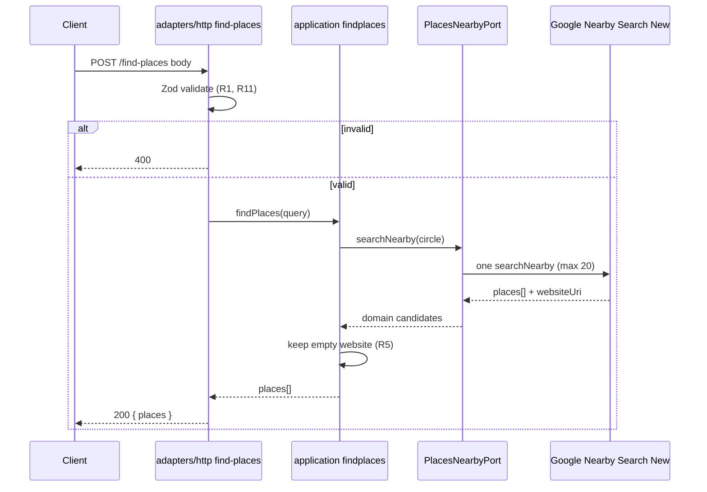

# Findplaces - Plan

## Goal Capsule

**Objective:** Add `POST /find-places` that takes latitude, longitude, and radius, calls Google Nearby Search (New) once for that circle, and returns nearby places whose website is empty — contact-ready fields for the owner's outreach.

**Product authority:** This plan's Product Contract. Extends the existing TypeScript microservice skeleton; Places product rules outside this contract are not in scope.

**Open blockers:** None.

**Execution profile:** Follow `AGENTS.md` echo vertical and hexagonal boundaries. First outbound port in this repo; keep Google/client types out of `domain` and `application`.

**Stop if:** Scope expands into area tiling, type filters, scoring/CRM, auth/multi-tenant exposure, or a second Places vendor.

---

## Product Contract

**Product Contract preservation:** changed: R10 — route path renamed to `/find-places` (user-directed at plan confirmation). Other Product Contract meaning and IDs unchanged.

### Summary

A `find-places` capability for the owner's own outreach: supply lat, lng, and radius; run one Google Nearby Search (New) for that circle (up to ~20); keep only places with an empty/missing website; return name, address, phone, and place id (blanks OK except website).

### Problem Frame

The owner needs nearby businesses without websites for outreach and has no existing process or tool for it. Manual discovery does not scale; this search is the first automated cut.

### Actors

- A1. Business owner — local caller who supplies a map point and radius and uses the returned contact fields for outreach.
- A2. Google Places Nearby Search (New) — external source of nearby places and website/contact fields.

### Key Decisions

- **Single-pass Nearby Search + filter** — one search for the circle, then drop places with a website; do not keep searching to fill a quota. (session-settled: user-directed — chosen over fill-quota and two-step enrich: simplest first useful cut) Governs R3, R4, R8.
- **Google Places only** — Nearby Search (New) is the required source; no alternate vendor in v1. (session-settled: user-directed — chosen over vendor-agnostic or Google-with-fallback) Governs R2.
- **Filter on empty/missing `websiteUri`** — Places API (New) can return `websiteUri` on Nearby Search via field mask; no Place Details round-trip required for the website check. (session-settled: user-approved — chosen over Details-heavy enrich) Governs R4, R5.
- **Contact fields may be blank** — name/address/phone may be missing; only website emptiness gates inclusion. (session-settled: user-directed — chosen over phone-required gate) Governs R6, R7.

### Requirements

**Input / search**
- R1. Caller supplies latitude, longitude, and search radius; radius is interpreted in meters (Google Nearby Search circle units).
- R2. Search uses Google Places Nearby Search (New) only (`places:searchNearby`), not the legacy Nearby Search endpoint.
- R3. Exactly one Nearby Search request per `find-places` call for the given circle; no area tiling, paging past the first page, or subgroup sweeps.
- R4. Request at most 20 places from Google (`maxResultCount` ≤ 20); returning fewer after filtering is success.

**Filter / output**
- R5. Keep only places whose website is empty or absent (`websiteUri` missing/empty); drop any place with a non-empty website.
- R6. Each returned place includes place id, name, address, and phone when Google provides them.
- R7. Places missing phone and/or address are still returned if they pass R5.
- R8. Response is the filtered list only — no ranking, scoring, CRM export, or separate enrich step in v1.
- R9. No business-type include/exclude filter in v1; results may include non-business places among the Nearby Search hits.

**Service shape**
- R10. Exposed as `POST /find-places` on the existing HTTP service, following the skeleton's domain → application → HTTP → composition → tests path.
- R11. Google API credentials are configured via env (not hardcoded); invalid caller input is rejected at the HTTP edge with 4xx.

### Key Flows

- F1. Successful no-website search
  - **Trigger:** A1 calls `POST /find-places` with valid lat, lng, and radius.
  - **Actors:** A1, A2
  - **Steps:** Validate input → one Nearby Search (New) for the circle → filter per R5 → return remaining places with fields per R6–R7.
  - **Outcome:** 0–20 contact-ready no-website places.
  - **Covered by:** R1–R8, R10–R11
- F2. Invalid input
  - **Trigger:** Missing/invalid lat, lng, or radius.
  - **Actors:** A1
  - **Steps:** Reject at the edge without calling Google.
  - **Outcome:** 4xx; no outbound Places call.
  - **Covered by:** R1, R11

### Acceptance Examples

- AE1. Covers R5, R6
  - **Given:** Nearby Search returns places, some with `websiteUri` set and some without.
  - **When:** `find-places` runs for that circle.
  - **Then:** Only places with empty/missing website appear; each includes id/name/address/phone when present.
- AE2. Covers R7
  - **Given:** A place has no website and no phone.
  - **When:** It appears in the Nearby Search result set.
  - **Then:** It is still returned; phone is empty/null.
- AE3. Covers R3, R4
  - **Given:** The area has many establishments.
  - **When:** `find-places` runs once.
  - **Then:** At most one Nearby Search is made; at most 20 candidates are considered before filtering; no tiling.
- AE4. Covers R11, F2
  - **Given:** Latitude is missing or not a number.
  - **When:** The caller invokes `find-places`.
  - **Then:** Response is 4xx and Google is not called.

### Scope Boundaries

**In scope**
- Single-circle Google Nearby Search (New) + no-website filter + contact-ready list via `POST /find-places`.

**Deferred for later**
- Business-type filters, ranking/scoring, CRM/export, email outreach, multi-step enrich APIs, area tiling / fill-quota search.

**Outside this product's identity (v1)**
- Alternate map/Places vendors; legacy Places Nearby Search as the primary path; auth/multi-tenant productization beyond local use.

### Deferred to Follow-Up Work

- Live smoke against a real Google project (manual; not part of default `npm test`).
- Optional `@googlemaps/places` client if raw `fetch` proves painful — not in this plan.

### Dependencies / Assumptions

- A Google Places API key with **Places API (New)** enabled is available for local `dev` use.
- Empty/missing `websiteUri` on Nearby Search (New) means “no website known to Google” for v1 (not proof of zero web presence).
- Radius unit is meters; Google circle radius must be > 0 and ≤ 50_000 m.
- Repo today has no Places client, key wiring, or `find-places` route (skeleton: `/health`, `/echo` only).

### Outstanding Questions

**Resolve Before Planning:** None.

**Deferred to Implementation**
- Exact Zod error message wording for invalid bodies.
- Whether to prefer `nationalPhoneNumber` alone vs also exposing `internationalPhoneNumber` in the JSON field named `phone`.

### Sources / Research

- Google Nearby Search (New): [nearby-search](https://developers.google.com/maps/documentation/places/web-service/nearby-search), [choose-fields](https://developers.google.com/maps/documentation/places/web-service/choose-fields), [usage-and-billing](https://developers.google.com/maps/documentation/places/web-service/usage-and-billing) — field mask including phones + `websiteUri` bills at Nearby Search Enterprise.
- Repo: `AGENTS.md`, `docs/architecture.md`, echo vertical under `src/domain|application|adapters/http|composition/`, `docs/solutions/tooling-decisions/express-http-adapter-over-fastify-hexagonal.md`.

---

## Planning Contract

### Key Technical Decisions

- KTD1. **Hexagonal echo vertical + first outbound port** — Mirror `POST /echo` for inbound path; add an application port and `src/adapters/places/` client for Google. Do not put `fetch`, Express, or Google types in `domain`/`application`. Align with `AGENTS.md` / `docs/architecture.md`. Governs R10.
- KTD2. **Thin raw `fetch` adapter** — Call `POST https://places.googleapis.com/v1/places:searchNearby` with Node 22 `fetch`; no `@googlemaps/places` dependency in v1. (session-settled: user-approved — chosen over official client library: thinner outbound seam) Adapter owns headers, field mask, and JSON mapping.
- KTD3. **`GOOGLE_PLACES_API_KEY` via `loadEnv`** — Zod-validate in `src/composition/env.ts`; document in `.env.example`. Ban raw `process.env` elsewhere. Key required when constructing the real adapter in `main` / composition; HTTP/unit tests inject a stub port so `npm test` never needs a real key or live Google.
- KTD4. **Explicit field mask (Enterprise SKU)** — Request `places.id,places.displayName,places.formattedAddress,places.nationalPhoneNumber,places.websiteUri` (adjust only if mapping needs `displayName.text`). Never use `*`. Map to domain fields: id, name, address, phone, websitePresent-or-uri for filter.
- KTD5. **Error split** — Invalid caller input → 400 at HTTP edge (no Google call). Port/upstream failures → opaque 502 (bad config, unexpected upstream, adapter bug) or 503 (quota/unavailable/timeout); do not forward Google error text. Domain filter errors stay rare; prefer pure filter without throws.
- KTD6. **Response envelope** — `200` with `{ "places": [ ... ] }` even when empty after filter. Each place: `{ "id", "name", "address", "phone" }` with null/omit for missing optionals (pick one convention and keep it consistent in tests).
- KTD7. **Request body** — JSON `{ "latitude", "longitude", "radiusMeters" }` on `POST /find-places`; validate numbers, finite lat/lng ranges, radius in (0, 50000].

### Assumptions

- Composition may extend `buildApp` deps to accept an injectable Places port / use-case factory for tests while preserving a single registration path.
- Health remains liveness-only and never calls find-places.

### High-Level Technical Design



Layering (directional):

```text
HTTP (Zod, status mapping)
  → application use case (port + domain filter)
    → PlacesNearbyPort (interface in application)
      → adapters/places Google client (fetch + field mask)
domain: Place types + isMissingWebsite rule only
```

### Implementation Units sequencing

U1 → U2 → U3 → U4 (HTTP tests alongside wiring); application tests can start after U2 with stubs; U5 docs with or after U4.

---

## Implementation Units

### U1. Domain place types and no-website filter

**Goal:** Pure domain types and the website-empty rule with no framework imports.

**Requirements:** R5, R6, R7

**Dependencies:** None

**Files:**
- Create: `src/domain/findplaces.ts`
- Test: `tests/domain/findplaces.test.ts`

**Approach:**
1. Define input/result types for a place (id, name, address, phone; website field used only for filtering or as optional raw before filter).
2. Implement pure `hasNoWebsite` / filter helper: missing or empty string → keep; non-empty → drop.
3. Domain errors only if needed; prefer filter without throws.

**Patterns to follow:** `src/domain/echo.ts`

**Test scenarios:**
- Covers AE1. Place with website URI is excluded; place without URI is kept.
- Covers AE2. Place with no website and no phone is kept; phone may be null/empty.
- Empty string website is treated as no website.

**Verification:** Domain unit tests pass; no Express/fetch imports under `src/domain/`.

---

### U2. Application port and find-places use case

**Goal:** Use case depends on an injected Places search port and applies the domain filter once per call.

**Requirements:** R2, R3, R4, R5, R8

**Dependencies:** U1

**Files:**
- Create: `src/application/ports/places-nearby.ts` (or equivalent port module name)
- Create: `src/application/findplaces.ts`
- Test: `tests/application/findplaces.test.ts`

**Approach:**
1. Define port as a plain function/type: circle query in → candidate places out (domain types only).
2. Use case calls the port **once**, then filters with domain rules; does not loop or tile.
3. Cap expectation: port returns ≤20; use case does not request more.

**Patterns to follow:** `src/application/echo.ts`; DI style of `EchoUseCase` in routes.

**Execution note:** Implement use-case behavior test-first with an in-memory stub port.

**Test scenarios:**
- Covers AE1. Stub returns mixed website/no-website → only no-website remain.
- Covers AE3. Stub is invoked exactly once per use-case call.
- Empty stub list → empty result (success path).
- Stub candidates all have websites → empty result.

**Verification:** Application tests pass with stub port; no Google URLs in application module.

---

### U3. Google Nearby Search (New) outbound adapter

**Goal:** Real port implementation using one `searchNearby` request and field-mask mapping.

**Requirements:** R2, R3, R4, R6, R11

**Dependencies:** U2, KTD2–KTD4

**Files:**
- Create: `src/adapters/places/google-nearby-search.ts`
- Test: `tests/adapters/places/google-nearby-search.test.ts`

**Approach:**
1. Construct client with API key (from composition); implement the port interface.
2. `POST` to Places API (New) with `X-Goog-Api-Key`, `X-Goog-FieldMask`, JSON `locationRestriction.circle` + `maxResultCount: 20`.
3. Map Google places to domain candidates; treat missing/`""` `websiteUri` as no website signal for the use case.
4. On non-OK HTTP / network failure, throw a port-level error type (no Google JSON leaked upward).
5. Do not log API key or response bodies (PII).

**Patterns to follow:** Keep SDK types out of application; outbound sibling to `adapters/http/` (per architecture outbound-port guidance).

**Test scenarios:**
- Stub `fetch`: assert URL, method, headers (key + field mask), body circle + maxResultCount 20.
- Fixture with/without `websiteUri` maps correctly to domain fields.
- Non-2xx `fetch` → port error (not raw Google body).
- Covers AE3. Single `fetch` invocation per search call.

**Verification:** Adapter tests pass with mocked `fetch`; no live Google required.

---

### U4. HTTP route, env, and `buildApp` wiring

**Goal:** Expose `POST /find-places`, wire env + real client in composition, keep health independent.

**Requirements:** R1, R10, R11

**Dependencies:** U2, U3, KTD3, KTD5–KTD7

**Files:**
- Create: `src/adapters/http/findplaces-routes.ts` (or `find-places-routes.ts`)
- Modify: `src/composition/env.ts`, `src/composition/build-app.ts`, `src/main.ts` (if adapter constructed there)
- Modify: `.env.example`
- Test: `tests/adapters/http/findplaces.test.ts`
- Modify: `tests/composition/env.test.ts` as needed

**Approach:**
1. Zod-validate body `{ latitude, longitude, radiusMeters }` at the edge; 400 on failure without calling the use case.
2. Register route on `buildApp` single path; inject use case (and allow test override of port/use case).
3. Map port/upstream errors to 502/503 opaque JSON; success `{ places: [...] }` including empty array.
4. Env: add `GOOGLE_PLACES_API_KEY`; ensure tests can load env without a real secret when using stubs.
5. Do not log request bodies by default (existing request-logging posture).

**Patterns to follow:** `src/adapters/http/echo-routes.ts`, `tests/adapters/http/echo.test.ts`, `src/composition/build-app.ts`

**Test scenarios:**
- Covers AE4. Invalid/missing latitude → 4xx; stub port not called.
- Valid body + stub returning filtered places → 200 with expected envelope.
- Empty filtered list → 200 `{ places: [] }`.
- Stub port throwing upstream error → 502 or 503 (not 500 with Google text).
- After find-places 4xx, `GET /health` still 200.

**Verification:** HTTP tests via `buildApp` + supertest; `typecheck` clean.

---

### U5. Docs and harness alignment

**Goal:** Document the outbound port and new route so agents follow the same practices.

**Requirements:** R10

**Dependencies:** U4

**Files:**
- Modify: `docs/architecture.md`
- Modify: `AGENTS.md` (architecture map / ask-first note if outbound is now present)
- Modify: `README.md` only if it lists HTTP surface

**Approach:**
1. Update architecture HTTP table with `POST /find-places`; change “outbound ports: none in v1” to describe Places adapter location and dependency rule.
2. Note env var and that tests mock the port.
3. Keep “ask first” for *additional* outbound ports; this feature is the approved first one.

**Test expectation:** none — documentation only.

**Verification:** Docs match actual paths and scripts; no contradiction with `AGENTS.md` recipe.

---

## Verification Contract

| Gate | Command / check | Applies to |
|------|-----------------|------------|
| Typecheck | `npm run typecheck` | All units |
| Automated tests | `npm test` | U1–U4 |
| No live Google in CI/default tests | Tests use stubs / mocked `fetch` | U2–U4 |
| Layering | No Express/fetch/Google SDK imports in `src/domain` or `src/application` | U1–U3 |
| Manual smoke (optional) | `npm run dev` with real `.env` key + one real POST | Operator only |

---

## Definition of Done

- [ ] `POST /find-places` accepts lat/lng/`radiusMeters`, performs one Nearby Search (New), returns no-website places with contact fields (R1–R11).
- [ ] Empty filter result is 200 with empty `places` array.
- [ ] Invalid input is 4xx without calling Google; upstream failures are opaque 5xx.
- [ ] `npm run typecheck` and `npm test` pass without a real Google key.
- [ ] `docs/architecture.md` / `AGENTS.md` reflect outbound Places adapter and route.
- [ ] U1–U5 complete per their verification sections.
