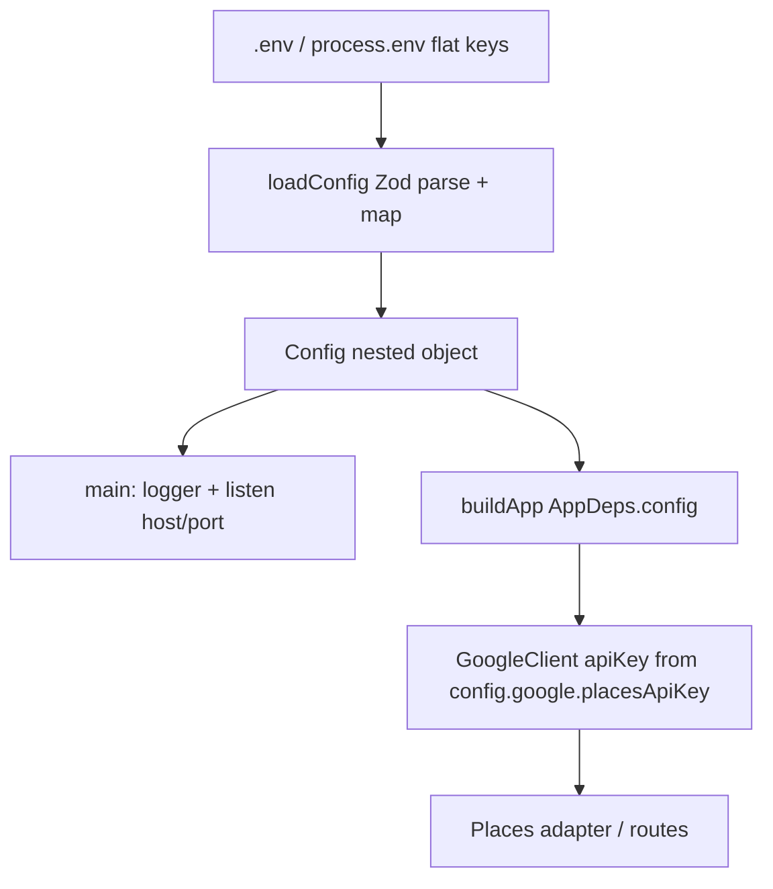

# refactor: Replace flat Env with nested Zod Config

## Goal Capsule

- **Objective:** Replace flat `Env` / `loadEnv` with a Zod-validated nested `Config` object (top-level server/log fields + nested `google`), still sourced from flat process env / `.env`, and wire composition + Google Places through it so raw `process.env` is banned outside the loader.
- **Authority:** This plan; `AGENTS.md` / `docs/architecture.md` for hexagonal + composition-root rules; session-settled decisions below.
- **Out of scope:** New config sources (JSON files, remote, secrets managers); changing Places product behavior; inventing persistence/auth.
- **Done when:** `loadConfig` returns nested `Config`; `HOST` restored with default `127.0.0.1`; Google key mapped from `GOOGLE_PLACES_API_KEY` (empty string → absent); adapters never read `process.env`; typecheck + tests pass without a committed `.env`.

---

## Product Contract

### Summary

Planning targets a composition-root config refactor: flat env vars remain the external contract (`.env.example` stays flat), but the in-app type becomes a nested `Config` with Zod validation at load. Product Contract preservation: N/A (ce-plan-bootstrap; no upstream brainstorm).

### Problem Frame

`src/composition/env.ts` exposes a flat SCREAMING_SNAKE `Env` type. Call sites and the WIP Google adapter either use that flat shape or read `process.env` directly (`GOOGLE_API_KEY`), which drifts from documented `GOOGLE_PLACES_API_KEY` and from the architecture ban on raw env reads. Tests still expect `HOST`; WIP schema dropped it. The team wants a nested config object (especially `google`) while keeping env-file loading and Zod.

### Requirements

**Config shape and loading**

- R1. Provide a nested typed `Config` with top-level `port`, `host`, `logLevel`, and nested `google.placesApiKey` (optional).
- R2. Load `Config` from flat process env / `.env` fields (`PORT`, `HOST`, `LOG_LEVEL`, `GOOGLE_PLACES_API_KEY`) via a single Zod-validated loader (`loadConfig`), injectable with a `NodeJS.ProcessEnv`-like source for tests.
- R3. Keep Zod as the only schema validation for config; fail fast on invalid values (e.g. non-positive `PORT`).
- R4. Treat empty-string optional secrets as absent so copying `.env.example` does not fail parse.

**Composition and adapters**

- R5. Composition root and process entry consume `Config` (not flat `Env`); bind listen with `host` defaulting to `127.0.0.1`.
- R6. Ban raw `process.env` outside the config loader; Google Places adapter / client receive the API key only via injected config or constructor deps.
- R7. Canonical env var for the Places key remains `GOOGLE_PLACES_API_KEY` (not `GOOGLE_API_KEY`).
- R8. Google key stays optional at load; HTTP/unit tests must not require a real key (stub/inject Places as today). Fail when constructing the live Google client without a key — not at every `loadConfig` call.

**Docs and verification**

- R9. Update `.env.example`, `AGENTS.md`, `docs/architecture.md`, and `README.md` (and `CONCEPTS.md` composition-root wording) so agents do not resurrect flat `Env`.
- R10. `npm run typecheck` and `npm test` succeed without a committed `.env`.

### Key Decisions

- KD1. Nested in-app `Config`, flat external env — Governs R1, R2. `(session-settled: user-directed — chosen over keeping flat Env: nested google config wanted while still using env files)`
- KD2. Keep Zod schema validation at the loader — Governs R3. `(session-settled: user-directed — chosen over dropping validation)`
- KD3. Optional Google key at load; required only when wiring the live Google client — Governs R8. `(session-settled: user-approved — chosen over required-at-boot: confirmed scoping call-out without redirect)`
- KD4. Fix Google adapter raw `process.env` in this change — Governs R6, R7. `(session-settled: user-approved — chosen over deferring adapter cleanup)`

### Acceptance Examples

- AE1. `loadConfig({})` yields defaults `port=3000`, `host=127.0.0.1`, `logLevel=info`, and `google.placesApiKey` undefined. Covers R1, R2, R5.
- AE2. `loadConfig({ GOOGLE_PLACES_API_KEY: "" })` succeeds with `google.placesApiKey` undefined. Covers R4.
- AE3. `loadConfig({ PORT: "0" })` throws. Covers R3.
- AE4. HTTP tests build the app with silent log level and no Google key; health/find-places stubs still work. Covers R8, R10.
- AE5. Google Places adapter code paths do not reference `process.env`; key comes from composition using `config.google.placesApiKey`. Covers R6, R7.

### Scope Boundaries

**In scope**

- Replace `env.ts` with `config.ts` (`Config` / `loadConfig`)
- Restore `HOST` in schema + `main` listen
- Empty-string → undefined for optional Google key
- Wire `AppDeps`, `buildApp`, `main`, Google adapter/client
- Update composition + HTTP tests and primary docs

**Out of scope**

- Nested keys inside `.env` files
- Additional config backends
- Requiring Google key for all boots / all tests
- Broader WIP places-layout cleanup unrelated to config injection (only touch what wiring needs)

### Deferred to Follow-Up Work

- Capture a `docs/solutions/` convention learning for nested Config after ship
- Broader architecture-doc path updates for the mid-refactor `places/` / `shared/` layout (beyond Config section)

---

## Planning Contract

### Assumptions

- Confirmed scoping call-outs (flat→nested mapping, optional key at load, include adapter `process.env` fix) stand without further redirects.
- Prefer top-level camelCase server/log fields + nested `google` over deeper `server` / `log` nesting (smaller call-site diff; matches “nested objects like a google config”).
- WIP tree is the implementation baseline; restore HEAD’s HOST bind and key-injection intent while adopting nested `Config`.

### Key Technical Decisions

- KTD1. **`config.ts` replaces `env.ts`** — Export `Config` and `loadConfig`; delete or stop exporting `Env` / `loadEnv`. Rename tests to `tests/composition/config.test.ts`. Rename `AppDeps.env` → `AppDeps.config`. `(session-settled: user-directed — chosen over keeping Env naming)`
- KTD2. **Flat Zod input + transform/map to nested `Config`** — Validate SCREAMING env names (coerce/defaults), then map to camelCase nested object. Prefer exporting only `Config` publicly; keep flat schema private. Reuse `LogLevel` from `logger.ts` rather than duplicating the enum.
- KTD3. **Empty optional secrets** — Preprocess or transform so `""` for `GOOGLE_PLACES_API_KEY` becomes `undefined` before `min(1)` checks.
- KTD4. **Live Google requires key at wire time** — Composition constructs `GoogleClient` / Places adapter with `config.google.placesApiKey` only when present; missing key fails clearly for real adapter construction. Tests keep injecting stubs so `loadConfig` never needs the key.
- KTD5. **Canonical key name `GOOGLE_PLACES_API_KEY`** — Map to `config.google.placesApiKey`; remove `GOOGLE_API_KEY` usage from the adapter.

### High-Level Technical Design

### Risks & Dependencies

- Empty-string optional key already breaks naive Zod `min(1).optional()` when `.env.example` is copied — must handle in U1.
- WIP `buildApp` / find-places tests may be out of sync on injectable Places service; config rename must not leave a second wiring path.
- Docs still cite older `adapters/google` paths in places; update Config-related claims even if full layout docs lag.

---

## Implementation Units

### U1. Nested `loadConfig` + unit tests

- **Goal:** Replace flat env loader with Zod-validated nested `Config`, including HOST defaults and empty-key handling.
- **Requirements:** R1, R2, R3, R4, R7, R10; KD1–KD3; KTD1–KTD3, KTD5
- **Dependencies:** None
- **Files:**
  - create: `src/composition/config.ts`
  - delete: `src/composition/env.ts` (after call sites move, or in U2 if preferred — prefer create + migrate in U2 then delete)
  - create: `tests/composition/config.test.ts`
  - delete: `tests/composition/env.test.ts` (after migration)
- **Approach:**
  1. Add private flat Zod schema for `PORT`, `HOST`, `LOG_LEVEL`, `GOOGLE_PLACES_API_KEY` with existing defaults/coercions.
  2. Normalize empty Google key to absent; map to nested `Config`.
  3. Export `loadConfig(source = process.env)` and `Config` type only.
  4. Port env unit tests to assert nested fields and empty-key / invalid-PORT cases.
- **Patterns to follow:** HEAD `env.ts` Zod `.parse` fail-fast; camelCase injected configs like `GoogleClientConfig`.
- **Test scenarios:**
  - Covers AE1. Empty source → defaults including `host` and undefined `google.placesApiKey`.
  - Covers AE2. Empty-string Google key → undefined nested key (no throw).
  - Covers AE3. Invalid / non-positive `PORT` → throw.
  - Happy path: string `PORT`/`LOG_LEVEL`/`HOST` coerce/map to nested camelCase fields.
  - Happy path: non-empty `GOOGLE_PLACES_API_KEY` → `config.google.placesApiKey`.
- **Verification:** Config unit tests pass; no public `Env` / `loadEnv` left once U2 migrates imports.

### U2. Wire composition, main, and Google through `Config`

- **Goal:** Call sites use `Config`; Google gets the key via DI; ban adapter `process.env`.
- **Requirements:** R5, R6, R7, R8; KD4; KTD1, KTD4, KTD5
- **Dependencies:** U1
- **Files:**
  - modify: `src/composition/build-app.ts`
  - modify: `src/main.ts`
  - modify: `src/places/adapters/google.ts` (and/or route through `GoogleClient` if that is the intended WIP path)
  - modify: any remaining `loadEnv` / `Env` imports under `src/`
- **Approach:**
  1. Rename `AppDeps.env` → `AppDeps.config`; pass `config.logLevel` into logger at callers.
  2. `main`: `loadConfig` → logger → `buildApp` → `listen(config.port, config.host)`.
  3. When constructing the live Google client/adapter, require `config.google.placesApiKey`; never read `process.env` in adapters.
  4. Prefer injecting into existing `GoogleClient({ apiKey, baseUrl })` rather than fetch-inside-adapter with env.
- **Patterns to follow:** Composition-root contract from `docs/solutions/tooling-decisions/express-http-adapter-over-fastify-hexagonal.md` and `docs/architecture.md` Config ban on raw `process.env`.
- **Test scenarios:**
  - Covers AE5. Grep/`process.env` absent under `src/` except `config.ts`.
  - Integration: real-adapter construction without key fails clearly (unit or composition-level assertion).
  - Integration: with key present, client receives that key (existing Google client tests already inject `apiKey` — keep that pattern).
- **Verification:** `src/` has a single `process.env` touchpoint in the config loader; `main` binds host.

### U3. HTTP tests + docs alignment

- **Goal:** Tests and docs speak `Config` / `loadConfig`; `.env.example` stays flat and consistent.
- **Requirements:** R9, R10; AE4
- **Dependencies:** U2
- **Files:**
  - modify: `tests/adapters/http/health.test.ts`
  - modify: `tests/adapters/http/findplaces.test.ts`
  - modify: `tests/adapters/http/echo.test.ts` (if still present)
  - modify: `.env.example`
  - modify: `AGENTS.md`
  - modify: `docs/architecture.md` (Config + composition wording)
  - modify: `README.md`
  - modify: `CONCEPTS.md` (Composition root: “load config” not “load env”)
- **Approach:**
  1. Swap test helpers to `loadConfig({ LOG_LEVEL: 'silent' })` and `buildApp({ config, logger, ... })`.
  2. Keep stub Places injection so tests need no Google key.
  3. Document nested in-app config + flat env vars; architecture map “Config + buildApp”.
  4. Keep `.env.example` flat; document optional empty Google key semantics if helpful in one line.
- **Patterns to follow:** Existing silent-log HTTP test bootstrap; AGENTS “Always” bind `HOST=127.0.0.1`.
- **Test scenarios:**
  - Covers AE4. Health (and find-places with stub) succeed via `buildApp` without Google key.
  - Regression: no test imports `loadEnv` / `Env`.
- **Verification:** `npm run typecheck` and `npm test` green without committed `.env`; docs no longer prescribe flat `Env` as the in-app type.

---

## Verification Contract

| Gate | Command / check | Applies to |
|------|-----------------|------------|
| Typecheck | `npm run typecheck` | U1–U3 |
| Unit + HTTP tests | `npm test` | U1–U3 |
| Env isolation | Tests pass with no committed `.env` | U1, U3 |
| process.env ban | Only `src/composition/config.ts` reads `process.env` under `src/` | U2 |
| Local bind | Default `host` is `127.0.0.1`; `main` listens on host | U1, U2 |

---

## Definition of Done

- Nested `Config` / `loadConfig` shipped; flat `Env` / `loadEnv` removed.
- HOST restored; Google key optional at load, wired at composition for live Google only.
- Adapters do not read `process.env`.
- Tests and primary docs updated; typecheck + test green.
- AGENTS.md architecture map reflects Config if layout wording changed.

---

## Sources & Research

- Repo patterns: `src/composition/env.ts`, `tests/composition/env.test.ts`, `src/main.ts`, `src/composition/build-app.ts`, WIP `src/places/adapters/google.ts`, `src/shared/client/client.ts`
- Institutional: `docs/solutions/tooling-decisions/express-http-adapter-over-fastify-hexagonal.md` (composition-root / AppDeps contract)
- Prior plans (historical): `docs/plans/2026-08-11-001-feat-typescript-microservice-skeleton-plan.md`, `docs/plans/2026-08-11-002-feat-findplaces-plan.md`
- External research: skipped — strong local Zod + composition patterns; approach settled
