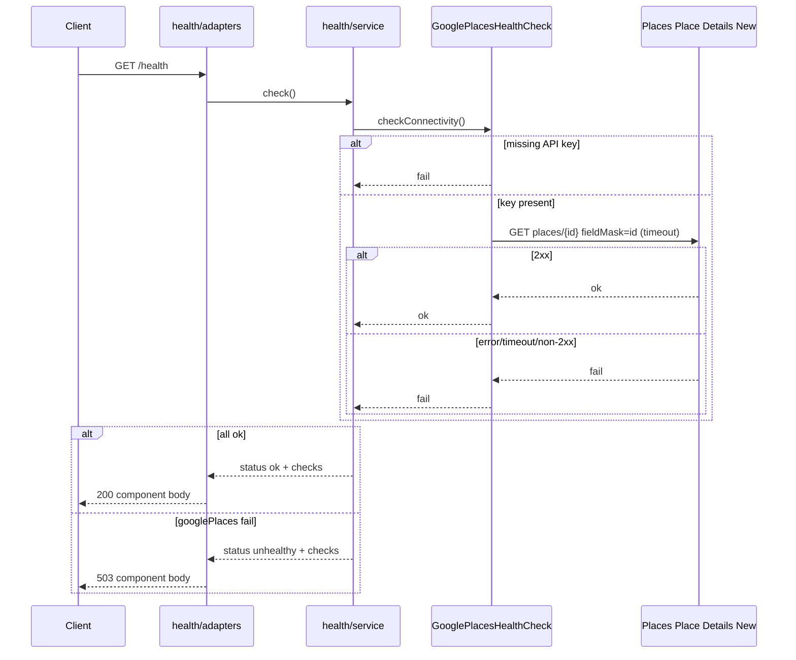

# Health Google Places Check - Plan

## Goal Capsule

**Objective:** Expand `GET /health` so every request also runs a live connectivity/auth check against Google Places, returns component-detail status, and fails the probe with a non-success HTTP status when that check fails or times out.

**Product authority:** This plan's Product Contract. Revises the prior skeleton rule that Health is liveness-only and independent of outbound deps. Surrounding work (find-places behavior, caching, separate readiness) is not active scope.

**Open blockers:** None.

**Execution profile:** Follow hexagonal boundaries under the live vertical-slice tree (`src/health/`, `src/places/`, `src/shared/client/`, `src/composition/`); update harness docs so agents do not resurrect liveness-only health.

**Stop if:** Scope expands into multi-dependency orchestration dashboards, auth on health, or a second Places vendor.

---

## Product Contract

**Product Contract preservation:** unchanged — meaning and stable R/A/F/AE IDs preserved; Outstanding Questions resolved into Planning Contract KTDs.

### Summary

`GET /health` becomes a single probe that reports process reachability plus a live Google Places connectivity/auth check. Healthy responses include per-check detail; Google failure or timeout makes `/health` return a non-success status with an unhealthy Google Places component.

### Problem Frame

The service already exposes a trivial always-ok `/health` and depends on Google Places for its main feature, but operators cannot tell from health whether Google is reachable or authenticated. The owner wants that signal on the existing `/health` surface rather than a separate readiness endpoint.

### Actors

- A1. Local operator / probe consumer — calls `GET /health` to decide if the service is usable.
- A2. Google Places API — external dependency whose reachability/auth is checked on every health request.

### Key Decisions

- **Fold Google into `/health`** — one probe surface; do not add a separate readiness route. (session-settled: user-directed — chosen over separate readiness and always-reachable composite-only: single probe) Governs R1, R2.
- **Live connectivity/auth ping** — outbound check that Google Places accepts the configured credentials; not config-presence-only and not a find-places nearby-search exercise. (session-settled: user-directed — chosen over config-only, skip-when-no-key, and search-path/dual-signal probes: cheaper and less coupled) Governs R3, R4.
- **Non-success HTTP status when unhealthy** — probe consumers can key off status code; intended default is 503. (session-settled: user-directed — chosen over always-200 body-only and mixed degraded-200: probe-friendly) Governs R5.
- **Ping every request** — no caching/TTL in this pass. (session-settled: user-directed — chosen over short-TTL cache and deferring caching: simplest) Governs R6.
- **Component-detail body** — response names overall status and a Google Places check result. (session-settled: user-directed — chosen over minimal status-only: shows the dependency explicitly) Governs R7, R8.
- **Missing/invalid Google key is unhealthy** — live ping cannot succeed without usable credentials. (session-settled: user-approved — confirmed scoping call-out without redirect) Governs R4, R9.
- **Rewrite liveness-only harness contract** — docs and vocabulary must match the new health meaning. (session-settled: user-approved — confirmed scoping call-out without redirect) Governs R12.

### Requirements

**Probe behavior**

- R1. `GET /health` remains the sole health endpoint for this work; it reports both service reachability and Google Places dependency status.
- R2. When the Google Places check passes, `/health` returns success HTTP status with an overall healthy status.
- R3. On every `/health` request, perform a live outbound connectivity/auth check against Google Places (no cached prior result).
- R4. The check proves Google Places connectivity and credential acceptance, not that find-places nearby-search product behavior works end-to-end.
- R5. When the Google Places check fails or times out, `/health` returns a non-success HTTP status (intended: 503) and an unhealthy overall status.
- R6. Do not introduce health-result caching or TTL behavior in this pass.

**Response shape**

- R7. Healthy and unhealthy bodies include overall status plus a Google Places component entry (e.g. ok/fail), not status-only.
- R8. The Google Places component reflects the outcome of that request's live check.

**Independence and testability**

- R9. Absence or invalidity of the Google Places API key yields an unhealthy Google Places check (and thus unhealthy `/health` for live wiring).
- R10. Invalid find-places (or other feature) request bodies must not by themselves make `/health` unhealthy when the Google Places check would otherwise pass.
- R11. Automated `typecheck` and `test` must not require a real Google API key or committed `.env`; tests inject/stub the Google Places health dependency.

**Docs**

- R12. Update `AGENTS.md`, `docs/architecture.md`, and `CONCEPTS.md` so Health is no longer described as liveness-only / forbidden from outbound dependency checks.

### Key Flows

- F1. Healthy Google Places
  - **Trigger:** A1 `GET /health` while Google Places accepts the live check.
  - **Actors:** A1, A2
  - **Steps:** Request arrives; live Google Places connectivity/auth check runs; check passes; response returns success status with overall healthy status and googlePlaces ok.
  - **Outcome:** Probe consumers treat the service as healthy.
  - **Covered by:** R1, R2, R3, R7, R8

- F2. Unhealthy Google Places
  - **Trigger:** A1 `GET /health` while Google Places rejects, errors, or times out (including missing/invalid key in live wiring).
  - **Actors:** A1, A2
  - **Steps:** Request arrives; live check runs; check fails or times out; response returns non-success status with overall unhealthy status and googlePlaces fail.
  - **Outcome:** Probe consumers treat the service as unhealthy.
  - **Covered by:** R3, R5, R7, R8, R9

### Acceptance Examples

- AE1. With a stubbed Google Places check that succeeds, `GET /health` returns success HTTP status and a body with overall healthy status plus googlePlaces ok. Covers R2, R7, R8, R11.
- AE2. With a stubbed Google Places check that fails or times out, `GET /health` returns non-success HTTP status (intended 503) and a body with overall unhealthy status plus googlePlaces fail. Covers R5, R7, R8, R11.
- AE3. Live wiring without a usable Google Places API key yields unhealthy `/health` (googlePlaces fail). Covers R4, R9.
- AE4. After a find-places validation failure, `GET /health` still reflects only the Google Places check outcome (not the validation failure). Covers R10.
- AE5. `npm run typecheck` and `npm test` pass without a committed `.env` or real Google key. Covers R11.
- AE6. Harness docs no longer state that Health is liveness-only or must not call outbound dependency checks. Covers R12.

### Scope Boundaries

**In scope**

- Extending `GET /health` with a live Google Places connectivity/auth check
- Component-detail healthy/unhealthy responses and non-success status on Google failure/timeout
- Stub/inject support for tests without a real key
- Updating Health vocabulary and harness docs
- Shared Google client GET + timeout needed for the ping; composition boot that can start without a key

**Deferred for later**

- Response caching / TTL for health pings
- Separate readiness endpoint
- Dual-signal diagnosis (connectivity plus nearby-search path)
- Health checks for dependencies other than Google Places
- Migrating find-places `searchNearby` onto the shared client (allowed if cheap while touching the client; not required)

**Outside this product's identity**

- Auth, rate limits, or public exposure controls on `/health`
- Multi-vendor Places health
- Changing find-places search/filter product behavior

### Dependencies / Assumptions

- Assumes Google Places remains the service's outbound Places dependency and a credential is available for live `dev` use via existing env/config loading.
- Assumes primary consumer is a local operator or simple probe that keys off HTTP status plus JSON body.
- Motivation is owner intent to ship this signal; no separate production incident was recorded as evidence.
- Assumes the same API key can call Place Details (New) when Places is enabled; if Console enablement differs from Nearby Search, health may fail while find-places works (or vice versa) — call out in README/ops note if observed.

### Outstanding Questions

**Resolve Before Planning**

- None.

**Deferred to Planning**

- Resolved in Planning Contract KTDs (ping RPC, JSON enums, timeout, composition wiring, boot-without-key).

### Sources / Research

- Current health route returns `{ status: "ok" }` only: `src/health/adapters/health-routes.ts`
- Prior vocabulary: `CONCEPTS.md` (Health), `AGENTS.md` (liveness-only boundary), `docs/architecture.md` (HTTP surface)
- Google Places outbound adapter today: `src/places/adapters/google.ts`
- Shared client (POST-only today): `src/shared/client/client.ts`
- Composition: `src/composition/build-app.ts`, `src/composition/config.ts`
- Prior plans: `docs/plans/2026-08-11-001-feat-typescript-microservice-skeleton-plan.md`, `docs/plans/2026-08-11-002-feat-findplaces-plan.md`, `docs/plans/2026-08-12-001-refactor-nested-config-object-plan.md`
- Institutional learning: `docs/solutions/tooling-decisions/express-http-adapter-over-fastify-hexagonal.md`
- External: Places API (New) Place Details GET with minimal field mask `id` for auth/reachability ([Place Details](https://developers.google.com/maps/documentation/places/web-service/place-details))

---

## Planning Contract

### Key Technical Decisions

- KTD1. **Health port separate from `PlacesService`** — Inject a Google Places health-check port into health; never call `PlacesService.getPlaces` / find-places. Governs R4, R10, R11. (session-settled product choice instantiated here: connectivity/auth over search-path)
- KTD2. **Place Details (New) ping** — Live check is `GET https://places.googleapis.com/v1/places/{placeId}` with a fixed well-known place id constant and `X-Goog-FieldMask: id`. Success = HTTP 2xx; any network error, non-2xx, or timeout = fail. Do not use `searchNearby`. Governs R3, R4. (session-settled: user-approved — confirmed plan scoping call-out: Place Details over other Places calls)
- KTD3. **Shared `GoogleClient` gains GET + timeout** — Extend `src/shared/client/client.ts` with GET support and a per-request timeout via `AbortSignal` (default **3000ms** for health). Opaque errors only (`google api unavailable`); no Google body leakage. Governs R5. (session-settled: user-approved — shared client cleanup in this change over adapter-local fetch-only ping)
- KTD4. **Response contract** — Body shape `{ "status": "ok" | "unhealthy", "checks": { "googlePlaces": "ok" | "fail" } }`. Healthy → HTTP **200**; unhealthy → HTTP **503**. Governs R2, R5, R7, R8.
- KTD5. **Boot without key; unhealthy health** — `google.placesApiKey` optional at `loadConfig` (empty/missing → absent). Process may listen without a key. Missing key → health check returns fail without outbound call. Live find-places wiring fails at request/construction of the Places path when key absent (opaque), not by refusing to start the process. Governs R9, AE3. (session-settled: user-approved — confirmed plan scoping: start + unhealthy over fail-fast boot) Conflict call-out: current WIP `createLivePlacesService` throws at `buildApp` when key missing; this KTD supersedes that for health deliverability.
- KTD6. **Replace empty `.go` health stubs with TypeScript** — Implement `src/health/domain/` and `src/health/service/` in TS matching the places vertical slice; delete empty `.go` files. Governs R1, R12 layout honesty.
- KTD7. **Harness docs match vertical slices** — When updating Health wording, also correct stale `AGENTS.md` / `docs/architecture.md` paths that still point at deleted `src/adapters/http/health-routes.ts` / liveness-only language so agents follow `src/health/` and the new probe semantics. Governs R12.

### Assumptions

- Place Details (New) is available to the same Google Cloud project/key used for Nearby Search in typical local setup; SKU/enablement mismatch is an ops caveat, not a product fork.
- Fixed place id may be refreshed later if Google retires it; treat as a named constant, not magic inline string.
- `tests/` may be partially missing or mid-migration on disk; recreate/extend health HTTP tests under `tests/adapters/http/health.test.ts` (and health unit tests under `tests/health/` or mirrored slice) as needed.

### High-Level Technical Design



Layering (directional):

```text
HTTP health route (status mapping only)
  → health service (aggregate overall status)
    → GooglePlacesHealthCheck port (domain)
      → GooglePlacesAdapter / GoogleClient Place Details ping
find-places PlacesService remains a separate port; unused by health
```

### Implementation Units sequencing

U1 → U2 → U3 → U4 → U5 (docs can finalize with or after U4).

---

## Implementation Units

### U1. Health domain types, port, and service

**Goal:** Pure health check types, outbound health port, and aggregator that maps component results to overall status — no Express.

**Requirements:** R1, R4, R7, R8, R10

**Dependencies:** None

**Files:**
- Create/replace: `src/health/domain/port.ts` (replace empty `port.go`)
- Create/replace: `src/health/service/health-service.ts` (replace empty `health-service.go`)
- Delete: `src/health/domain/port.go`, `src/health/service/health-service.go`
- Test: `tests/health/health-service.test.ts` (or `tests/health/service/health-service.test.ts`)

**Approach:**
1. Define component result enums and overall health result matching KTD4 (`ok` / `unhealthy` / `fail`).
2. Define `GooglePlacesHealthCheck` port with a single connectivity check method returning ok/fail (or equivalent).
3. Health service calls the port once per `check()`, sets `checks.googlePlaces`, and sets overall `status` to `ok` only when googlePlaces is ok.
4. No caching; no find-places imports.

**Patterns to follow:** `src/places/domain/port.ts` + `src/places/service/places-service.ts` vertical-slice shape; keep Express out of domain/service.

**Execution note:** Implement service behavior test-first with an in-memory health-check stub.

**Test scenarios:**
- Stub returns ok → overall `ok` and `checks.googlePlaces` ok.
- Stub returns fail → overall `unhealthy` and `checks.googlePlaces` fail.
- Service invokes the port exactly once per check.

**Verification:** Unit tests pass; no Express/fetch imports under `src/health/domain` or `src/health/service`.

---

### U2. GoogleClient GET/timeout and Place Details health adapter

**Goal:** Real health-check port implementation via Place Details (New) using shared client GET + timeout; missing key short-circuits to fail.

**Requirements:** R3, R4, R5, R9

**Dependencies:** U1, KTD2, KTD3, KTD5

**Files:**
- Modify: `src/shared/client/client.ts`
- Modify: `src/places/adapters/google.ts` (or thin sibling adapter implementing the health port)
- Test: `tests/shared/client/client.test.ts` and/or `tests/places/adapters/google-health.test.ts` (names flexible; prefer mirroring live tree)

**Approach:**
1. Extend `GoogleClient` with GET (path + fieldMask) and AbortSignal/timeout support; keep opaque errors; treat non-ok HTTP as failure.
2. Implement health port: if no API key → fail immediately; else GET Place Details for the fixed place-id constant with field mask `id` and 3000ms timeout.
3. Do not call `getNearbyPlaces` / searchNearby for health.
4. Prefer routing the new ping through `GoogleClient` (KTD3); find-places may keep its current fetch until a later cleanup unless the touch is trivial.

**Patterns to follow:** Opaque error style already in `GoogleClient.post`; Places API (New) headers `X-Goog-Api-Key` + `X-Goog-FieldMask`.

**Test scenarios:**
- Missing key → fail with zero `fetch` calls.
- Stub `fetch` 200 → ok; assert GET URL contains `/places/{id}`, field mask `id`, and timeout/abort wiring.
- Stub `fetch` non-2xx → fail.
- Stub `fetch` network throw / abort → fail.
- Must not POST `searchNearby` for the health path.

**Verification:** Adapter/client unit tests pass with mocked `fetch`; no real Google calls.

---

### U3. Health HTTP route and composition wiring

**Goal:** Async `/health` returns KTD4 body and 200/503; `buildApp` injects health checker; process can start without a Google key.

**Requirements:** R1, R2, R5, R7, R8, R9, R11

**Dependencies:** U1, U2, KTD4, KTD5

**Files:**
- Modify: `src/health/adapters/health-routes.ts`
- Modify: `src/composition/build-app.ts`
- Modify: `src/composition/config.ts` (optional `google.placesApiKey`)
- Modify as needed: `tests/composition/config.test.ts`, `tests/composition/build-app.test.ts`
- Test: `tests/adapters/http/health.test.ts`

**Approach:**
1. `registerHealthRoutes(app, healthService)` — await check; map overall ok → 200, else 503; JSON body per KTD4.
2. Extend `AppDeps` with optional injectable health checker / health service (parallel to `placesService?`).
3. Live default: construct health port from config key (absent key → fail-fast port that returns fail).
4. Stop throwing in `buildApp` when key missing; wire find-places so missing key fails at Places request path, not boot.
5. Make `loadConfig` treat missing/empty `GOOGLE_PLACES_API_KEY` as absent (align with nested-config intent).

**Patterns to follow:** `registerPlacesRoutes(app, placesService)`; composition-root single registration path; `docs/solutions/tooling-decisions/express-http-adapter-over-fastify-hexagonal.md`.

**Execution note:** Start with failing HTTP tests for AE1/AE2 body + status, then wire.

**Test scenarios:**
- Covers AE1. Injected ok checker → 200 + `{ status: "ok", checks: { googlePlaces: "ok" } }`.
- Covers AE2. Injected fail checker → 503 + unhealthy/fail body.
- Covers AE3. Live wiring path with no key (or fail-without-call port) → unhealthy health without requiring `.env`.
- Covers AE4. After find-places validation 400, health with ok stub still 200/ok.
- Covers AE5. Tests run with silent logger and no real key via stubs.
- `loadConfig` without `GOOGLE_PLACES_API_KEY` / empty string succeeds with absent key.

**Verification:** Health HTTP tests green through `buildApp` + `supertest`; `buildApp({ config, logger })` does not throw when key absent.

---

### U4. Docs and harness alignment

**Goal:** Health vocabulary and architecture map match the new probe; agents do not resurrect liveness-only health or deleted paths.

**Requirements:** R12

**Dependencies:** U3 (behavior stable enough to describe)

**Files:**
- Modify: `AGENTS.md`
- Modify: `docs/architecture.md`
- Modify: `CONCEPTS.md` (confirm Health entry; already updated in brainstorm — keep aligned)
- Modify if present: `README.md` health example

**Approach:**
1. Replace “Health is liveness only…” with the probe semantics (process + live Google Places connectivity/auth; 503 when unhealthy; feature validation alone must not flip health).
2. Update HTTP surface table for `/health` response shape and meaning.
3. Point exemplar paths at `src/health/adapters/health-routes.ts` and the health vertical slice, not deleted `src/adapters/http/health-routes.ts`.
4. Note every-request live ping (no cache) and optional ops caveat about Place Details enablement.

**Patterns to follow:** Existing AGENTS “Always / Never / Boundaries” style; architecture table format.

**Test expectation:** none — docs only. Covers AE6 via review of wording.

**Verification:** Docs no longer claim liveness-only or forbid outbound health checks; paths match on-disk tree.

---

## Verification Contract

| Gate | Command / check | Applies to |
|------|-----------------|------------|
| Typecheck | `npm run typecheck` | All units |
| Unit + HTTP tests | `npm test` | U1–U3 |
| No committed `.env` / real key required | Tests use stubs + optional config | R11, AE5 |
| Manual smoke (optional) | `npm run dev` + `GET /health` with real key | Live happy path |

---

## Definition of Done

- Product Contract R1–R12 satisfied; AE1–AE6 demonstrable via tests or doc review.
- U1–U4 complete per unit verification.
- `npm run typecheck` and `npm test` pass without a real Google key.
- Empty health `.go` stubs removed; TypeScript health vertical is the source of truth.
- Harness docs describe Google-backed `/health`, not liveness-only.

---

## System-Wide Impact

- **Boot / process entry:** Optional Google key means `main` can listen without `GOOGLE_PLACES_API_KEY`; operators who relied on fail-fast boot must use `/health` (or find-places errors) instead.
- **find-places:** Unchanged product filter/search behavior; only failure timing shifts from composition throw to request-time opaque failure when key absent.
- **Probe consumers:** Clients that treated `/health` as always-200 liveness must accept 503 + component body when Google is down.
- **Shared client:** GET + timeout on `GoogleClient` is available for later Places calls; this plan does not require migrating `searchNearby`.
- **Harness agents:** Doc updates prevent recreating liveness-only health under deleted `src/adapters/http/` paths.

## Risks & Dependencies

| Risk | Mitigation |
|------|------------|
| Place Details SKU/API not enabled while Nearby Search is | Document ops caveat; ping still correctly reports fail |
| Every-request ping burns quota/latency | Accepted for this pass (R6); caching deferred |
| Boot-without-key changes find-places fail mode | Opaque request-time failure; do not invent new product behavior for find-places filter |
| Doc/layout drift resurrects dead paths | KTD7 updates AGENTS/architecture paths in the same change |
| Unused/legacy `src/shared/google/*` or old `adapters/` trees | Prefer live vertical-slice paths; do not revive deleted layout |

### Deferred to Follow-Up Work

- Cache/TTL for health pings
- Separate readiness endpoint
- Dual connectivity + search-path diagnosis
- Full migration of find-places onto shared `GoogleClient`
- Additional dependency checks beyond Google Places
