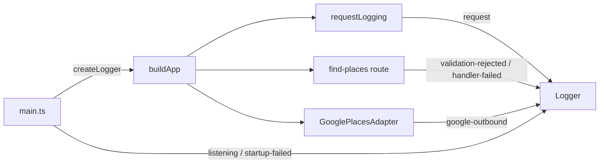

# Richer Named Event Logging - Plan

## Goal Capsule

**Objective:** Make local console logging feel present by emitting a stable set of named events — failures loud, plus request finish, Google outbound, validation rejects, and process lifecycle — with request/response bodies only at `debug` and API keys never logged.

**Product authority:** This plan's Product Contract. Extends the existing logger / request-logging posture; does not redefine Places search product rules beyond making upstream Google non-2xx throw so failure events can fire.

**Open blockers:** None.

**Execution profile:** Prefer extending the existing level-gated console logger and `LOG_LEVEL` / `config.log.level` rather than introducing a new logging product.

**Stop if:** Scope expands into request correlation IDs, external observability/APM, or shipping log aggregation.

---

## Product Contract

**Product Contract preservation:** restructured, no scope change: R3/R4/R5 qualifiers clarified to match settled Zod-only validation and level-gated emission; AE3 Then-clause names both Google and handler failure events. Plan-time HOW defaults confirmed: Google non-2xx must throw for failure events; validation events cover Zod rejects only; shared redaction helper preferred.

### Summary

Richer local console logging as named events: errors loud; request finish, Google outbound, validation rejects, and process lifecycle on the path; bodies only when `LOG_LEVEL=debug`; API keys never.

### Problem Frame

Today the service mostly emits a sparse request-finish `info` line. Caught failures and Google failures often produce no useful logger output, so local debugging feels like there is no logging.

### Actors

- A1. Local developer — runs the service and reads the console to diagnose behavior.
- A2. Google Places API — outbound dependency whose call outcomes should appear as log events (without leaking keys).

### Key Decisions

- **Named event coverage** — stable event names/fields for the full path, not only bolt-on failure logs. (session-settled: user-directed — chosen over failure-only bolt-ons and over correlation-id tracing: full path visibility without extra carrying cost) Governs R1–R6.
- **Full event set in one pass** — request finish, Google outbound, validation/4xx, process lifecycle, and loud errors ship together. (session-settled: user-directed — chosen over errors+Google-only first cut) Governs R1–R6.
- **Bodies at debug only** — request/response detail allowed when `LOG_LEVEL=debug`; default levels stay body-free. (session-settled: user-directed — chosen over always-redacted bodies: local debug needs detail without changing default posture) Governs R7–R8. Supersedes the findplaces plan’s blanket “do not log response bodies” for `debug` only; default and non-debug levels remain body-free per R7 and `AGENTS.md`.
- **Never API keys** — credentials never appear in log output at any level. (session-settled: user-directed — chosen as hard floor alongside debug bodies) Governs R8.
- **Informal success** — no formal verification checklist in this contract; A1 judges by console usefulness. Governs none; see Assumptions.

### Requirements

**Event coverage**
- R1. Every finished HTTP request emits a named request-finish event with method, path, status, and duration (no bodies except per R7).
- R2. Outbound Google Places calls emit named events for start and/or result, and for failure, without including the API key.
- R3. Zod validation rejects on `POST /find-places` emit a named `validation-rejected` event (not global parser/404 middleware).
- R4. Process lifecycle emits named events for successful listen/startup and for fatal startup/process failure (via the logger, not only bare `console.error`), when the configured log level permits emission (not `silent`).
- R5. Caught request/handler failures and upstream/Google failures emit loud `error` (or equivalent severity) named events with enough non-secret context to diagnose locally, when the configured log level permits emission (not `silent`).
- R6. Event names and field shapes are stable enough that A1 can scan the console without guessing ad-hoc message strings.

**Redaction / levels**
- R7. At default/`info` (and other non-`debug` levels), request and response bodies are not logged.
- R8. When `LOG_LEVEL=debug`, request/response bodies may be logged for diagnosis; API keys must never be logged at any level.
- R9. Client-facing error responses stay opaque (no Google error text or secrets in HTTP JSON); detailed failure context belongs in logs, not the response body.

### Key Flows

- F1. Successful request with Google call
  - **Trigger:** A1 issues a valid places search request.
  - **Actors:** A1, A2
  - **Steps:** Validation passes → Google outbound event(s) → success response → request-finish event.
  - **Outcome:** Console shows path events without bodies (unless `debug`).
  - **Covered by:** R1, R2, R6–R8
- F2. Invalid input
  - **Trigger:** Missing/invalid request fields.
  - **Actors:** A1
  - **Steps:** Edge validation rejects → validation/4xx event → request-finish with 4xx status.
  - **Outcome:** Opaque 400 JSON plus a `validation-rejected` log event; no Google call.
  - **Covered by:** R1, R3, R6–R7
- F3. Google / handler failure
  - **Trigger:** Upstream/network/adapter failure during a search.
  - **Actors:** A1, A2
  - **Steps:** Google fails → `google-outbound` failure at error severity → route catch emits `handler-failed` → opaque error response → request-finish with error status.
  - **Outcome:** Console shows both outbound failure and handler-failed; HTTP body stays opaque per R9.
  - **Covered by:** R1, R2, R5, R6, R8–R9
- F4. Fatal startup
  - **Trigger:** Process cannot start (env/listen failure).
  - **Actors:** A1
  - **Steps:** Failure occurs → fatal/error lifecycle event via logger.
  - **Outcome:** Startup failure is visible as a named log event.
  - **Covered by:** R4, R5, R8

### Acceptance Examples

- AE1. Successful search at default level
  - **Covers:** R1, R2, R7
  - **Given:** `LOG_LEVEL` is `info` (or default).
  - **When:** A valid places search completes.
  - **Then:** Console shows request-finish and Google path events; no request/response bodies appear.
- AE2. Validation reject
  - **Covers:** R3, R1
  - **Given:** A request with invalid input.
  - **When:** The edge rejects it.
  - **Then:** A named validation/4xx event appears, and request-finish shows a 4xx status.
- AE3. Upstream failure is loud
  - **Covers:** R5, R9
  - **Given:** Google/adapter fails during a search.
  - **When:** The handler catches the failure.
  - **Then:** A `google-outbound` failure event and a `handler-failed` error event appear with non-secret context; the HTTP JSON remains opaque.
- AE4. Debug bodies without keys
  - **Covers:** R7, R8
  - **Given:** `LOG_LEVEL=debug`.
  - **When:** A request that involves Google runs.
  - **Then:** Bodies may appear in logs; the API key never appears.
- AE5. Fatal startup via logger
  - **Covers:** R4
  - **Given:** The process fails before serving.
  - **When:** Startup aborts.
  - **Then:** A logger-backed fatal/error lifecycle event is emitted (not only an unformatted dump).

### Scope Boundaries

**In scope**
- Named console events for the event set in R1–R5, using existing `LOG_LEVEL` semantics.
- Debug-only bodies; never API keys.
- Making live Google non-2xx throw (so R2/R5 failure events can fire) without changing opaque client JSON.

**Deferred for later**
- Per-request correlation IDs stitching HTTP and Google lines into one id.
- External observability stacks, log shipping, or APM.
- Named events for non-Zod 4xx (malformed JSON body parser, 404).

**Outside this work’s identity**
- Changing Places search product rules beyond the non-2xx throw needed for failure logging.
- Inventing a second logging framework as the default path.

### Dependencies / Assumptions

- Existing `createLogger` + `config.log.level` remain the logging surface.
- Nested `Config` / `loadConfig` from the config refactor must be typecheck-clean (`Config` imported in `build-app.ts`) before or as part of this work.
- Standing `AGENTS.md` rule “do not log request bodies by default” remains true; R7/R8 are the deliberate debug exception. Debug is for local diagnosis; do not share/ship debug logs.
- Prior findplaces “do not log response bodies” constraint is relaxed only at `debug` for HTTP request/response bodies (see Key Decisions); Google response bodies are never logged at any level.
- Success is informal: A1 decides the console is useful; automated tests still guard regressions. The `tests/` tree may need scaffolding from zero if absent.
- Live Google path today is `GooglePlacesAdapter` (direct `fetch` in `src/places/adapters/google.ts`); `GoogleClient` is not on the live `buildApp` path and is out of required touch unless reused.

### Outstanding Questions

**Deferred to Planning** — resolved in Planning Contract KTDs below.

### Sources / Research

- Current logger: `src/composition/logger.ts`
- Current request middleware: `src/shared/logging/request-logging.ts`
- Live Google adapter: `src/places/adapters/google.ts`
- Composition: `src/composition/build-app.ts`, `src/main.ts`
- `AGENTS.md` — do not log request bodies by default
- Prior constraint (superseded at `debug` only): `docs/plans/2026-08-11-002-feat-findplaces-plan.md`

---

## Planning Contract

### Key Technical Decisions

- KTD1. **Event catalog** — Use stable message strings: `request` (finish), `validation-rejected`, `google-outbound`, `handler-failed`, `listening`, `startup-failed`. Severities: `request`/`listening` → info; `validation-rejected` → warn; `google-outbound` success → info, failure → error; `handler-failed`/`startup-failed` → error. Fields: request → `{ method, path, statusCode, durationMs }` (+ optional debug bodies); validation → `{ method, path, statusCode: 400 }` (no raw body at non-debug); google-outbound → `{ path: 'places:searchNearby', outcome: 'success'|'failure', durationMs, status? }` never headers/key; handler-failed → `{ path, message }` via `safeErrorMessage`; startup-failed → `{ message }` opaque (e.g. `config load failed` / `listen failed`), never raw Zod/env dumps. Governs R1–R6.
- KTD2. **Single Google span event** — One `google-outbound` event on completion (success or failure) inside the live adapter; optional `debug`-only start line is not required. (Chosen over start+finish pair for scan simplicity.) Governs R2.
- KTD3. **Shared redaction helper** — Add `src/shared/logging/redact.ts` with a **case-insensitive** denylist covering `apiKey`, `placesApiKey`, `GOOGLE_PLACES_API_KEY`, `X-Goog-Api-Key`, `authorization`, plus common aliases (`key`, `token`, `secret`, `password`, `credential`, `bearer`, `googleApiKey`). Apply to every logger `extra` object and to string fields that may carry secrets (`handler-failed.message`, `startup-failed.message`, debug bodies). Never log Google response bodies at any level. (session-settled: user-approved — chosen over call-site-only discipline) Governs R8.
- KTD4. **Zod-only validation events** — Emit `validation-rejected` only from find-places Zod `safeParse` failure; do not add global 4xx middleware for parser/404 in this pass. (session-settled: user-approved — chosen over all-HTTP-4xx coverage) Governs R3.
- KTD5. **Live Google non-2xx throws** — After `fetch`, if `!response.ok`, throw opaque `Error('google api unavailable')` and emit `google-outbound` with `outcome: 'failure'` and safe `status`. Do not put Google response text in HTTP JSON. (session-settled: user-approved — chosen over logging-only without propagation) Governs R2, R5, R9.
- KTD6. **Logger injection at edges only** — Pass `Logger` into `requestLogging`, `registerPlacesRoutes`, and `GooglePlacesAdapter` from `buildApp` / `main`. Do not inject logger into domain or `PlacesServiceImpl`. Governs hexagonal posture.
- KTD7. **Level gating always wins** — `LOG_LEVEL=silent` suppresses all severities including `error` (existing logger behavior). Tests that assert logs use a capture logger at `info`/`debug`, not `silent`. Governs testability of R5.
- KTD8. **Startup bootstrap logger** — Wrap `main` so config/listen/`buildApp` failures emit `startup-failed` via `createLogger(config.log.level)` when available, else `createLogger('error')` before `process.exit(1)`. Messages stay opaque; never dump full errors that may include env values. Governs R4, AE5.
- KTD9. **safeErrorMessage** — Map known opaque upstream errors to their fixed message; otherwise use a fixed fallback (`handler failed`). Never log stacks, causes, or Google response text. Governs R5, R8, R9.

### Assumptions

- Capture-logger tests are allowed even though Product Contract success is informal.
- Aligning unused `GoogleClient` with the same event/throw behavior is follow-up unless the implementer reuses it in the live path.
- `AGENTS.md` should get a one-line debug-body exception note in the same change.

### High-Level Technical Design

Event emitters stay at inbound HTTP, outbound adapter, and process entry. Domain/service stay logger-free.

### System-Wide Impact

- Developers gain console visibility; HTTP response contracts stay opaque.
- Tests that rely on `LOG_LEVEL=silent` keep quiet console output; new log assertions use injected capture loggers.
- Debug mode may log PII-ish Google/request bodies locally — accepted product trade-off; keys remain forbidden.

---

## Implementation Units

### U1. Event catalog, redaction helper, and request middleware

**Goal:** Stabilize named request-finish events and enable debug-only body logging with key redaction.

**Requirements:** R1, R6, R7, R8 — KTD1, KTD3

**Dependencies:** None

**Files:**
- Modify: `src/composition/logger.ts` (only if needed for debug level introspection; prefer passing `LogLevel` into middleware)
- Modify: `src/shared/logging/request-logging.ts`
- Create: `src/shared/logging/redact.ts`
- Create: `tests/helpers/capture-logger.ts`
- Create: `tests/shared/logging/request-logging.test.ts`
- Create: `tests/shared/logging/redact.test.ts`
- Create: `tests/composition/logger.test.ts` (level gating / silent)

**Approach:**
1. Keep `message` string as the event name; the existing `request` finish event already matches KTD1 — extend it, do not duplicate.
2. Extend `requestLogging(logger, logLevel)` (logger is already wired in `buildApp`); pass `deps.config.log.level`.
3. On `res.finish`, always emit `request` with method/path/statusCode/durationMs.
4. When `logLevel === 'debug'`, wrap `res.json` to capture response payload; include redacted `req.body` and captured response on the finish event. Prefer schema-known fields when available; always run through `redact`.
5. Never log headers wholesale; never log Google response bodies (inbound HTTP response only at debug).
6. Add `tests/helpers/capture-logger.ts` (`createCaptureLogger`) for structured assertions without relying on `console`.
7. If `tests/` is empty, scaffold the tree and vitest imports as part of this unit.

**Patterns to follow:** Existing `requestLogging` + `createLogger` emit shape; composition creates logger outside `buildApp`.

**Test scenarios:**
- Covers AE1 (partial). Capture logger at `info`: finish event has method/path/statusCode/durationMs and no body fields.
- Capture logger at `debug`: bodies present after redact; denylisted keys (including case variants / aliases) stripped.
- Covers AE4 (partial). Redact removes `apiKey` / `X-Goog-Api-Key` / `token` aliases from nested objects.
- `createLogger('silent')` emits nothing for info/error.

**Verification:** Unit tests pass; typecheck clean for touched files.

---

### U2. Route validation and handler failure events

**Goal:** Emit Zod validation and loud handler-failure events while keeping opaque HTTP JSON.

**Requirements:** R3, R5, R6, R9 — KTD1, KTD4, KTD6

**Dependencies:** U1 (logger + catalog conventions)

**Files:**
- Modify: `src/places/adapters/find-places-route.ts`
- Modify: `src/composition/build-app.ts`
- Create: `tests/helpers/capture-logger.ts` (if not created in U1)
- Create or extend: `tests/adapters/http/findplaces.test.ts`

**Approach:**
1. Change `registerPlacesRoutes(app, placesService, logger)`.
2. On Zod failure: `logger.warn('validation-rejected', { method, path, statusCode: 400 })`; return existing 400 JSON.
3. On catch: `logger.error('handler-failed', redact({ path, message: safeErrorMessage(error) }))`; return existing opaque 500 JSON.
4. Wire logger from `buildApp`.
5. HTTP tests use stub injection: `buildApp({ config, logger: capture, placesService: stub })` so live Google key is not required.

**Patterns to follow:** Existing Zod-at-edge + opaque 500; inject logger like middleware.

**Test scenarios:**
- Covers AE2. Invalid body → 400 + capture logger saw `validation-rejected`; request-finish still fires with 400.
- Covers AE3 (partial). Stub `placesService` throws with a message containing a fake API key → 500 opaque body + `handler-failed` with no key in extras.
- Silent logger still produces quiet console in other HTTP tests.

**Verification:** HTTP tests pass with capture logger assertions.

---

### U3. Google outbound events and non-2xx throw

**Goal:** Log Google call outcomes and ensure non-2xx becomes a thrown failure the route can surface as opaque 500 + loud logs.

**Requirements:** R2, R5, R8, R9 — KTD1, KTD2, KTD5, KTD6

**Dependencies:** U2 (route already logs handler failures)

**Files:**
- Modify: `src/places/adapters/google.ts`
- Modify: `src/composition/build-app.ts`
- Create: `tests/places/adapters/google.test.ts` (or `tests/adapters/google/…` mirroring layout)

**Approach:**
1. Accept `logger` (and keep `apiKey`) in `GooglePlacesAdapter` constructor.
2. Change `createLivePlacesService(config, logger)` (or inline in `buildApp`) to pass `deps.logger` into `new GooglePlacesAdapter(apiKey, logger)`.
3. Time the `fetch`; on network throw → emit `google-outbound` at **error** with `{ outcome: 'failure', durationMs, path: 'places:searchNearby' }` then rethrow opaque error.
4. On `!response.ok` → emit failure at **error** with safe `status`, throw opaque error (do not return empty places). Never log Google response body at any level.
5. On success → emit `google-outbound` at **info** with `{ outcome: 'success', durationMs, path: 'places:searchNearby' }`; return places as today.
6. Never log headers or apiKey; at debug, only redacted outbound request fields if logged (not Google responses).

**Patterns to follow:** Opaque `'google api unavailable'` messages; composition-only construction.

**Test scenarios:**
- Mock `fetch` 200 → success event; places returned.
- Mock `fetch` 500 → failure event with status; throws; no key in logger extras.
- Mock network failure → failure event; throws.
- Covers AE3 with adapter unit + route integration (both `google-outbound` failure and `handler-failed`).

**Verification:** Adapter unit tests + find-places failure path still opaque.

---

### U4. Process lifecycle logging and docs note

**Goal:** Logger-backed startup success/failure; document debug-body exception.

**Requirements:** R4, R5, R8 — KTD8

**Dependencies:** U1

**Files:**
- Modify: `src/main.ts`
- Modify: `AGENTS.md` (one-line: bodies allowed only at `LOG_LEVEL=debug`; never keys)
- Optional: `tests/composition/main-startup.test.ts` only if easily testable without brittle process exit; otherwise manual AE5 + thin unit of a extracted `logStartupFailure` helper

**Approach:**
1. Keep successful `listening` event.
2. Replace bare `console.error` in `main().catch` with logger-backed `startup-failed` using opaque messages (never full error dumps that may include env values).
3. Handle pre-logger `loadConfig` failures via `createLogger('error').error('startup-failed', …)`.
4. Ensure `server.on('error')` path reaches the same logging.
5. Ensure `Config` is imported/exported cleanly so typecheck passes with the nested-config surface.

**Test scenarios:**
- Covers AE5. Helper or catch path emits `startup-failed` via logger (spy/capture), not only `console.error`; fake key in error text must not appear in extras.
- Missing live API key during `buildApp` without stub surfaces as startup failure when exercised from main path (or document as covered by catch).

**Verification:** typecheck + tests; AGENTS wording matches R7/R8.

---

## Verification Contract

| Gate | Command / check | Applies to |
|------|-----------------|------------|
| Typecheck | `npm run typecheck` | All units |
| Unit / HTTP tests | `npm test` | U1–U4 |
| Manual console (optional) | `npm run dev` with info then debug | AE1, AE4 informal |

---

## Definition of Done

- [ ] All Implementation Units U1–U4 complete
- [ ] Named events from the catalog appear for request finish, validation reject, Google outbound, handler failure, listening, and startup failure
- [ ] Non-debug levels never log request/response bodies; API keys never appear at any level
- [ ] Google non-2xx throws and yields opaque HTTP error + loud logs
- [ ] `npm run typecheck` and `npm test` pass without a committed `.env`
- [ ] `AGENTS.md` notes the debug-body exception

---

## Appendix

### Confirmed plan-time scoping defaults

- Full brainstorm coverage; extend existing logger; capture-logger tests; no correlation IDs / APM
- Google non-2xx throws so failure events fire
- Zod-only validation events
- Shared redaction helper
