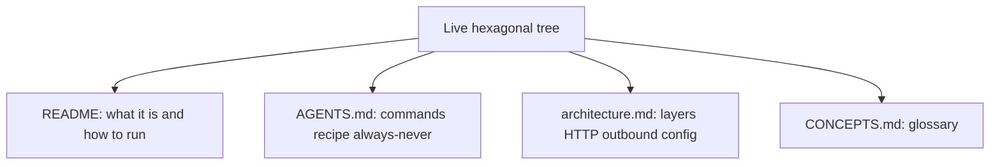
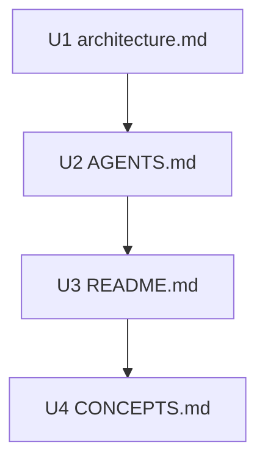

# Living Docs Match Hexagonal Layout - Plan

## Goal Capsule

**Objective:** Align living docs with the live hexagonal layout so humans and coding agents add features as domain / service / adapters slices, not the retired echo / application tree.

**Product authority:** This plan's Product Contract. Historical plans, the Express solutions writeup, and leftover old-tree code are not active scope.

**Open blockers:** None.

**Execution profile:** Docs-only. Correct slice paths and vocabulary. Keep Health as a Google Places connectivity/auth check in prose. Do not document the current HEAD-to-google.com stub. Do not change `.env.example` or delete leftover source. Do not use `npm test` / `typecheck` as proof of this pass.

**Stop if:** Scope expands into rewriting historical plans, documenting the live health stub as the product, changing env var names in code, or deleting leftover echo/old-tree files.

---

## Product Contract

**Product Contract preservation:** unchanged — meaning and stable R/A/F/AE IDs preserved. R7's "what the running app wires" is interpreted by KTD1 as slice paths and composition registration, not as documenting the current health HEAD stub.

### Summary

Living docs for the Places service will match the live hexagonal layout: each function is a slice with domain, service, and adapters. README, AGENTS.md, architecture.md, and CONCEPTS.md each own one job so that story is not copied four times.

### Problem Frame

The running service is already hexagonal slices (health and places). Living docs still teach echo, an application layer, and a generic skeleton. Agents and humans who follow those docs will put new work in the wrong place.

### Key Decisions

- **Living docs only** — historical plans and the solutions writeup stay snapshots. (session-settled: user-directed — chosen over rewriting everything or annotating old plans: agents copy the live contract)
- **Split ownership** — each living doc owns one job and links to the others. (session-settled: user-approved — chosen over patch-in-place and AGENTS-only: stops the next four-file drift) Governs R1, R2, R3, R4, R5.
- **Generic recipe** — domain / service / adapters, with health and places as examples, not one copy-me feature. (session-settled: user-directed — chosen over a single health or places exemplar: both slices are live) Governs R2.
- **Omit echo** — living docs describe only the live tree. (session-settled: user-directed — chosen over a do-not-follow warning and keeping echo until leftover code is deleted: leftover files are out of this pass) Governs R7.
- **Always "service"** — drop "application" from living docs. (session-settled: user-directed — chosen over hexagonal prose names and synonyms: match the live middle-layer name) Governs R6.
- **Hexagonal layout only in CONCEPTS** — no Vertical slice glossary entry; delete Echo vertical. (session-settled: user-directed — chosen over adding Vertical slice or making slice the primary term: one layout name) Governs R4.
- **README is the Places service** — not a generic starter. (session-settled: user-directed — chosen over skeleton framing and structure-only README edits: identity matches the running product) Governs R1.
- **Drop "don't invent Places product behavior"** — agents may extend find-places from existing behavior. (session-settled: user-directed — chosen over keeping or softening that line: this is the Places service) Governs R8.
- **Ask-first / Never stay** — no DB, auth, queues, extra outbound ports, or exposing beyond local use without asking. (session-settled: user-approved — chosen over loosening those rules now: user confirmed the synthesis that kept them) Governs R9.

<!-- ce-section: work-relationships -->
### How This Work Fits Together

This plan owns living-docs alignment with the live hexagonal tree. The broader breakdown below is the current understanding, not a committed roadmap.

- Historical plans under `docs/plans/`
  - Can proceed independently of this plan
  - Stay snapshots of what was true when written
- Leftover old-tree / echo source
  - Can proceed independently of this plan
  - This plan omits those files from living docs rather than deleting them
- Express solutions writeup under `docs/solutions/`
  - Can proceed independently of this plan

### Actors

- A1. Human developer — runs the service from README and adds features from AGENTS.md.
- A2. Coding agent — cold session with only repo files; must add a feature from living docs without recreating the echo / application tree.

### Requirements

**Doc ownership**

- R1. README presents this as the Places service (health + find-places), not a generic starter, and documents how to run it.
- R2. AGENTS.md owns commands, the architecture map, the add-a-feature recipe, and Always / Ask / Never. The recipe describes domain / service / adapters and points at both health and places as examples.
- R3. `docs/architecture.md` owns layers, HTTP surface, outbound adapters, and config, and matches the live tree (health ping lives in the health slice).
- R4. CONCEPTS.md owns glossary only: Hexagonal layout uses domain / service / adapters; Echo vertical is removed; no Vertical slice entry is added; remaining layout entries match the live tree.
- R5. Each living doc states only the facts it owns and links to the others instead of restating their full content.

**Layout and vocabulary**

- R6. Living docs call the middle layer "service" and do not call it "application".
- R7. Living docs omit echo and the leftover old tree. They describe only what the running app wires.

**Product framing**

- R8. AGENTS.md does not tell agents not to invent Places product behavior. Agents may extend find-places from existing behavior.
- R9. Ask-first / Never boundaries remain: persistence, auth, queues, additional outbound ports, and exposing the service beyond local use still require asking first.

### Key Flows

- F1. Add a feature
  - **Trigger:** A1 or A2 needs a new function.
  - **Actors:** A1, A2
  - **Steps:** Read AGENTS.md recipe. Add a named slice with domain, service, and adapters. Register it in composition. Add tests. Do not create a top-level domain or application tree.
  - **Covered by:** R2, R6, R7
- F2. Cold start
  - **Trigger:** A1 wants to run the service.
  - **Actors:** A1
  - **Steps:** Follow README. Call health and find-places. There is no echo endpoint in the documented surface.
  - **Covered by:** R1, R7

### Acceptance Examples

- AE1. After the pass, a reader following AGENTS.md would put a new feature in a named slice with domain / service / adapters, not in a top-level domain or application tree. **Covers R2, R6, R7.**
- AE2. README has no echo endpoint and does not call the project a skeleton or starter. **Covers R1, R7.**
- AE3. CONCEPTS.md has no Echo vertical entry. Hexagonal layout names domain and service. **Covers R4, R6.**
- AE4. architecture.md does not place the Google Places health ping in the places slice. **Covers R3.**
- AE5. AGENTS.md no longer forbids inventing Places product behavior, and still requires asking before persistence, auth, queues, extra outbound ports, or non-local exposure. **Covers R8, R9.**

### Scope Boundaries

**In scope:** AGENTS.md, README.md, `docs/architecture.md`, CONCEPTS.md.

**Deferred for later:**

- Rewriting historical plans
- Updating the Express solutions writeup
- Deleting leftover echo / old-tree source

**Outside this pass:** New product features, new outbound ports, persistence, auth, deploy.

### Dependencies / Assumptions

- The live tree is what composition wires (health and places slices), not leftover files still on disk.
- Leftover echo / old-tree files may remain after this pass. Living docs will not mention them.
- `docs/architecture.md` already describes hexagonal slices in part. This pass still owns remaining mismatches, including the health-ping location.

### Sources / Research

- Live wiring: `src/composition/build-app.ts` registers health and places only.
- Live slices: `src/health/{domain,service,adapters}/`, `src/places/{domain,service,adapters}/`.
- Health ping adapter: `src/health/adapters/google-health.ts` (architecture.md currently lists `src/places/adapters/google-health.ts`).
- Process entry: `src/main.ts` loads config from `src/composition/config.ts` and logger from `src/shared/logging/`.
- Drifted living docs: AGENTS.md (echo recipe, application layer), README.md (echo, skeleton framing). CONCEPTS.md already uses service in Hexagonal layout and has no Echo vertical; remaining glossary drift is the "Skeleton layout" section heading.

---

## Planning Contract

### Key Technical Decisions

- KTD1. **Layout-only Health and config** — Keep Health as a Google Places connectivity/auth check with component detail. Keep `GOOGLE_PLACES_API_KEY` in living-doc config prose. Do not document `HEAD https://www.google.com` or `GOOGLE_API_KEY` / `GOOGLE_BASE_URL`. (session-settled: user-directed — chosen over documenting live runtime: the HEAD stub is incomplete code, not the product) Instantiates R1, R3, R4.
- KTD2. **Correct live composition facts** — Document `buildApp(config, logger)`, adapters constructed in the factory, and the health-ping file under the health slice. Do not invent a `buildApp(deps)` bag. Instantiates R3.
- KTD3. **Keep the shared Google HTTP client on the map** — List `src/shared/client/` as the intended shared client even though it is unwired. Consistent with KTD1. Instantiates R3, R2.
- KTD4. **Recipe cites live slice paths only** — Name `src/<slice>/{domain,service,adapters}/` and both health and places as examples. Do not cite leftover echo/old-tree files. Do not say tests mirror layers. Composition wiring is the live tree. Instantiates R2, R7.
- KTD5. **Drop the missing-Places-docs ignore line** with the invent-behavior ban. Rank living docs plus composition over `docs/solutions/` and historical plans for layout. Instantiates R8.
- KTD6. **Verify by reading the four living files** — Do not use `npm test` or `typecheck` as proof. Leftover tests still fail against live `buildApp`. Instantiates AE1–AE5.

### High-Level Technical Design

Edit order: architecture map first, then the agent recipe, then README identity, then the CONCEPTS heading. Cross-links last so each file only states what it owns (R5).

### Assumptions

- The current health adapter's `HEAD` to google.com is incomplete implementation, not the Health product to document (KTD1).
- `.env.example` stays `GOOGLE_PLACES_API_KEY`. README how-to-run may not match `loadConfig` until a follow-up aligns env names.
- Confirming the scoping synthesis without picking the shared-client fork keeps the intended client on the map (KTD3).

### Implementation constraints

- Touch only the four living docs.
- Living docs win on layout when `docs/solutions/` still says "application".
- Do not add a Vertical slice CONCEPTS entry.
- Ask-first / Never substance stays (R9).

### Sequencing

U1 → U2 → U3 → U4.

---

## Implementation Units

### U1. architecture.md system map

**Goal:** Make architecture.md the layer / HTTP / outbound / config owner, with the health ping in the health slice and live composition signature.

**Requirements:** R3, R5, R6, R7, AE4

**Dependencies:** KTD1, KTD2, KTD3

**Files:**
- Modify: `docs/architecture.md`

**Approach:**
1. Keep hexagonal layers as domain / service / adapters per slice. No "application".
2. Move the Google Places health ping row to `src/health/adapters/google-health.ts`. Keep its role as Place Details connectivity/auth (KTD1). Do not describe HEAD google.com.
3. Document `buildApp(config, logger)` and `loadConfig` → `buildApp` → listen (KTD2).
4. Keep the shared Google HTTP client row at `src/shared/client/client.ts` as intended (KTD3). Keep nearby search at `src/places/adapters/google.ts`.
5. Keep HTTP surface as health + find-places with the intended health body (status plus googlePlaces check). No echo.
6. Keep config prose on `GOOGLE_PLACES_API_KEY` (KTD1). Ban raw `process.env` outside `src/composition/config.ts`.
7. Testing: service/domain unit tests; HTTP via `supertest` through `buildApp(config, logger)`. Do not document leftover stub-injection into a deps bag.
8. Link AGENTS.md for the recipe. Do not paste the numbered recipe here.

**Patterns to follow:** Current `docs/architecture.md` section shape; CONCEPTS Composition root (`buildApp(config, logger)`).

**Execution note:** This is documentation. Prefer a read-through over unit coverage.

**Test scenarios:**
- Covers AE4. Health ping location is the health slice, not the places slice.
- File has no echo endpoint and no layer-name "application".
- File documents `buildApp(config, logger)`, not `buildApp(deps)`.
- File still describes Health as a Google Places check, not HEAD google.com.

**Verification:** Read `docs/architecture.md` against AE4 and KTD1–KTD3.

---

### U2. AGENTS.md harness recipe

**Goal:** Make AGENTS.md the commands / map / recipe / Always-Ask-Never owner so a cold agent adds a named slice, not an echo/application tree.

**Requirements:** R2, R5, R6, R7, R8, R9, AE1, AE5

**Dependencies:** U1, KTD4, KTD5

**Files:**
- Modify: `AGENTS.md`

**Approach:**
1. Drop "Do not invent Places/lead-finder product behavior" and the "ignore missing Places docs" sentence (KTD5, R8).
2. Architecture map: health and places slices, composition, `src/main.ts`, `src/shared/logging/`, intended `src/shared/client/` (KTD3), CONCEPTS.md, `docs/solutions/` as snapshots. Dependency rule: domain and service never import Express.
3. Always: copy domain → service → adapters → `buildApp` → tests. Keep typecheck/test before done, update this file when layout/scripts change, bind locally, do not log request bodies.
4. Ask first and Never: keep substance (R9). Replace "domain or application" with "domain or service". Drop "in this skeleton".
5. Recipe: generic steps under `src/<name>/{domain,service,adapters}/`. Point at both `src/health/` and `src/places/` as examples. Register in `buildApp`. Tests under `tests/<slice>/` plus HTTP via `supertest` and `buildApp(config, logger)`. Do not cite echo paths or leftover `src/domain/`, `src/application/`, `src/adapters/http/`.
6. Boundaries: code + package scripts win; Health remains a live Google Places check (KTD1); no DB/auth/queues/Docker/K8s/runtime LLM.
7. Link `docs/architecture.md` for layers/HTTP/outbound/config. Do not restate that essay.

**Patterns to follow:** Current AGENTS.md section order (Commands, map, Always/Ask/Never, recipe, Boundaries). Express solutions writeup's copy-me path translated to service (read as snapshot, do not copy "application").

**Execution note:** This is documentation. Prefer a read-through over unit coverage.

**Test scenarios:**
- Covers AE1. Recipe would land a new feature in `src/<name>/{domain,service,adapters}/`, not `src/domain/` or `src/application/`.
- Covers AE5. No invent-Places ban. Ask-first/Never still names persistence, auth, queues, extra outbound ports, and non-local exposure.
- No echo, no leftover old-tree paths, no layer-name "application".

**Verification:** Read AGENTS.md against AE1 and AE5.

---

### U3. README Places-service identity

**Goal:** Present the project as the Places service and document how to run health + find-places with no echo.

**Requirements:** R1, R5, R7, AE2

**Dependencies:** U2, KTD1

**Files:**
- Modify: `README.md`

**Approach:**
1. Replace skeleton/starter framing with the Places service (health + find-places).
2. Keep quick start commands. Drop `POST /echo`. Keep health and find-places examples.
3. Keep `GOOGLE_PLACES_API_KEY` in the how-to-run story (KTD1). Do not switch to `GOOGLE_API_KEY`.
4. Docs links: AGENTS.md for adding features; `docs/architecture.md` for layers. Do not paste the recipe.

**Patterns to follow:** Current README section order (title, quick start, docs, scripts).

**Execution note:** This is documentation. Prefer a read-through over unit coverage.

**Test scenarios:**
- Covers AE2. No echo endpoint. Does not call the project a skeleton or starter.
- Health and find-places remain the documented HTTP surface.

**Verification:** Read README.md against AE2.

---

### U4. CONCEPTS.md glossary remainder

**Goal:** Finish glossary alignment: no skeleton heading, no Echo vertical, no Vertical slice entry.

**Requirements:** R4, R6, AE3

**Dependencies:** U3, KTD1

**Files:**
- Modify: `CONCEPTS.md`

**Approach:**
1. Rename `## Skeleton layout` to a non-skeleton heading (e.g. `## Layout`).
2. Confirm Hexagonal layout already says domain and service. Do not add Vertical slice.
3. Keep Health as Google Places connectivity/auth (KTD1). Keep Composition root and Bootstrap logger.
4. Do not restate the AGENTS recipe or architecture HTTP table.

**Patterns to follow:** Existing CONCEPTS entry shape (term, definition, Avoid line).

**Execution note:** This is documentation. Prefer a read-through over unit coverage.

**Test scenarios:**
- Covers AE3. No Echo vertical. Hexagonal layout names domain and service.
- No "skeleton" in the section heading.

**Verification:** Read CONCEPTS.md against AE3.

---

## Verification Contract

Do not treat `npm run typecheck` or `npm test` as gates for this pass. Leftover tests still fail against live `buildApp`.

**Done when all of these hold in the four living files:**

- No `POST /echo` and no echo exemplar paths.
- No layer-name "application".
- No `src/domain/`, `src/application/`, or `src/adapters/http/` as the add-a-feature path.
- Health ping is not listed under `src/places/adapters/google-health.ts`.
- No "invent Places product behavior" ban. Ask-first/Never still present.
- README is not a skeleton/starter.
- CONCEPTS has no Echo vertical and no Skeleton layout heading.
- Health prose is still a Google Places check, not HEAD google.com.

---

## Definition of Done

- U1–U4 complete against their test scenarios and AE1–AE5.
- Each living doc states only the facts it owns and links the others (R5).
- No leftover-code deletion and no historical-plan edits in the diff.
- Abandoned draft wording (echo recipe, application layer, skeleton blurb) is gone from the four files, not left commented.

### Deferred to Follow-Up Work

- Delete leftover echo/old-tree source and tests.
- Align `.env.example` / `loadConfig` env names (`GOOGLE_PLACES_API_KEY` vs `GOOGLE_API_KEY`).
- Implement the documented Google Places health ping (replace HEAD google.com).
- Refresh `docs/solutions/tooling-decisions/express-http-adapter-over-fastify-hexagonal.md` vocabulary.
