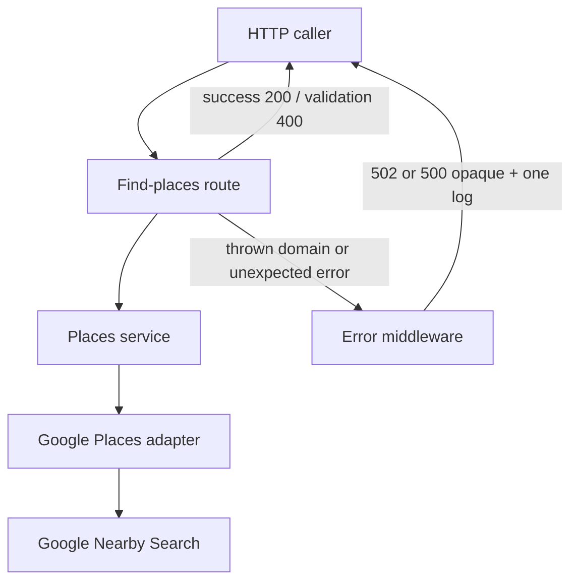
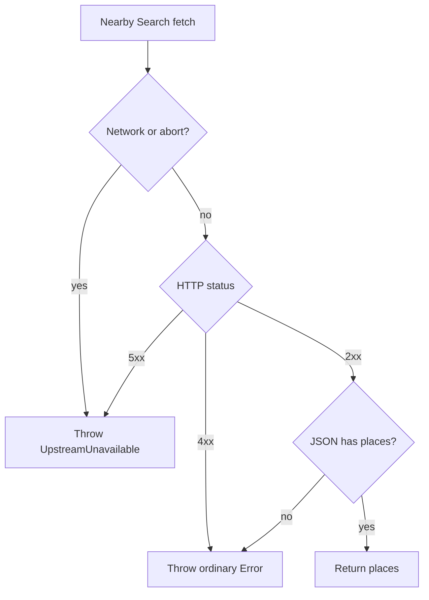
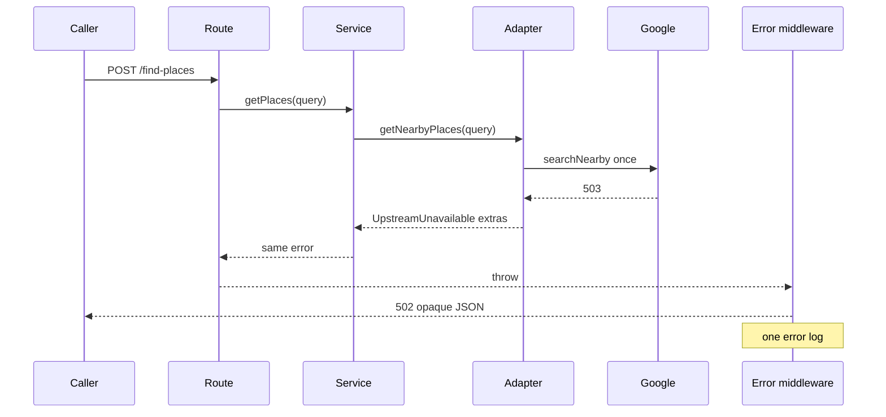

# Upstream Unavailability Handling - Plan

## Goal Capsule

**Objective:** When Google Nearby Search is unavailable (5xx including 503, timeout, or network failure), `POST /find-places` classifies that as upstream unavailability, returns opaque HTTP 502, and logs the failure once.

**Product authority:** This plan's Product Contract. Snapshot plans that split 502/503 or log the same failure in two layers are historical; living docs plus this contract win.

**Open blockers:** None.

**Execution profile:** Hexagonal slice recipe in `AGENTS.md`. HTTP tests through `buildApp(config, logger)` are the contract of record; adapter tests are not a substitute. There is no `tests/` tree yet.

**Stop if:** Scope expands into retries, correlation IDs, a new logging framework, GoogleClient migration, or changing Health's 503 meaning.

---

## Product Contract

### Summary

Places search treats Google 5xx, timeouts, and network failures as one unavailability class. The outbound adapter classifies and throws a domain error. The service passes it through. The HTTP edge maps it to opaque 502 and emits the single failure log. Health stays on its own 503 probe contract.

### Problem Frame

Today a Google 503 is logged in the outbound adapter (including the Google body), wrapped again in the service, logged again in the route, and returned as HTTP 500. Callers cannot tell a dependency outage from a bug. Operators see duplicate lines and leaked upstream bodies. Health already uses 503 for "this process is unhealthy," so echoing Google's 503 on search would collide and invite retries.

### Actors

- A1. Local caller — issues `POST /find-places` and reads the HTTP status plus opaque JSON.
- A2. Google Places Nearby Search (New) — outbound dependency that may return 5xx, stall, or fail the network.

### Key Decisions

- **One unavailability class** — Google 5xx (including 503), timeouts, and network failures are the same product condition. (session-settled: user-approved — chosen over 503-only handling: one client contract for "search dependency is down") Governs R1, R3, R5.
- **Fail immediately** — exactly one Google attempt; no retries. (session-settled: user-approved — chosen over retry-on-503: avoid amplifying an upstream outage) Governs R2.
- **Places search only** — Health's unhealthy/503 meaning stays unchanged. (session-settled: user-approved — chosen over applying the same pattern to health: the probe is a different product signal) Governs R7.
- **Log a failure once** — not a duplicate line in route, service, and adapter. (session-settled: user-approved — chosen over keeping a log line in every layer: unique context should ride on the error, not be re-narrated) Governs R8, R9, R10.

### Requirements

**Classification and HTTP**
- R1. Google Nearby Search 5xx (including 503), request timeout, and network failure are classified as upstream unavailability.
- R2. The search path makes exactly one Google attempt per request and fails immediately on unavailability.
- R3. `POST /find-places` returns HTTP 502 and opaque JSON when the search hits upstream unavailability.
- R4. Client JSON never includes Google error text, Google status, stack traces, or secrets.
- R5. Unexpected failures (bugs, Google 4xx, malformed Google 2xx bodies) return HTTP 500 and the same opaque JSON family as R3; they are not upstream unavailability.
- R6. Zod-invalid caller body still returns HTTP 400 at the HTTP edge with no Google call.
- R7. `GET /health` keeps its current unhealthy mapping and 503 meaning; a find-places 502 must not change it.

**Logging**
- R8. Each find-places failure that reaches the HTTP error path (upstream unavailability or unexpected per R5) emits one error log, not one per layer.
- R9. That log's extras allowlist is `path`, `method`, `durationMs`, `operation`, and `upstreamStatus` when Google returned a status. Extras are only those fields as a plain record. They never include the Google response body, API key, the `Error` object, `message`, `stack`, `cause`, or request/response bodies at default log level.
- R10. The service layer does not log.

### Key Flows

- F1. Successful search
  - **Trigger:** A1 sends a valid body and A2 returns 2xx.
  - **Actors:** A1, A2
  - **Steps:** Zod passes → one Nearby Search → filter empty website → 200 with places.
  - **Outcome:** Success path unchanged; no failure log.
  - **Covered by:** R2
- F2. Invalid input
  - **Trigger:** Missing or out-of-range body fields.
  - **Actors:** A1
  - **Steps:** HTTP edge rejects → 400 JSON → no Google call.
  - **Outcome:** Validation stays in-route; not an exception mapped as 502.
  - **Covered by:** R6
- F3. Upstream unavailability
  - **Trigger:** Valid body; A2 returns 5xx, times out, or the network fails.
  - **Actors:** A1, A2
  - **Steps:** Adapter classifies → domain error propagates through service → HTTP edge maps to 502 opaque JSON and one error log.
  - **Outcome:** Caller sees 502; console shows one failure event with R9 extras.
  - **Covered by:** R1–R4, R8–R10
- F4. Unexpected Google or handler failure
  - **Trigger:** Google 4xx, malformed 2xx body, or a bug after a successful Google call.
  - **Actors:** A1, A2
  - **Steps:** Not classified as unavailability → 500 opaque JSON and one error log.
  - **Outcome:** Distinct from F3 by status code only.
  - **Covered by:** R4, R5, R8–R9
- F5. Health during a search outage
  - **Trigger:** Find-places is returning 502 while A1 also calls `GET /health`.
  - **Actors:** A1
  - **Steps:** Health probe runs as today.
  - **Outcome:** Health still 200 or 503 with its existing JSON; not rewritten as find-places 502.
  - **Covered by:** R7

### Acceptance Examples

- AE1. Google 503, empty body
  - **Covers:** R1, R3, R4, R8, R9
  - **Given:** Nearby Search returns HTTP 503 with an empty body.
  - **When:** A1 sends a valid `POST /find-places`.
  - **Then:** Response is exactly `{ error: 'places search unavailable' }` at 502. One error log includes `upstreamStatus` 503. Fetch was called once.
- AE2. Google 503, non-JSON body
  - **Covers:** R1, R3, R4, R9
  - **Given:** Nearby Search returns HTTP 503 with HTML or JSON that contains a planted secret-like string.
  - **When:** A1 sends a valid search.
  - **Then:** Still 502 with the same opaque body. Classification used the status, not `response.json()`. The planted string appears in neither the client body nor the failure log.
- AE3. Network failure
  - **Covers:** R1, R3, R9
  - **Given:** `fetch` rejects (connection refused / DNS / TypeError).
  - **When:** A1 sends a valid search.
  - **Then:** 502 opaque. Error log has no `upstreamStatus`. Fetch once.
- AE4. Timeout
  - **Covers:** R1, R2, R3
  - **Given:** Google does not respond before the adapter abort.
  - **When:** A1 sends a valid search.
  - **Then:** 502 opaque. No retry. Fetch once.
- AE5. Google 400
  - **Covers:** R5
  - **Given:** Nearby Search returns HTTP 400.
  - **When:** A1 sends a valid search.
  - **Then:** 500 opaque, not 502.
- AE6. Invalid body
  - **Covers:** R6
  - **Given:** Body fails Zod.
  - **When:** A1 posts it.
  - **Then:** 400. No Google call. No unavailability log.
- AE7. Health unchanged
  - **Covers:** R7
  - **Given:** Find-places unavailability handling is in place.
  - **When:** A1 calls `GET /health` and the current health adapter fails.
  - **Then:** Health still returns 503 with today's health JSON shape, not find-places 502.

### Scope Boundaries

**In scope**
- Find-places domain error, adapter classification, service pass-through, inbound HTTP mapping, and single-owner failure logging.
- Adapter-local abort timeout on the live Nearby Search `fetch`.
- First `tests/places/` coverage for this contract.
- Living-doc updates so the 502 mapping and error-middleware pattern replace snapshot recipes.

**Deferred for later**
- Retries, backoff, or circuit breaking.
- Per-request correlation IDs.
- Migrating `GooglePlacesAdapter` onto `GoogleClient`.
- Splitting timeouts to HTTP 504.
- Mapping Google 429/403 to distinct client statuses.
- Extracting an outbound port so the service no longer imports the concrete adapter.
- Named-event rename pass from the richer-logging snapshot.

**Outside this product's identity**
- Changing Health's meaning of unavailable or its 503 mapping.
- A second logging framework, log shipping, or APM.
- Auth, persistence, or exposing the service beyond local use.

### Dependencies / Assumptions

- Living docs plus `buildApp(config, logger)` win over snapshot plans (`docs/plans/2026-08-12-002-feat-richer-named-event-logging-plan.md` dual `google-outbound` + `handler-failed`; find-places snapshot 502/503 split).
- `GoogleClient` stays unwired. Timeout is added on the live adapter `fetch`.
- Opaque client body stays `{ error: 'places search unavailable' }` for both 502 and 500. Callers distinguish via status.
- Success-path Google `info` log on the adapter may remain. This plan only removes the duplicate *failure* log.
- Validation `warn` stays in-route. It is not the same failure as F3.

---

## Planning Contract

### Key Technical Decisions

- KTD1. **Typed `UpstreamUnavailable` in places domain** — Error subclass with extras `operation`, `durationMs`, and optional `upstreamStatus`. No Express types. No `status` / `statusCode` fields (Express 5 default handler copies those onto the response). `message` and `cause` are fixed opaque strings, never Google body or text. Governs the R1 classification shape for implementers.
- KTD2. **Service pass-through** — Remove `catch` that wraps `new Error('places search failed', { cause })`. That wrap breaks `instanceof` at the HTTP edge. Filter logic stays. Cites R10.
- KTD3. **Classify from status; never read the Google error body** — On `!ok`, use `response.status` only. 5xx → `UpstreamUnavailable`. 4xx → ordinary Error with an opaque message (R5). Empty or non-JSON 503 must still be R1, not a parse throw. Stop logging `body`. Do not put Google text on the thrown error either.
- KTD4. **Inbound error middleware is the failure-log owner** — Adapter attaches extras on the error and does not log failures. Middleware logs once with R9 allowlisted fields as a plain `Record<string, unknown>`. Log-once does not itself require middleware over an in-route catch; middleware is the owner because KTD6 removes the route catch. (session-settled: user-approved — chosen over logging every layer: extras ride on the error so one line has both request and upstream context) Instantiates the log-once Key Decision. Cites R8, R9, R10.
- KTD5. **502 for unavailability, 500 for unexpected, 400 for validation** — RFC 9110 §15.6.3: this server is a gateway to Google. 503 stays Health-only (Retry-After / instance-down signal). 500 stays bugs. Do not echo Google's status to callers. Cites R3, R5, R6, R7.
- KTD6. **Express 5 four-arg middleware registered last in `buildApp`** — Last registration makes this the app-wide error sink, including `express.json` parse failures (those become 500 with the same opaque body, not 400 and not 502). Zod 400 stays in-route. Guard `res.headersSent`. Chosen over keeping only the in-route `try/catch` (removing that catch without middleware leaves Express 5's default handler, which writes `err.stack`). Chosen over a new shared HTTP error framework (only places has `UpstreamUnavailable` now). Cites R4.
- KTD7. **Adapter-local 10s `AbortSignal`** — Live `GooglePlacesAdapter` has no timeout today, so "timeout" never fires and requests hang. 10s is a hard upper bound for one Nearby Search, not a measured SLO (health's intended client uses 3s on GET only). Chosen over a service- or route-level timeout (wrong layer). Wiring `GoogleClient.post` stays deferred, not rejected for hexagonal reasons. Abort maps to `UpstreamUnavailable` without `upstreamStatus`. Cites R1, R2.

### High-Level Technical Design

Layer ownership:

Classification:

503 sequence:

### Implementation constraints

- Domain and service stay free of Express and `fetch` types.
- Logger extra is `Record<string, unknown>` only. No callbacks or arrays.
- Tests must not need a real Google key or committed `.env`.
- Do not add `placesService` stub injection to `buildApp`. HTTP tests stub global `fetch` and URL-route Nearby Search vs health `HEAD https://www.google.com`.

### Sequencing

U1 (domain error + service pass-through) before U2 (adapter throws it) before U3 (middleware maps it). U4 updates living docs after the mapping exists. HTTP tests in U3 prove the full contract.

---

## Implementation Units

### U1. Domain error and service pass-through

**Goal:** Introduce `UpstreamUnavailable` and stop the service from wrapping it.

**Requirements:** R1, R10

**Dependencies:** None

**Files:**
- Create `src/places/domain/errors.ts`
- Modify `src/places/service/places-service.ts`
- Create `tests/places/places-service.test.ts`

**Approach:**
1. Add the Error subclass per KTD1.
2. Remove the service `catch` wrap per KTD2. Re-throw the original error.
3. Keep website filtering on the success path.

**Patterns to follow:** Domain types in `src/places/domain/` with no framework imports. Service depends on the existing adapter constructor argument (do not extract an outbound port in this unit).

**Test scenarios:**
- Adapter throws `UpstreamUnavailable` → `getPlaces` rejects with the same instance (`instanceof` still true).
- Adapter throws ordinary `Error` → `getPlaces` rejects with that same error, not a wrapped `'places search failed'`.
- Adapter returns places including one with `websiteUri` → filtered list excludes it.

**Verification:** Service tests fail until the wrap is gone. Typecheck clean for the new domain module.

---

### U2. Adapter classification, timeout, and silent failure path

**Goal:** Live Nearby Search `fetch` classifies unavailability, aborts after 10s, and does not log failures or Google bodies.

**Requirements:** R1, R2, R9

**Dependencies:** U1

**Files:**
- Modify `src/places/adapters/google.ts`
- Create `tests/places/google-adapter.test.ts`

**Approach:**
1. Abort the request after 10s per KTD7 (`AbortSignal.timeout` is available on Node 22).
2. On `!ok`, classify from `response.status` only per KTD3. Do not call `response.json()` on the error path.
3. Throw `UpstreamUnavailable` for 5xx, abort, and network failure. Throw ordinary `Error` for 4xx. Both messages are fixed opaque strings per KTD1/KTD3.
4. Remove the failure `logger.error`. Keep the success `info` duration log.
5. Attach extras on the thrown error: `operation` (Nearby Search), `durationMs`, `upstreamStatus` only when Google returned a status. Never `status`/`statusCode`. Never Google text on `message` or `cause`.

**Execution note:** Mock `fetch` in unit tests. Do not require `buildApp` here.

**Patterns to follow:** Current adapter request body and field mask. Logger extra as a plain record on the *success* path only.

**Test scenarios:**
- Covers AE1. Fetch resolves 503 with empty body → throws `UpstreamUnavailable` with `upstreamStatus` 503. Logger `error` not called. Fetch once.
- Covers AE2. Fetch resolves 503 with non-JSON text containing a planted string → same typed throw. Planted string is not on `message` or `cause`. No parse throw.
- Covers AE3. Fetch rejects → `UpstreamUnavailable` without `upstreamStatus`. Fetch once.
- Abort after timeout → `UpstreamUnavailable` without `upstreamStatus`. Fetch once. Prefer fake timers over a real 10s wait.
- Fetch resolves 400 → ordinary Error, not `UpstreamUnavailable`. Opaque message, no Google body.
- Fetch resolves 200 with `places` → returns places; `info` success log still fires.
- Failure extras never include `body`, `status`, `statusCode`, or the API key. Logger `error` not called.

**Verification:** Adapter tests cover 5xx, 4xx, network, and abort. No Google body in logger calls.

---

### U3. Inbound mapping and single log

**Goal:** Route lets service errors throw. `buildApp` registers error middleware that maps per KTD5 and logs once per KTD4.

**Requirements:** R3, R4, R5, R6, R7, R8, R9

**Dependencies:** U1, U2

**Files:**
- Create `src/places/adapters/http-error.ts`
- Modify `src/places/adapters/find-places-route.ts`
- Modify `src/composition/build-app.ts`
- Create `tests/places/find-places-http.test.ts`

**Approach:**
1. Remove the route `try/catch` that logged and returned 500. Keep Zod 400 in-route with the existing validation warn.
2. Add a four-arg Express handler per KTD6. Register it last in `buildApp`.
3. Log extras as the R9 allowlist only. Do not pass the raw `Error` object.
4. HTTP tests: `loadConfig` with a full google env object (including a distinctive fake API key and `GOOGLE_BASE_URL`). Stub global `fetch` and URL-route it: Nearby Search vs health `HEAD https://www.google.com`. Spy the injected logger. No `placesService` stub on `buildApp`.

**Execution note:** Start with a failing HTTP test for Google 503 → 502 before moving the catch into middleware.

**Patterns to follow:** `buildApp(config, logger)` as the only registration path. HTTP tests via `supertest`. Health routes stay registered as today.

**Test scenarios:**
- Covers AE1. Mock Nearby Search 503 empty body → HTTP 502, body exactly `{ error: 'places search unavailable' }`, one `error` log with `upstreamStatus` 503, fetch once for Nearby Search.
- Covers AE5. Mock Nearby Search 400 with planted Google JSON → 500 with the same exact opaque body, not 502. Planted JSON and fake API key absent from response and from stringified `logger.error` args.
- Covers AE6. Invalid body → 400, fetch not called.
- Covers AE7. `GET /health` with today's failing health adapter still 503 and live `{ status: 'unhealthy' }` (not architecture's aspirational `checks.googlePlaces` shape).
- Mock `fetch` reject on Nearby Search → 502, log without `upstreamStatus`.
- Malformed JSON body to `POST /find-places` → 500 opaque (global sink per KTD6), not 502 and not the Zod 400 message.
- Google 503 → response status 502, never 503. `NODE_ENV` unset/development: response has no stack frames and no `stack` field.
- Logger `error` extras keys ⊆ `{ path, method, durationMs, operation, upstreamStatus }`. No `error`/`err`/`stack`/`cause`/`message`/`body`. Called once on the F3 path and once on the AE5/F4 500 path.

**Verification:** `npm test` covers the HTTP contract. `GET /health` assertions match current health behavior, not the aspirational architecture snippet.

---

### U4. Living docs for the mapping

**Goal:** `AGENTS.md` and `docs/architecture.md` describe 400 / 502 / 500 at the HTTP edge.

**Requirements:** R3, R5, R6, R7

**Dependencies:** U3

**Files:**
- Modify `AGENTS.md`
- Modify `docs/architecture.md`

**Approach:**
1. Replace “map errors to 4xx” as the only HTTP-edge rule with domain-error mapping: 400 validation, 502 unavailability, 500 unexpected.
2. Do not rewrite health’s live JSON or probe into the aspirational Place Details shape while doing that.

**Test expectation:** none -- living-doc alignment only.

**Verification:** Docs name 502 for find-places unavailability and keep Health’s 503 as a separate probe contract.

---

## Verification Contract

| Gate | Command / signal | Proves |
|------|------------------|--------|
| Typecheck | `npm run typecheck` | Domain error and middleware types compile without Express in domain/service. |
| Tests | `npm test` | U1–U3 scenarios, including AE1–AE7. |
| Env | Tests pass without a committed `.env` or live Google key | Fetch is mocked. |
| Health non-interference | HTTP test for `GET /health` | R7 / AE7 against live health JSON. |
| Log once | HTTP tests spy on `logger.error` | R8 on the F3 path; extras match R9. |
| Docs | U4 file review | `AGENTS.md` and `docs/architecture.md` name 502 vs health 503. |

No `release:validate` in this repo.

---

## Definition of Done

- F3 returns 502 opaque JSON. F4 returns 500 opaque JSON. F2 stays 400. F5 health is unchanged.
- `UpstreamUnavailable` survives the service. Adapter does not log failures or Google bodies.
- Error middleware is the single failure-log owner. Default Express stack is not written to the client on these paths.
- `AGENTS.md` and `docs/architecture.md` describe the mapping (U4). `CONCEPTS.md` already defines upstream unavailability.
- Abandoned experiments (extra wrappers, retries, GoogleClient wiring) are not left in the diff.
- `npm run typecheck` and `npm test` pass.

**Per unit:** U1 pass-through proven. U2 classification and timeout proven. U3 HTTP contract proven. U4 living docs name 502 vs health 503.

---

## System-Wide Impact

Callers of `POST /find-places` that treated every Google failure as HTTP 500 will see 502 for classified unavailability. Monitoring that alerts on 500-only will miss outages until it includes 502. Failure log volume drops from two lines to one.

KTD6's last-in-`buildApp` handler is the app-wide error sink. `express.json` syntax/entity-too-large errors become 500 with the places opaque body, not Zod 400 and not 502. Removing the route catch without that middleware would expose Express 5's default stack dump. Health's intentional 200/503 path does not throw, so it still avoids the sink; only an unexpected health throw would inherit the places opaque 500 copy.

The 10s abort closes in-flight Nearby Search hangs only. It is not a whole-request Express timeout. Until a later `GoogleClient` migration, GET health-path timeout (3s on the unwired client) and this 10s adapter abort can drift.

---

## Risks & Dependencies

- **Callers keyed to 500** — Mitigate by keeping the same opaque body and documenting 502 in architecture (U4).
- **10s timeout too aggressive** — Mitigate with adapter tests using fake timers; tune only if implementation shows false 502s. Do not add config in this change.
- **Snapshot dual-logging recipes** — Living docs plus this plan override `docs/plans/2026-08-12-002-feat-richer-named-event-logging-plan.md` F3/AE3. Do not re-add `handler-failed` plus adapter failure for the same event.
- **Empty 503 body** — KTD3 exists because today's `response.json()` on `!ok` would mis-classify those as 500.
- **Google text on `Error.message` / `cause`** — Mitigate with KTD1/KTD3 opaque strings and U2/U3 planted-string fixtures.
- **Express default handler fail-open** — If middleware is missing, not last, or `headersSent` delegates to `next(err)`, clients get stack in non-production. Mitigate with U3 under development `NODE_ENV`.
- **`status` / `statusCode` on the domain error** — Express would echo Google 503 to callers. Mitigate with KTD1 and U3 asserting HTTP 502.
- **Raw `Error` in logger extras** — `JSON.stringify` is lossy today; a later logger could dump `stack`/`cause`. Mitigate with R9 allowlist and U3 extras assertions.
- **App-wide places copy on non-places errors** — Accept for this change (KTD6). Do not invent a shared mapper yet.

---

## Sources & Research

External research was load-bearing for KTD4, KTD5, and KTD6.

- RFC 9110 §15.6.3 / §15.6.4 — 502 (gateway got an unusable upstream result) vs 503 (this server cannot handle the request).
- [Express 5 error handling](https://expressjs.com/en/guide/error-handling.html) — async throws forward to four-arg middleware; default handler writes `err.stack` and copies `err.status`.
- [Express 5 migration](https://expressjs.com/en/guide/migrating-5/) — rejected promises become `next(err)`.
- Zalando RESTful guidelines — 502 for unexpected inbound results; 503 implies clients may retry.
- OWASP Logging Cheat Sheet — no secrets or sensitive bodies in logs.
- Live path: `src/places/adapters/google.ts`, `src/places/service/places-service.ts`, `src/places/adapters/find-places-route.ts`, `src/composition/build-app.ts`.
- Layout: `AGENTS.md`, `docs/architecture.md`, `CONCEPTS.md`.
- Learnings: `docs/solutions/documentation-gaps/living-docs-hexagonal-slices.md`, `docs/solutions/tooling-decisions/express-http-adapter-over-fastify-hexagonal.md`, `docs/solutions/developer-experience/config-load-error-logging.md`.
- Snapshot conflict (do not follow): `docs/plans/2026-08-12-002-feat-richer-named-event-logging-plan.md` dual failure events.

A dedicated framework-docs researcher pass aborted; Express 5 behavior was taken from the official error-handling and migration guides instead.
