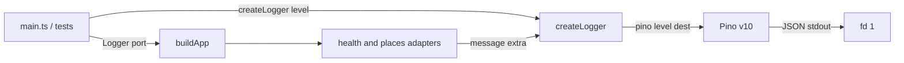
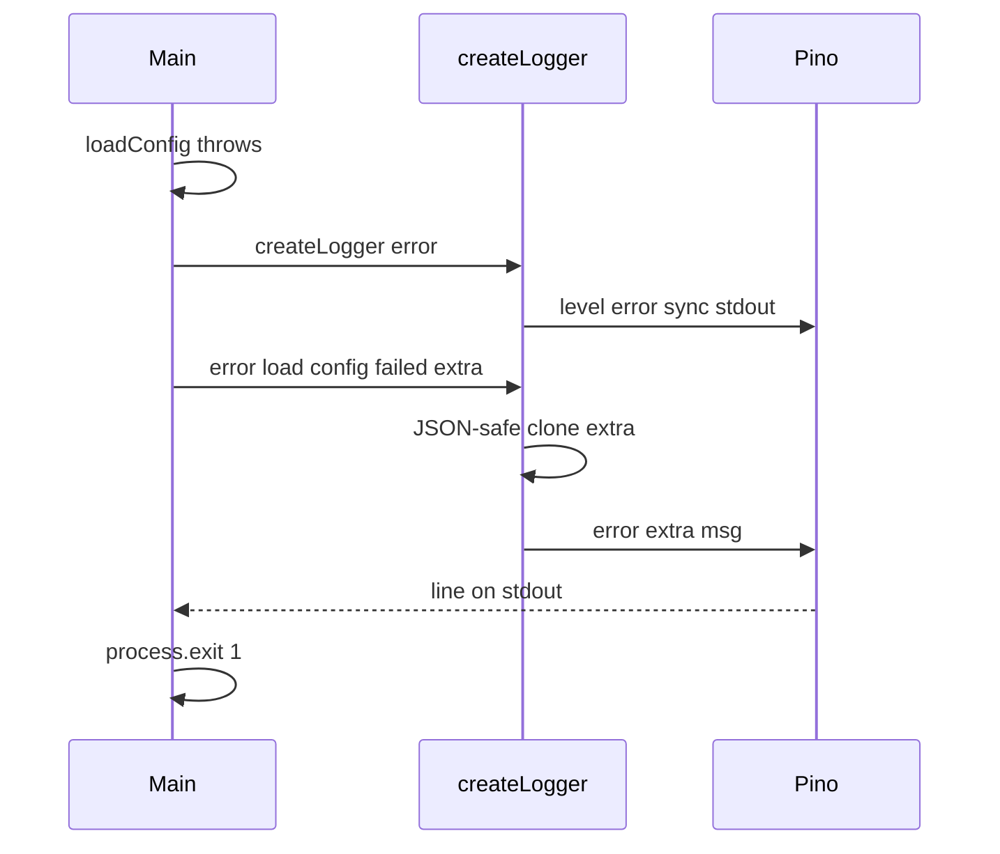

# Replace Home-Grown Logger with Pino - Plan

## Goal Capsule

**Objective:** Use Pino as the process log sink while keeping the existing `Logger` port, production `createLogger(level)`, composition injection, and adapter call-site messages. HTTP status mapping and domain/service behavior stay unchanged. Log line format becomes Pino JSON.

**Product authority:** This plan's Product Contract. Living docs plus `src/composition/build-app.ts` win over snapshot plans, including `docs/plans/2026-08-12-002-feat-richer-named-event-logging-plan.md` (named events, debug bodies, "prefer the console logger").

**Open blockers:** None.

**Execution profile:** Hexagonal slice recipe in `AGENTS.md`. Pino stays inside `src/shared/logging/`. Callers still create the logger and pass it into `buildApp(config, logger)`. Prove the wrapper with `tests/shared/logging/` plus `npm run typecheck` and `npm test`.

**Stop if:** Scope expands into `pino-http`, pretty-print, Fastify, named-event catalogs, request-body logging, domain/service logging, or changing which events fire.

---

## Product Contract

### Summary

Replace the home-grown `console` + `JSON.stringify` emitter with Pino, behind the same message-first `Logger` type. Operators see JSON lines instead of `level: message {…}` text. Developers keep injecting a `Logger` into adapters. Business logic, HTTP contracts, and log *events* (method + message + extra keys) stay as they are in the live tree.

**Product Contract preservation:** Product Contract created in this bootstrap (no upstream brainstorm).

### Problem Frame

`src/shared/logging/logger.ts` implements levels, silent gating, and extras by hand. The team wants Pino for JSON logs and a maintained sink without rewriting slices or inventing a second logging API. Pino's native call shape is object-first (`info(obj, msg)`); the live port is message-first (`info(message, extra?)`). A raw `pino.Logger` on `buildApp` would force every call site to change and would drop extras passed as a second argument.

### Actors

- A1. Local operator — runs the process and reads logs on stdout.
- A2. Developer / tests — constructs `createLogger` and passes `Logger` into `buildApp`.

### Key Decisions

- **Pino as the sink** — Pino v10 is the emitter inside `createLogger`. Chosen over keeping the custom `emit` implementation. Governs R1, R5.
- **Keep the Logger port** — Adapters and `main.ts` keep `(message, extra?)`. Chosen over typing those modules as `pino.Logger`. Governs R1, R2.
- **Same events, new envelope** — Method, message string, and extra *keys* stay; line shape becomes Pino JSON. Governs R2, R6.
- **No HTTP access logs** — (session-settled: user-approved — chosen over adding request access logs: this swap is the process logger only) Governs R7.
- **JSON, not pretty-print** — (session-settled: user-approved — chosen over a local pretty transport: operators read Pino JSON) Governs R6.

### Requirements

**Port and call sites**
- R1. Production `createLogger` still takes a `LogLevel` and returns the existing four-method `Logger` type (`info`, `warn`, `error`, `debug`), each `(message: string, extra?: Record<string, unknown>) => void`. An optional last `Writable` is allowed as a test-only destination seam and is omitted in `src/main.ts`.
- R2. Live call sites keep their current method, message string, and extra keys. Do not rename to the unimplemented named-event catalog (`validation-rejected`, `startup-failed` as a code, and so on).
- R3. Domain and service modules still do not import the logger. `buildApp(config, logger)` still receives the logger from the caller.

**Levels and bootstrap**
- R4. `LOG_LEVEL` / `LogLevel` values stay `fatal | error | warn | info | debug | trace | silent`. `silent` suppresses all four methods, including `error`. `fatal` as the min level still emits nothing from those four methods (same as today's rank table).
- R5. When `loadConfig()` throws, `src/main.ts` still uses `createLogger('error')` then logs `'load config failed'` with `{ error: message string }` then `process.exit(1)`. That line must actually appear before exit (Pino's default async destination is not enough by itself).

**Format and safety**
- R6. Emitted lines are Pino JSON (`msg` holds the message string). Extra fields that JSON can represent ride on the merging object. The wrapper must not throw when extras contain `Error` or a Fetch body stream (today `JSON.stringify` yields `{}` and does not throw).
- R7. Do not log request bodies. Do not add request/response serializers or access-log middleware.
- R8. HTTP status codes, response bodies, and Google call behavior stay unchanged.

### Key Flows

- F1. Config load fails
  - **Trigger:** Invalid or missing env; `loadConfig()` throws.
  - **Actors:** A1
  - **Steps:** Bootstrap `createLogger('error')` → `'load config failed'` → `process.exit(1)`.
  - **Outcome:** One JSON error line is visible; configured `LOG_LEVEL` is not used.
  - **Covered by:** R5, R6
- F2. Process listens
  - **Trigger:** Valid config and successful `listen`.
  - **Actors:** A1
  - **Steps:** `createLogger(config.log.level)` → `buildApp` → `'listening'` with `{ port }`.
  - **Outcome:** JSON info line; app serves.
  - **Covered by:** R1, R3
- F3. Bind fails
  - **Trigger:** `listen` `'error'` (for example `EADDRINUSE`).
  - **Actors:** A1
  - **Steps:** Configured logger `'startup failed'` with `{ reason: error }` → reject → `process.exit(1)`.
  - **Outcome:** The error line is not dropped by process exit.
  - **Covered by:** R5, R6
- F4. Feature logs
  - **Trigger:** `GET /health` or `POST /find-places`.
  - **Actors:** A1, A2
  - **Steps:** Existing adapter/route logs fire with the same messages and extra keys as today.
  - **Outcome:** HTTP behavior unchanged; log envelope is Pino JSON.
  - **Covered by:** R2, R8
- F5. Silent logger
  - **Trigger:** `createLogger('silent')` or `LOG_LEVEL=silent` after a successful load.
  - **Actors:** A2
  - **Steps:** Any of the four methods may be called.
  - **Outcome:** No lines written.
  - **Covered by:** R4

### Acceptance Examples

- AE1. Config missing required Google env. Process exits 1. Stdout contains one JSON object whose `msg` is `load config failed` and whose `error` field is the joined Zod message string. Covers F1 / R5.
- AE2. `createLogger('silent').error('x')` writes nothing. Covers F5 / R4.
- AE3. `createLogger('error').info('listening', { port: 3000 })` writes nothing; `.error('startup failed', { reason: 'busy' })` writes a JSON line with `msg` `startup failed`. Covers R4.
- AE4. `createLogger('info').error('google request failed', { status: 500, error: {} })` writes JSON with those extra keys and does not throw. Covers R6.
- AE5. Health and find-places HTTP status/body contracts are unchanged (no adapter/route edits required for the happy path of this plan). Covers F4 / R8.

### Success Criteria

- `pino` is a runtime dependency; `@types/pino` is not added.
- `Logger` / `createLogger` remain the only logging types adapters import.
- `npm run typecheck` and `npm test` pass.
- Bootstrap and listen-failure logs survive `process.exit(1)`.

### Scope Boundaries

**In scope**
- `src/shared/logging/logger.ts` sink swap
- `pino` in `package.json` / lockfile
- Wrapper tests under `tests/shared/logging/`
- Living-doc sentences that currently describe `console.*` / `JSON.stringify` / stderr-only errors

**Out of scope**
- `pino-http`, `pino-pretty`, worker transports
- New log events or the 2026-08-12 named-event catalog
- Request-body logging or a redaction helper
- Fastify
- Changing HTTP handlers, Google mapping, or domain/service code
- Splitting error lines to stderr via `pino.multistream` (Pino default is all-stdout)

### Deferred to Follow-Up Work

- Optional `destination` pretty transport for local humans
- Child loggers with stable `component` bindings
- HTTP tests through `buildApp` once a `tests/` tree exists for slices (this plan only adds logger unit tests)
- Remapping extras keys `error` / `reason` onto Pino's `err` serializer

---

## Planning Contract

### Key Technical Decisions

- KTD1. **Pino v10 as the only new runtime logging dependency** — Install `pino@^10` (current line 10.3.x; v10 drops Node 18, which this repo already requires `>=22`). Types ship in the package. Do not add `@types/pino` (stub since v7; conflicts). Pino is not deprecated. Instantiates R1, R5.
- KTD2. **Thin wrapper, not `pino.Logger` on the port** — Inside `createLogger`, construct Pino and map `logger.info(message, extra)` → `pino.info(extra ?? {}, message)` (and the same for warn/error/debug). Adapters keep importing `Logger` from `src/shared/logging/logger.ts`. Rejected: returning `pino.Logger` (object-first calls drop extras; exposes `child`/`flush`). Rejected: `hooks.logMethod` on an exported Pino instance (argument order can flip, but the type still leaks Pino). Instantiates R1, R2. (Directive "use Pino" was pressure-tested: wrapping is feasible; replacing the port is not compatible with "keep the same structure.")
- KTD3. **Sync stdout destination** — Create Pino with a destination to fd 1 and `sync: true` so `'load config failed'` and `'startup failed'` are not lost on `process.exit(1)`. Rejected: `flush` on the port or in `src/main.ts` (changes call sites). Rejected: bootstrap via Pino `fatal` (new method). All levels go to stdout. Instantiates R5, R6. (session-settled: user-approved — JSON-only local output, no pretty transport)
- KTD4. **JSON-safe extras clone** — Before calling Pino, clone `extra` with `JSON.parse(JSON.stringify(extra))` when present; if stringify throws, pass `{}`. Rejected: passing extras through raw (stream/`Error` can throw on the Google `!ok` path and change HTTP mapping). Rejected for this plan: remapping `error`/`reason` onto Pino `err` (changes extra keys). Instantiates R6.
- KTD5. **Pass `level` through 1:1 including `silent`** — Pino's `silent` disables all methods. Do not implement `logger.silent()` as a log method. Do not add `fatal`/`trace` methods on `Logger`. Instantiates R4.
- KTD6. **Test seam: optional destination** — `createLogger(level, destination?)` matches `loadConfig(env?)`: production omits the last I/O override. Type that argument as Node `Writable` (or a local alias in `logger.ts`), not `pino.DestinationStream`. Tests parse NDJSON from the buffer. Do not spy `console.*`. Instantiates AE2–AE4.
- KTD7. **Pino JSON defaults for the envelope** — Keep Pino `base` (pid, hostname), numeric `level`, `time`, and `msg`. Do not add `formatters.level` or strip `base` unless typecheck or tests force it. Instantiates R6.
- KTD8. **Named ESM import** — Prefer `import { pino } from 'pino'` under `moduleResolution: NodeNext`. If `tsc` rejects it, fall back to the default export; do not add `createRequire` unless both fail. Instantiates R1.

### Assumptions

- Snapshot plan "prefer the existing console logger; do not invent a second logging framework" is superseded for the *sink*; the *port* and bootstrap logger concept remain living.
- Working-tree `google.ts` logging `response.body` (a stream) stays as-is; the wrapper's JSON clone is the mitigation, not an adapter edit.
- Empty `tests/` today: adding `tests/shared/logging/` is in scope; slice HTTP tests are not.

### High-Level Technical Design

Pino never leaves the logging module. Composition and adapters keep today's types.

Bootstrap (must remain visible after exit):

### System-Wide Impact

Pino may be imported only in `src/shared/logging/logger.ts`. `buildApp`, adapters, `config.ts`, and tests import `Logger` / `createLogger` only.

`buildApp(config, logger)` keeps injecting the same port into `GooglePlacesHealthAdapter`, `GooglePlacesAdapter`, `registerHealthRoutes`, and `registerPlacesRoutes`. Domain and service stay logger-free. The optional destination is a factory argument only — not a `buildApp` or `Config` field.

If the sink throws, find-places never reaches status mapping (`google.ts` logs `response.body` then classifies; the route logs `{ error }` then rethrows). Extras cloning (KTD4) is a request-path invariant. Operators who used to see errors on stderr now see all JSON on stdout (KTD3); CONCEPTS must say so (U3).

### Implementation Constraints

- Do not import Express or Pino from `domain` or `service`.
- Do not log request bodies.
- Bind locally remains `HOST=127.0.0.1`; unrelated to this swap.
- Update `AGENTS.md` only if layout or scripts change (they should not).

### Sequencing

U1 (dependency, wrapper, and logger tests) then U3 (living docs that currently describe `console` / stringify / stderr).

### Risks and Dependencies

- **Lost bootstrap line** — Mitigate with KTD3 (`sync: true`).
- **Logger throws on Google extras** — Mitigate with KTD4 so HTTP mapping (R8) cannot become an unhandled 500.
- **Pino type leak** — Destination typed as `Writable`; `LogLevel` stays the local union, not Pino's. Typecheck will not catch `import { pino }` in an adapter that still uses `Logger` — forbid that import in U1.
- **CJS Pino + NodeNext** — Mitigate with KTD8 and `npm run typecheck` in U1.
- **Agents copy the snapshot "no second framework" line** — Mitigate with U3 living-doc wording: Pino is the sink; `Logger` is still the port.

### Sources and Research

- Live emitter: `src/shared/logging/logger.ts`
- Bootstrap: `src/main.ts`, `docs/solutions/developer-experience/config-load-error-logging.md`, CONCEPTS Bootstrap logger
- Injection: `src/composition/build-app.ts`, `docs/solutions/tooling-decisions/express-http-adapter-over-fastify-hexagonal.md`
- Pino v10 API: [docs/api.md](https://github.com/pinojs/pino/blob/v10.3.1/docs/api.md) (object-first methods, `silent`, destination, `logMethod`)
- Pino v10 release: Node 18 dropped; types in-package
- Do not treat `docs/plans/2026-08-12-002-feat-richer-named-event-logging-plan.md` as the operating recipe

External research was load-bearing for KTD1, KTD2, KTD3, KTD6, and KTD8.

---

## Implementation Units

### U1. Pino wrapper behind createLogger

**Goal:** Add `pino` and replace `emit` so `createLogger` still returns the same `Logger` port, with capture-stream tests proving silent gating and JSON extras.

**Requirements:** R1, R2, R4, R5, R6, R7; Covers F5, AE2, AE3, AE4

**Dependencies:** None

**Files:**
- Modify: `package.json`, `package-lock.json`, `src/shared/logging/logger.ts`
- Create: `tests/shared/logging/logger.test.ts`

**Approach:**
1. Add `pino` as a runtime dependency (`^10`). Do not add `@types/pino` or `pino-pretty` / `pino-http`. Import `pino` only in `src/shared/logging/logger.ts`.
2. Keep exported `LogLevel` and `Logger` unchanged except an optional last `Writable` on `createLogger` (KTD6), same seam shape as `loadConfig(env?)`. Do not use an options bag.
3. Construct Pino with `level`, sync stdout destination (KTD3), and map the four methods object-first (KTD2) after JSON-safe extra clone (KTD4). Leave `emit`/`console` behind — one sink.
4. Leave `src/main.ts` and adapters untouched. Do not change `vitest.config.ts`.
5. Tests import `describe`/`it`/`expect` from `vitest` and the factory with a `.js` specifier. Pass a `Writable` buffer; parse NDJSON. Do not spy `console`, mock Pino, or add an in-memory fake `Logger`.

**Patterns to follow:** `createLogger(level)` in `src/main.ts`; `loadConfig(env?)` optional last I/O override; `tests/shared/logging/` mirroring `src/shared/logging/`.

**Execution note:** Typecheck the Pino import (KTD8) before filling tests. Implement the wrapper with failing capture-stream tests for silent and object-first extras.

**Test scenarios:**
- Covers AE2. `createLogger('silent', capture).error('x', { a: 1 })` yields no output.
- Covers AE3. `createLogger('error', capture).info('listening', { port: 3000 })` yields no output; `.error('startup failed', { reason: 'busy' })` yields one JSON line with `msg` `startup failed` and `reason` `busy`.
- Covers AE4. `createLogger('info', capture).error('google request failed', { status: 500, error: { nested: true } })` yields JSON with `status` 500 and extra `error` preserved; the call does not throw.
- `createLogger('info', capture).info('listening', { port: 3000 })` yields `msg` `listening` and `port` 3000.
- Passing `extra` that cannot survive `JSON.stringify` (for example an object with a circular reference) does not throw and still emits `msg`.
- `createLogger('fatal', capture).error('x')` yields no output (same rank behavior as today).

**Verification:** `npm run typecheck` succeeds with the Pino import. `npm test` runs the new file and passes. Adapters still typecheck against `Logger`.

### U3. Align living logger docs

**Goal:** Docs describe Pino JSON on stdout behind the same port, so agents do not restore `console.error` or treat the 2026-08-12 snapshot as a console-only veto.

**Requirements:** R3, R5, R6, R7

**Dependencies:** U1

**Files:**
- Modify: `CONCEPTS.md` (Bootstrap logger: stderr → stdout JSON via Pino; extras still a plain record, not callback/array)
- Modify: `docs/solutions/developer-experience/config-load-error-logging.md` (replace `JSON.stringify` / `console.error` implementation detail with Pino-behind-`createLogger`; keep inline `createLogger('error')` in `main.ts`)
- Modify only if a sentence would become false: `docs/solutions/tooling-decisions/express-http-adapter-over-fastify-hexagonal.md` (logger still created outside `buildApp`; Pino is allowed as the sink, not a Fastify plugin)

**Approach:**
1. Keep CONCEPTS names: Bootstrap logger, Composition root.
2. State that the sink is Pino JSON on stdout; the port is unchanged.
3. Do not rewrite snapshot plans.

**Test expectation:** none — documentation only.

**Verification:** Docs no longer claim `console.*` emission or stderr-only bootstrap as the live implementation.

---

## Verification Contract

| Gate | What it proves | When |
|------|----------------|------|
| `npm run typecheck` | NodeNext import of Pino and unchanged adapter `Logger` types | After U1 |
| `npm test` | U1 NDJSON / silent / non-throwing extras | After U1 |
| Manual read of F1 | Optional: invalid env still prints `load config failed` JSON then exits | After U1 if easy; not a substitute for the capture-stream tests |

Do not add HTTP slice tests in this plan. Do not spy `console`.

---

## Definition of Done

- `createLogger` wraps Pino; exported `Logger` methods and live call sites are unchanged aside from the optional test destination.
- Silent and fatal min-levels still suppress `error`.
- Bootstrap and startup-failure logs use sync stdout so `process.exit(1)` cannot drop them.
- Extras clone cannot throw into request or startup paths.
- `pino-http`, pretty-print, and named-event work are absent.
- `npm run typecheck` and `npm test` pass.
- CONCEPTS and the bootstrap-logger solution match the live sink.

**Per unit:** U1 typecheck, Pino only in `logger.ts`, and capture-stream scenarios green; U3 living docs match stdout JSON / same port.
