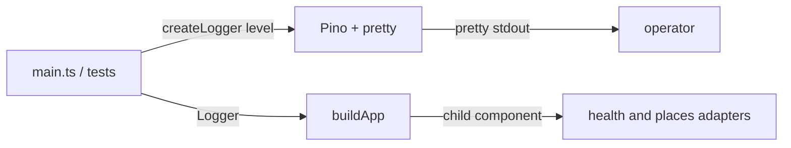

# Replace Home-Grown Logger with Pino - Plan

## Goal Capsule

**Objective:** The process logger is native Pino (`Logger = pino.Logger`) with colorized pretty local output. Callers still create the logger and pass it into `buildApp(config, logger)`. Composition binds one child per slice. HTTP status mapping and domain/service behavior stay unchanged.

**Product authority:** This plan's Product Contract, aligned with living docs and `src/composition/build-app.ts`. Living docs plus composition win over snapshot plans, including `docs/plans/2026-08-12-002-feat-richer-named-event-logging-plan.md`.

**Open blockers:** None.

**Execution profile:** This work has shipped. Treat this file as the current logger product, not a recipe to rebuild a message-first wrapper. Do not restore `(message, extra?)`, extra JSON cloning, or JSON-only stdout.

**Stop if:** Scope expands into `pino-http`, named-event catalogs, request-body logging, or domain/service logging.

**Product Contract preservation:** Restated 2026-08-19 to match the live logger (pretty, native Pino, slice children, Error-first bootstrap). Wrapper-era how-to lives in git history only.

---

## Product Contract

### Summary

Use Pino as `createLogger`. The exported type is `pino.Logger`. Operators see colorized pretty lines. Developers inject that logger into adapters. Object-first and message-only Pino calls are both valid. Business logic and HTTP contracts stay as they are.

### Problem Frame

A home-grown console emitter was replaced so the team could use a maintained sink. The live tree no longer wraps Pino behind a four-method `(message, extra?)` port.

### Actors

- A1. Local operator — runs the process and reads pretty logs.
- A2. Developer / tests — constructs `createLogger` and passes `Logger` into `buildApp`.

### Key Decisions

- **Pino as the sink** — Pino v10 plus `pino-pretty` inside `createLogger`. Governs R1, R6.
- **Native Pino is the logging API** — Adapters and `main.ts` use `pino.Logger`. Chosen over a custom message-first port. Governs R1, R2.
- **Pretty local logs** — Colorized pretty is the operator-facing format, not JSON-on-stdout. Governs R6.
- **No HTTP access logs** — Process logger only. Governs R7.
- **Slice child loggers** — `buildApp` binds `component: health | places` children. Governs R3.

### Requirements

- R1. `createLogger` takes a Pino level (including `silent`) and returns `pino.Logger`. There is no custom four-method `(message, extra?)` port and no extra JSON cloning.
- R2. Call sites use native Pino (object-first and/or message-only). Do not rename to the unimplemented named-event catalog.
- R3. Domain and service modules do not import the logger. `buildApp(config, logger)` receives the process logger from the caller and binds one child per slice before wiring adapters and routes.
- R4. `LOG_LEVEL` values stay `fatal | error | warn | info | debug | trace | silent`.
- R5. When `loadConfig()` throws, `src/main.ts` uses `createLogger('error').error(error as Error, 'load config failed')` then `process.exit(1)`.
- R6. Local emitted lines are colorized pretty. Extra fields ride on Pino's merging object when callers pass one.
- R7. Do not log request bodies. Do not add access-log middleware.
- R8. HTTP status codes, response bodies, and Google call behavior stay unchanged.

### Key Flows

- F1. Config load fails
  - **Trigger:** Invalid or missing env; `loadConfig()` throws.
  - **Actors:** A1
  - **Steps:** Bootstrap `createLogger('error')` → Error-first `'load config failed'` → `process.exit(1)`.
  - **Outcome:** A pretty error line is visible; configured `LOG_LEVEL` is not used.
  - **Covered by:** R5, R6
- F2. Process listens
  - **Trigger:** Valid config and successful `listen`.
  - **Actors:** A1
  - **Steps:** `createLogger(config.log.level)` → `buildApp` → `info({ port }, 'listening')`.
  - **Outcome:** Pretty info line; app serves.
  - **Covered by:** R1, R3
- F3. Bind fails
  - **Trigger:** `listen` `'error'`.
  - **Actors:** A1
  - **Steps:** Configured logger `'startup failed'` → reject → `process.exit(1)`.
  - **Covered by:** R5, R6
- F4. Feature logs
  - **Trigger:** `GET /health` or `POST /find-places`.
  - **Actors:** A1, A2
  - **Steps:** Adapter/route logs fire on slice children; adapters may child further.
  - **Outcome:** HTTP behavior unchanged; pretty envelope.
  - **Covered by:** R2, R8

### Acceptance Examples

- AE1. Config missing required Google env. Process exits 1. Stdout contains a pretty line whose message is `load config failed`. Covers F1 / R5.
- AE2. `createLogger('silent')` writes nothing for ordinary log methods. Covers R4.
- AE3. Health and find-places HTTP status/body contracts are unchanged. Covers F4 / R8.

### Success Criteria

- `pino` and `pino-pretty` are runtime dependencies.
- `Logger` / `createLogger` remain what adapters import; the type is `pino.Logger`.
- Living docs match this product. The 2026-08-12 named-event plan is a snapshot.

### Scope Boundaries

**In scope (current product)**
- `src/shared/logging/logger.ts` as native Pino + pretty
- Slice `component` children in `buildApp`
- Error-first bootstrap in `main.ts`

**Out of scope**
- `pino-http`
- New log events or the 2026-08-12 named-event catalog
- Request-body logging
- Fastify
- Changing HTTP handlers, Google mapping, or domain/service code

### Deferred to Follow-Up Work

- Align logger tests and `LogLevel` export with live `createLogger(level: LevelWithSilent)`
- Optional refresh of other solutions' flat `buildApp` logger snippets

---

## Planning Contract

### Key Technical Decisions

- KTD1. **Pino v10 plus pino-pretty** — `createLogger` constructs Pino with `transport.target: 'pino-pretty'` and `colorize: true`. Instantiates R1, R6.
- KTD2. **Export `Logger = pino.Logger`** — No message-first wrapper. Instantiates R1, R2.
- KTD3. **Slice children at composition** — `logger.child({ component })` per slice, passed into adapters and routes. Instantiates R3.
- KTD4. **Error-first bootstrap** — `createLogger('error').error(error as Error, 'load config failed')`. Instantiates R5.
- KTD5. **Pass `level` through including `silent`** — Instantiates R4.

### Assumptions

- Snapshot plan "prefer the existing console logger" is superseded. Pino is the sink and the API.
- Working-tree tests may still describe the old wrapper; that is deferred code work, not a reason to restore the wrapper.

### High-Level Technical Design

### Implementation Constraints

- Do not import Express or Pino from `domain` or `service`.
- Do not log request bodies.
- Do not rebuild a `(message, extra?)` wrapper to make old tests pass.

### Sequencing

Shipped. Docs restatement (2026-08-19) is the follow-on alignment pass.

### Sources and Research

- Live emitter: `src/shared/logging/logger.ts`
- Bootstrap: `src/main.ts`
- Injection: `src/composition/build-app.ts`
- Do not treat `docs/plans/2026-08-12-002-feat-richer-named-event-logging-plan.md` as the operating recipe

---

## Implementation Units

### U1. Native Pino createLogger

**Goal:** Live `createLogger` returns `pino.Logger` with pretty colorize. This unit describes the shipped tree, not work remaining.

**Requirements:** R1, R2, R4, R6

**Dependencies:** None

**Files:**
- `src/shared/logging/logger.ts`
- `package.json` (`pino`, `pino-pretty`)

**Approach:**
1. Export `type Logger = pino.Logger`.
2. Construct Pino with `level` and pretty transport. Do not add a four-method wrapper, extra clone, or optional `Writable` destination.
3. Import Pino only in `src/shared/logging/logger.ts`.

**Test scenarios:**
- Covers AE2. Silent level emits nothing for ordinary methods.
- Object-first and message-only calls typecheck against `pino.Logger`.

**Verification:** `logger.ts` matches R1. No `(message, extra?)` port.

### U2. Composition children and bootstrap

**Goal:** Slice children and Error-first config-load logging as shipped.

**Requirements:** R3, R5, R7, R8; Covers F1, F2, F4, AE1, AE3

**Dependencies:** U1

**Files:**
- `src/composition/build-app.ts`
- `src/main.ts`

**Approach:**
1. `buildApp` creates `health` and `places` component children and passes them into adapters and routes.
2. Config-load catch uses Error-first then `'load config failed'`.
3. Do not add `pino-http` or request-body logs.

**Test scenarios:**
- Covers AE1. Bootstrap call is Error-first plus message.
- A single unscoped process logger is not passed into every adapter.

**Verification:** Matches R3 and R5.

### U3. Living logger docs

**Goal:** Living docs match this product (pretty, native Pino, slice children, Error-first bootstrap).

**Requirements:** R1, R3, R5, R6

**Dependencies:** U1, U2

**Files:**
- `CONCEPTS.md`
- `docs/architecture.md`
- `docs/solutions/developer-experience/config-load-error-logging.md`

**Approach:** Follow `docs/plans/2026-08-19-001-docs-logger-ce-docs-restatement-plan.md`. Do not rewrite the 2026-08-12 named-event snapshot.

**Test expectation:** none — documentation only.

**Verification:** Docs do not teach a message-first wrapper or JSON-only stdout as the product.

---

## Verification Contract

| Gate | What it proves |
|------|----------------|
| Cold read of this plan | Would not reconstruct a four-method wrapper or forbid pretty |
| Living docs | Match R1–R6 |
| `npm run typecheck` / `npm test` | May fail on pre-existing `LogLevel` / capture-stream drift; do not restore the wrapper to green them |

---

## Definition of Done

- Live `createLogger` is native Pino plus pretty.
- Slice `component` children exist in `buildApp`.
- Bootstrap is Error-first then `'load config failed'`.
- This file does not instruct rebuilding the retired wrapper.
- Named-event plan remains a snapshot.
