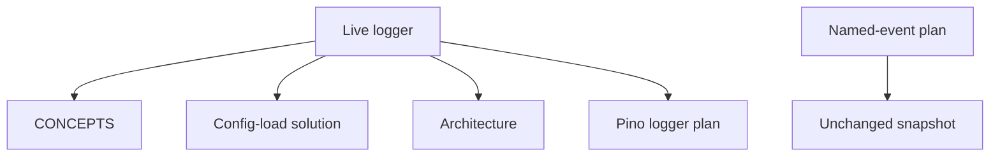
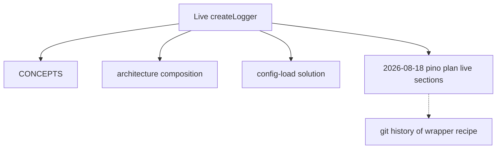

# Restate Logger in CE Docs - Plan

## Goal Capsule

**Objective:** Restate the live logger as the current product in living CE docs and in the 2026-08-18 pino logger plan, so the next agent follows native Pino, pretty local logs, slice child loggers, and Error-first bootstrap instead of the old message-first JSON wrapper.

**Product authority:** This plan's Product Contract. After this pass, living docs plus `src/composition/build-app.ts` remain the operating recipe; the rewritten pino plan must not contradict them.

**Open blockers:** None.

**Execution profile:** Docs-only restatement. Frontmatter `execution: code` means `ce-work` may edit files in this repo. It does not authorize logger or test code changes (R12). Hexagonal slice recipe in `AGENTS.md` is unchanged. Quote live code in docs only. Prove with cold-read scenarios plus `npm run typecheck` and `npm test`. If those commands fail because tests still describe the old wrapper, do not "fix" logger code in this pass (R12). The pass is still done.

**Stop if:** Scope expands into logger/test/`LogLevel` code, named-event plan rewrite, other solutions' flat logger snippets, `pino-http`, access logs, or request-body logging.

**Product Contract preservation:** Problem Frame updated for the partial CONCEPTS restatement. R8 expanded to include still-live pino-plan how-to (confirmed at plan-time) so it matches AE1 and KTD1.

---

## Product Contract

### Summary

Rewrite living logger docs and the 2026-08-18 pino logger plan as one current product: native Pino (object-first and message-only calls), colorized pretty local logs, slice child loggers, and Error-first bootstrap on config failure. Do not change logger code in this pass.

### Problem Frame

`CONCEPTS.md` already names native Pino bootstrap and child loggers. The config-load solution, architecture composition bullets, and the 2026-08-18 pino plan still teach a message-first port, JSON-on-stdout, extra cloning, and no pretty transport. Following those remaining docs reconstructs a wrapper the tree no longer has.

### Key Decisions

- **Pretty logs are the product** — (session-settled: user-directed — chosen over JSON-as-contract and documenting both: the live logger is what operators should be told they get) Governs R1.
- **Native Pino is the logging API** — (session-settled: user-directed — chosen over keeping a message-first port in the docs and over waiting to normalize call sites first: mixed Pino call styles are valid) Governs R2, R4.
- **Restate living docs plus the pino plan** — (session-settled: user-directed — chosen over living-only and over rewriting every logging plan: named-event history stays a snapshot) Governs R5, R6, R7, R8, R10.
- **Current-logger restatement** — (session-settled: user-directed — chosen over surgical sentence patches and over a plan-amendment appendix: one coherent current story including child loggers) Governs R3, R5, R6, R7, R8.
- **Other flat-logger solution snippets stay** — confirmed with the scoping synthesis: those writeups are not this pass. Governs R11.
- **No logger code in this pass** — tests and `LogLevel` export drift stay code work. Governs R12.

### Actors

- A1. Future agent or developer following CE docs to log or to change logging.
- A2. Local operator reading process logs.
- A3. Author of living docs and snapshot plans (keeps history vs current contract distinct).

### Requirements

**Current logger product (what the restated docs must say)**

- R1. Operator-facing local logs are colorized pretty output, not JSON-on-stdout as the documented contract.
- R2. The process logger type is native Pino. Object-first calls and message-only calls are both valid; docs must not reintroduce a custom four-method `(message, extra?)` port or extra cloning.
- R3. Composition binds one child logger per slice (`component: health` / `places`) and passes that child into routes and outbound adapters. Living wiring docs describe that. Adapters may create further children internally. Do not document a single unscoped process logger passed into every adapter, and do not invent composition-time `adapter` bindings that `buildApp` does not make.
- R4. When config load fails, bootstrap still uses a fixed error-severity logger (configured level is unavailable). The documented call is Pino Error-first then a message string, and the line must still be visible before exit.

**Which artifacts this pass updates**

- R5. `CONCEPTS.md` restates the bootstrap logger (and any logging terms this restatement settles) to match R1–R4. Drop JSON-before-exit and the extra-argument avoid-list that only applied to the old port.
- R6. `docs/solutions/developer-experience/config-load-error-logging.md` is rewritten as a current solution for the live bootstrap path, not as a snapshot of the wrapper.
- R7. Living architecture wiring that shows logger injection is restated with child loggers (R3).
- R8. `docs/plans/2026-08-18-001-refactor-pino-logger-plan.md` live Product Contract, Planning Contract, and implementation how-to are rewritten to match R1–R4. JSON-not-pretty and keep-the-message-first-port must not remain live requirements or live how-to in that file.

**Unchanged this pass**

- R9. Do not log request bodies by default. Do not add HTTP access logs. `AGENTS.md` already states the body rule; this pass does not reopen it.
- R10. `docs/plans/2026-08-12-002-feat-richer-named-event-logging-plan.md` is not rewritten. Readers keep treating it as a snapshot.
- R11. Other living solutions whose `buildApp` snippets still pass one logger into adapters without children are not required to change in this pass.
- R12. Logger implementation, tests, and config `LogLevel` typing are out of scope.

### Key Flows

This pass is an artifact restatement, not a new runtime path. The flows below are the reader/agent behaviors the restated docs must support.

- F1. Agent adds or changes a log line
  - **Trigger:** A1 follows living docs to log from an adapter or process entry.
  - **Actors:** A1
  - **Steps:** Read CONCEPTS / architecture for logger type and child bindings → use native Pino call shape → do not invent a wrapper or named-event catalog from the 2026-08-12 snapshot.
  - **Outcome:** Call site matches live Pino usage (R2, R3, R10).
  - **Covered by:** R2, R3, R5, R7, R10
- F2. Config load fails
  - **Trigger:** Invalid or missing env; config load throws.
  - **Actors:** A2
  - **Steps:** Process creates an error-severity logger → logs the failure Error-first with message `load config failed` → exits.
  - **Outcome:** A2 sees a pretty error line; docs describe that call, not `(message, { error })`.
  - **Covered by:** R1, R4, R6

### Acceptance Examples

- AE1. Wrapper not reconstructed
  - **Covers R2, R8.**
  - **Given:** A1 reads restated CONCEPTS and the rewritten pino plan.
  - **When:** They implement or "fix" logging to match the docs.
  - **Then:** They do not add a four-method `(message, extra?)` wrapper, extra JSON cloning, or JSON-only stdout as the product.
- AE2. Bootstrap call shape
  - **Covers R4, R6.**
  - **Given:** Config load throws.
  - **When:** A1 follows the config-load solution.
  - **Then:** They log with Pino Error-first then the message string, not message-then-extra-Record.
- AE3. Snapshot named-event plan
  - **Covers R10.**
  - **Given:** A1 finds the 2026-08-12 named-event plan.
  - **When:** They choose which logging recipe to follow.
  - **Then:** Living docs plus composition win; they do not treat that plan as the current logger.

### Success Criteria

- A cold agent using only restated living docs and the rewritten pino plan would describe the live logger, not the retired wrapper.
- Snapshot vs living remains obvious: the named-event plan can stay wrong relative to today without being this pass's job.

### Scope Boundaries

- **In:** CONCEPTS logging vocabulary, the config-load solution, living architecture logger wiring, rewrite of the 2026-08-18 pino plan's live Product Contract and still-live how-to that would reconstruct the wrapper.
- **Not in this pass:** Named-event plan rewrite; other solutions' flat logger snippets (R11); `pino-http`, access logs, request-body logging, named-event catalogs; logger/test/`LogLevel` code changes.

### Deferred to Follow-Up Work

- Align logger tests and `LogLevel` export with the live `pino.Logger` factory.
- Optional refresh of other solutions' `buildApp` snippets to show `child` bindings (R11).
- Optional later mark or rewrite of the 2026-08-12 named-event plan.

<!-- ce-section: work-relationships -->
### How This Work Fits Together

This plan owns restating the current logger in living docs and in the 2026-08-18 pino plan. The list below is the current surrounding understanding, not a roadmap.

- Restate logger CE docs (this plan)
  - Can proceed independently of logger/test/`LogLevel` code alignment
  - Shares "current logger" facts with later code/test catch-up if that work happens
- Named-event logging snapshot
  - Can proceed independently of this restatement
  - Still to decide whether a later refresh should mark or rewrite it
- Other living solutions with flat logger snippets
  - Can proceed independently
  - Shares composition wiring with R3/R7; excluded here per R11

### Dependencies / Assumptions

- The live logger in `src/shared/logging/logger.ts` and bootstrap in `src/main.ts` are the intended product, even where tests still describe the old wrapper.
- Claim check (2026-08-19): live pretty native Pino, slice `component` children in `buildApp`, Error-first bootstrap, and the stale config-load / pino-plan text were confirmed against the tree.
- `CONCEPTS.md` Bootstrap logger and Child logger entries were already restated in the brainstorm session. This plan adds R1 pretty wording and reconciles Child logger binding shape with live `buildApp` (slice `component` children, not composition-time adapter fields).

### Sources / Research

- `src/shared/logging/logger.ts` — `Logger = pino.Logger`, pretty colorize
- `src/main.ts` — bootstrap `error(Error, 'load config failed')`
- `src/composition/build-app.ts` — `child({ component: 'health' | 'places' })` passed into adapters and routes
- `CONCEPTS.md` — Bootstrap logger and Child logger (partially restated)
- `docs/solutions/developer-experience/config-load-error-logging.md` — message-first extra cloning
- `docs/plans/2026-08-18-001-refactor-pino-logger-plan.md` — JSON-not-pretty, keep the Logger port, IUs that still teach the wrapper
- `docs/plans/2026-08-12-002-feat-richer-named-event-logging-plan.md` — snapshot, out of this pass
- `docs/architecture.md` — living `buildApp(config, logger)` wiring
- `AGENTS.md` — do not log request bodies by default (R9)

---

## Planning Contract

### Key Technical Decisions

- KTD1. **Rewrite still-live pino-plan how-to, not only Product Contract** — Chosen over leaving executed units as history: AE1 fails if IUs and KTDs still teach the wrapper. Instantiates R8, AE1.
- KTD2. **Finish CONCEPTS in place** — Keep Bootstrap logger and Child logger as the names. Add operator-facing pretty (R1). Align Child logger with live `buildApp` slice `component` children. Do not revert Error-first bootstrap. Instantiates R5.
- KTD3. **Rewrite the config-load solution as current** — Keep YAML frontmatter and the inline-`main.ts` lesson. Replace message-first extra cloning, JSON-on-stdout examples, and "What Didn't Work" rows that only apply to the old port. Instantiates R6, AE2.
- KTD4. **Architecture composition bullets only** — Document slice `component` children under Composition root. Mention that adapters may child further. Do not rewrite other architecture sections or other solutions (R11). Instantiates R7.
- KTD5. **No new test files** — Prove docs with cold-read scenarios. Run `npm run typecheck` and `npm test` because `AGENTS.md` requires them before claiming done. If they fail on pre-existing logger/test drift, do not change logger code (R12).

### Assumptions

- Confirm of the plan-time synthesis includes rewriting still-live pino-plan how-to (KTD1).
- Pretty transport is always on in live `createLogger`; docs do not invent a JSON-vs-pretty env switch (R1).

### High-Level Technical Design

Live logger is the single authority. Each in-scope artifact is rewritten to that picture. The named-event plan stays an unread snapshot for current logger behavior.

### Implementation Constraints

- Do not edit `src/**` or `tests/**` in this pass.
- Do not rewrite `docs/plans/2026-08-12-002-feat-richer-named-event-logging-plan.md`.
- Do not edit other solutions' `buildApp` snippets (R11).
- Quote live call shapes from `src/main.ts` and `src/composition/build-app.ts`; do not invent a new logging API in examples.

### Sequencing

U1 (CONCEPTS) then U2 (architecture) then U3 (config-load solution) then U4 (pino plan). Later units copy vocabulary from U1.

### Risks and Dependencies

- **Stale how-to in the pino plan** — Mitigate with KTD1 so IUs cannot reconstruct the wrapper.
- **Pre-existing failing tests** — Mitigate with KTD5 / R12: report, do not "fix" `logger.ts`.
- **Partial CONCEPTS already shipped in this working tree** — Mitigate with KTD2: finish, do not duplicate or revert.

---

## Implementation Units

### U1. Finish CONCEPTS logging vocabulary

**Goal:** CONCEPTS describes pretty local logs, native Pino bootstrap, and child loggers so A1 does not restore JSON-only stdout or a custom port.

**Requirements:** R1, R2, R4, R5; Covers F1

**Dependencies:** None

**Files:**
- Modify: `CONCEPTS.md`

**Approach:**
1. Keep Bootstrap logger and Child logger as the canonical names.
2. State colorized pretty as the operator-facing local format (R1).
3. Confirm bootstrap remains Error-first plus message at error severity (R4).
4. Align Child logger with live `buildApp`: slice `component` children. Do not claim composition-time `adapter` fields.
5. Remove any remaining JSON-before-exit or extra-Record avoid-list that only applied to the wrapper.

**Patterns to follow:** Existing CONCEPTS entry shape (definition, then `*Avoid:*`).

**Test scenarios:**
- Covers AE1. Reading Bootstrap logger and Child logger would not lead A1 to add `(message, extra?)` or JSON-only stdout as the product.
- Pretty is named as the local operator-facing format.
- Avoid-list does not mention callbacks or raw arrays as logger extras.

**Verification:** `CONCEPTS.md` matches R1–R4. No duplicate glossary entries for the same idea.

### U2. Restate architecture composition logger wiring

**Goal:** Living architecture shows slice `component` child loggers at `buildApp`.

**Requirements:** R3, R7; Covers F1

**Dependencies:** U1

**Files:**
- Modify: `docs/architecture.md`

**Approach:**
1. Under Composition root, say `buildApp` still receives the process logger from the caller.
2. Say composition binds one `child` per slice (`component`) and passes that child into routes and outbound adapters.
3. Note that adapters may create further children. Leave HTTP surface, layers, and test-path bullets otherwise unchanged.

**Patterns to follow:** Current `docs/architecture.md` composition bullets; live bindings in `src/composition/build-app.ts`.

**Test scenarios:**
- A reader of Composition root would not pass one unscoped logger into every adapter.
- `buildApp(config, logger)` remains the single registration path.

**Verification:** Architecture composition bullets match R3. Other solutions with flat logger snippets are untouched (R11).

### U3. Rewrite config-load error logging solution

**Goal:** The bootstrap solution matches live `main.ts`: `createLogger('error')`, Error-first then `'load config failed'`, pretty output, inline catch.

**Requirements:** R1, R4, R6; Covers F2, AE2

**Dependencies:** U1

**Files:**
- Modify: `docs/solutions/developer-experience/config-load-error-logging.md`

**Approach:**
1. Keep category, module, and the lesson that bootstrap stays inline in `main.ts`.
2. Update `applies_when` and body constraints that require `extra?: Record<string, unknown>` or JSON cloning.
3. Replace recommended examples with Pino Error-first then message. Drop JSON-line samples that present JSON-on-stdout as the contract (R1).
4. Replace "What Didn't Work" rows that only apply to the old port. Keep rows that still apply (Zod `.format()` / `.flatten()`, `createLogger(config.log.level)` in catch, helper in `config.ts`).

**Patterns to follow:** Existing solution frontmatter and section layout in `docs/solutions/developer-experience/`.

**Test scenarios:**
- Covers AE2. Following Guidance logs Error-first then `'load config failed'`, not message-then-extra-Record.
- Guidance does not tell the reader to JSON-clone extras before Pino.
- Related links still point at `src/main.ts` and `src/composition/config.ts`.

**Verification:** Solution body matches live bootstrap. Frontmatter still valid YAML.

### U4. Restate the 2026-08-18 pino plan as current

**Goal:** That plan's live Product Contract, Planning Contract, and implementation how-to describe the shipped logger. An agent cannot follow it as a recipe to rebuild the wrapper.

**Requirements:** R1, R2, R3, R8, R10; Covers AE1, AE3

**Dependencies:** U1, U2, U3

**Files:**
- Modify: `docs/plans/2026-08-18-001-refactor-pino-logger-plan.md`

**Approach:**
1. Rewrite live Product Contract requirements that still mandate message-first port, JSON-not-pretty, extra cloning, or optional `Writable` destination (R8).
2. Rewrite still-live Goal Capsule, frontmatter fields that still describe the wrapper recipe, KTDs, HTD, IUs, and verification text that would reconstruct that recipe (KTD1). State the shipped product: native `pino.Logger`, pretty colorize, slice `component` children, Error-first bootstrap. Leave executed-history only if it cannot be read as current how-to.
3. Do not modify `docs/plans/2026-08-12-002-feat-richer-named-event-logging-plan.md`. In the rewritten pino plan, keep calling it a snapshot (R10, AE3).
4. Do not use strikethrough strata. Git holds the wrapper-era text.

**Patterns to follow:** Unified plan headings already in that file. Living-docs-plus-composition win (CONCEPTS).

**Test scenarios:**
- Covers AE1. A cold read of that plan's live sections would not implement a four-method wrapper, extra cloning, or JSON-only stdout as the product.
- Covers AE3. The 2026-08-12 named-event plan is still named as a snapshot, not rewritten.
- Pretty and child loggers are in-scope current product, not deferred follow-up.

**Verification:** No live requirement or IU in that file still forbids `pino-pretty` or requires `(message, extra?)`. Named-event plan file is unmodified.

---

## Verification Contract

| Gate | When | Signal |
|------|------|--------|
| Cold-read AE1–AE3 | After U1–U4 | Restated docs would not reconstruct the wrapper; bootstrap is Error-first; named-event plan remains snapshot |
| `npm run typecheck` | Before claiming done | Pass, or fail only from pre-existing logger/test drift (do not edit `src/` / `tests/` to green this pass) |
| `npm test` | Before claiming done | Same rule as typecheck (KTD5, R12) |

---

## Definition of Done

- U1–U4 complete. Abandoned draft wording is not left beside the live restatement.
- R1–R12 hold. AE1–AE3 hold on a cold read.
- `AGENTS.md` body-log rule unchanged (R9).
- No logger code, logger tests, or `LogLevel` export changes in the diff (R12).
- `npm run typecheck` and `npm test` may fail solely from pre-existing logger/test/`LogLevel` drift. Report that and still treat the docs pass as done (KTD5).
