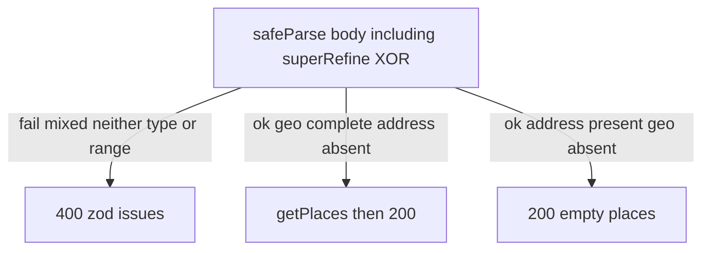

# Find-places address XOR validator - Plan

## Goal Capsule

**Objective:** Accept exactly one location mode on `POST /find-places`: the existing geo circle, or a new request address. Reject mixed and empty location input at the HTTP Zod edge. Do not geocode or search by address.

**Product authority:** This plan's Product Contract. Living layout: `AGENTS.md`, `docs/architecture.md`, `CONCEPTS.md`.

**Open blockers:** None.

**Execution profile:** Adapter-only code change in `src/places/adapters/find-places-route.ts`; also update the living HTTP table in `docs/architecture.md` and the glossary in `CONCEPTS.md`. Do not add, expand, or rewrite test files unless the user later asks.

**Stop if:** Address is passed into Nearby Search, the port/service/Google adapter grows an address argument, or a new location discriminant field is added to the public body.

**Product Contract preservation:** n/a — bootstrap Product Contract authored in this file.

---

## Product Contract

### Summary

Callers send either latitude, longitude, and radiusMeters, or a non-empty address, never both and never neither. Geo mode keeps today's Nearby Search. Address mode validates, then returns an empty place list without calling Google.

### Problem Frame

The request will later support address-based search. This cut only locks the exclusive input contract so mixed or empty location bodies cannot reach Google.

### Actors

- A1. Local caller of `POST /find-places`.
- A2. Google Places Nearby Search — used only in geo mode.

### Key Decisions

- **Exclusive location modes** — geo circle XOR request address. (session-settled: user-directed — chosen over address as an extra field on top of geo: both filled and neither filled must error) Governs R1–R4.
- **Mixed is invalid** — address plus any geo field is the same class of failure as an incomplete location. (session-settled: user-approved — chosen over error-only-when-all-fields-filled: partial mix must not pass as address mode) Governs R3.
- **Validator-only address** — do not geocode or pass address into search. (session-settled: user-directed — chosen over wiring Nearby Search or geocode from address) Governs R5–R6.
- **Address-only success is empty 200** — skip search and return `{ places: [], total: 0 }`. (session-settled: user-directed — chosen over a handler error until search exists: validation success must not fall through to `getPlaces`) Governs R5.

### Requirements

**Location modes**
- R1. Geo mode: `latitude`, `longitude`, and `radiusMeters` are all present; request address is absent. Existing geo range rules still apply.
- R2. Address mode: a non-empty request address is present; all three geo fields are absent.
- R3. Mixed input (request address present plus any geo field present) is invalid.
- R4. Neither mode (no complete geo circle and no request address) is invalid.

**Address stub**
- R5. A valid address-mode body does not call Google. The response is HTTP 200 with an empty places list and `total` 0.
- R6. Geo-mode success, logging, and mapping stay the current Nearby Search path.

**HTTP edge**
- R7. Invalid location mode is HTTP 400 with the existing `{ error: zodIssues }` body. No Google call.
- R8. `primaryTypes` stays an optional additive filter on both valid modes. Invalid enum values remain 400.
- R9. Health is unchanged. Feature 400s do not make `/health` unhealthy.

### Key Flows

- F1. Geo search
  - **Trigger:** A1 sends a complete geo circle and no request address.
  - **Actors:** A1, A2
  - **Steps:** Zod success → `getPlaces` → map response → 200.
  - **Covered by:** R1, R6, R8
- F2. Address stub
  - **Trigger:** A1 sends a non-empty request address and no geo fields.
  - **Actors:** A1
  - **Steps:** Zod success → skip `getPlaces` → 200 empty list.
  - **Covered by:** R2, R5, R8
- F3. Invalid location
  - **Trigger:** Mixed, neither, partial geo, or type/range failures.
  - **Actors:** A1
  - **Steps:** Zod failure → 400 `{ error: issues }` → return.
  - **Covered by:** R3, R4, R7

### Acceptance Examples

- AE1. Covers R1, R6. Given a body with valid geo and no `address` key, when `POST /find-places` runs, then Nearby Search runs as today.
- AE2. Covers R2, R5. Given `{ "address": "123 Main St" }` (geo keys omitted), when the request is valid, then 200 `{ "places": [], "total": 0 }` and Google is not called.
- AE3. Covers R3, R7. Given geo plus a non-empty `address`, when parsed, then 400 and no Google call.
- AE4. Covers R4, R7. Given `{}` or `primaryTypes` only, when parsed, then 400 and no Google call.
- AE5. Covers R1. Given valid geo plus whitespace-only `address`, when parsed, then treat address as absent and take geo mode (F1).

### Scope Boundaries

**In scope:** HTTP request type, Zod schema, post-parse geo vs address branch, living HTTP table and glossary for request address.

**Out of scope:** Geocoding, Nearby Search from address, port/service/Google adapter changes, health, logging of request bodies.

**Deferred to Follow-Up Work:** Using request address for search. Writing HTTP tests for this XOR (repo rule: no new tests unless asked).

---

## Planning Contract

### Key Technical Decisions

- KTD1. **Known `address` field plus `superRefine` XOR** — Add optional `address` on the existing Zod object, then `superRefine` for exclusive modes. (session-settled: user-directed on exclusive modes — chosen over `z.discriminatedUnion`: there is no public `mode` discriminant) A two-object `z.union` without `.strict()` would still strip `address` on the geo branch and accept mixed. Do not copy optional `primaryTypes` as a second additive field.
- KTD2. **Trim then treat empty as absent** — Trim `address` before XOR. Whitespace-only is absent (AE5). `null` or a non-string `address` is a type 400, not absent.
- KTD3. **Geo key presence** — A geo field is present when the key parses as a number (including out-of-range, which is still 400). Missing keys are absent. `null` / wrong type on a geo key is 400 before XOR.
- KTD4. **Address stub in the same route** — After success, if address mode, `res.status(200).json(mapFindPlacesResponse([]))` and return. Do not log the geo success line. Do not call `placesService.getPlaces`.
- KTD5. **No new test files** — Document scenarios; do not create or expand tests. (session-settled: user-approved — chosen over writing validator tests in this work: AGENTS.md plus user confirm)
- KTD6. **Keep 400 issue-array body** — Mixed/neither add a `superRefine` issue. Do not invent a new 400 envelope or 501.

### High-Level Technical Design

### Assumptions

- Unknown extra JSON keys stay stripped (no `.strict()`).
- Request address has no max length beyond `express.json` 32kb.
- `primaryTypes` may appear on either valid mode.

### Implementation Constraints

- Zod and Express stay in the inbound adapter. Domain/service/port unchanged.
- Do not log request bodies.
- Living docs plus composition win over snapshot solution snippets that still require geo-only bodies.

---

## Implementation Units

### U1. XOR request validator and address stub

**Goal:** Enforce exclusive location modes on `POST /find-places` and stub address mode with an empty 200.

**Requirements:** R1–R9, F1–F3, AE1–AE5, KTD1–KTD6

**Dependencies:** None

**Files:**
- modify: `src/places/adapters/find-places-route.ts`
- modify: `docs/architecture.md` (HTTP body row: geo XOR address; note address-mode empty 200)
- modify: `CONCEPTS.md` (request address vs Nearby place address)
- later tests, do not create, expand, or rewrite: `tests/places/find-places-http.test.ts`

**Approach:**
1. Widen `FindPlacesRequest` so geo fields and `address` are optional at the type level; keep `primaryTypes` optional.
2. Keep current geo number constraints when those fields are present. Add optional string `address`.
3. `superRefine` per KTD1–KTD3: geo complete XOR non-empty trimmed address; mixed and neither fail.
4. After success: geo mode calls `getPlaces` as today; address mode follows KTD4.
5. Update the living HTTP table and glossary so request address is not confused with returned Nearby place address.

**Execution note:** Do not create, add, or rewrite test files. Typecheck is the ship gate for this unit.

**Patterns to follow:** In-route `safeParse` and 400 `{ error: issues }` in `src/places/adapters/find-places-route.ts`. Do not copy `primaryTypes` optionality as the location-mode pattern. Do not copy snapshot 400 string `'invalid body: latitude, longitude, and radiusMeters are required'`.

**Test scenarios:** (coverage contract only — do not add files this work)
- Covers AE1. Valid geo, no `address` key: parse succeeds; `getPlaces` is called with those numbers.
- Covers AE2. `{ address: "123 Main St" }` only: parse succeeds; `getPlaces` is not called; 200 `{ places: [], total: 0 }`.
- Covers AE3. Valid geo plus non-empty `address`: 400; `getPlaces` is not called.
- Address plus only `latitude` (mixed partial): 400; `getPlaces` is not called.
- Covers AE4. `{}` or `{ primaryTypes: ["foodAndDrink"] }` with no location: 400.
- Covers AE5. Valid geo plus `address: "   "`: geo mode; `getPlaces` is called.
- `{ address: "   " }` only: 400 neither-mode.
- Out-of-range `latitude` in geo mode: 400 (existing range rule).
- Address mode plus invalid `primaryTypes` member: 400; `getPlaces` is not called.
- Address mode plus valid `primaryTypes`: 200 empty list; `getPlaces` is not called.

**Verification:** `npm run typecheck` passes. `npm test` still runs existing tests. Address-only path cannot call `getPlaces`. Geo-only path still destructures numbers into `getPlaces`.

---

## Verification Contract

| Gate | When | Done signal |
|------|------|-------------|
| `npm run typecheck` | After U1 | No type errors; address-only data is not passed as numbers into `getPlaces` |
| `npm test` | After U1 | Existing suite still runs; diff contains no new, expanded, or rewritten test files |
| Manual curl (optional) | If `.env` and `npm run dev` are available | Geo body still searches; address-only returns empty 200; mixed/empty return 400 |

---

## Definition of Done

- R1–R9 are implemented in `find-places-route.ts`.
- Port, service, and Google adapter have no address argument.
- Living HTTP table and `CONCEPTS.md` distinguish request address from Nearby place address.
- Diff contains no new, expanded, or rewritten test files.
- Abandoned stub approaches (501, throwing, calling `getPlaces` with undefined) are not left in the handler.

---

## Sources & Research

- Live validator: `src/places/adapters/find-places-route.ts` (`findPlacesRequestSchema`, unconditional `getPlaces` after parse).
- Port: `src/places/domain/port.ts` — `getPlaces(latitude, longitude, radiusMeters, primaryTypes)`.
- Living HTTP contract: `docs/architecture.md`.
- Closest HTTP Zod pattern (do not copy for XOR): `docs/solutions/design-patterns/primary-type-category-filters-for-nearby-search.md`.
- Snapshot to ignore for 400 copy: `docs/solutions/tooling-decisions/express-http-adapter-over-fastify-hexagonal.md`.
