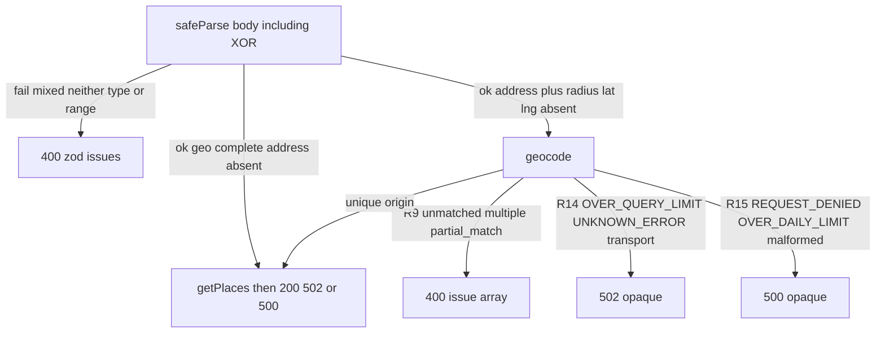
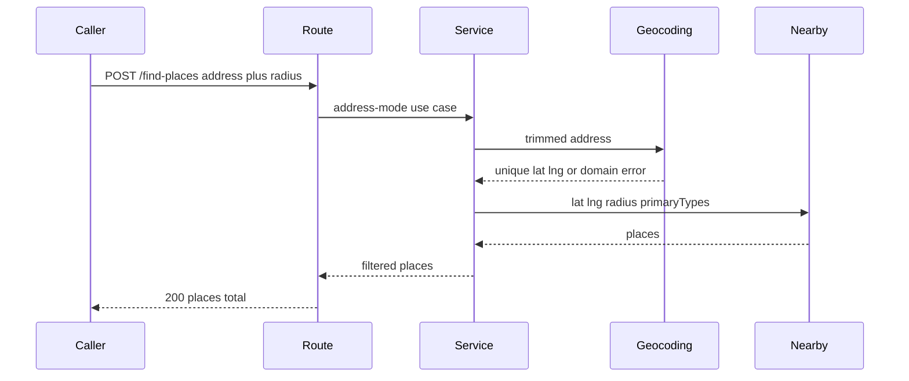

# Find-places geocode then Nearby Search - Plan

## Goal Capsule

**Objective:** On `POST /find-places` address mode, geocode the request address with Google Geocoding API v3, then run the existing Nearby Search from that origin. Callers send address plus `radiusMeters`. Latitude and longitude stay geo-mode-only.

**Product authority:** This plan's Product Contract. Living layout: `AGENTS.md`, `docs/architecture.md`, `CONCEPTS.md`. Prior stub: `docs/plans/2026-08-24-001-feat-findplaces-address-xor-validator-plan.md` (snapshot; do not keep its empty-200 address path).

**Open blockers:** None.

**Execution profile:** Domain port and errors, geocoding outbound adapter, service orchestration, HTTP XOR rewrite plus 400/502/500 mapping, living HTTP table and glossary. Do not add, expand, or rewrite test files unless the user later asks.

**Stop if:** Address is passed into Nearby Search, Geocoding is added to `/health`, a dedicated geocode HTTP endpoint is added, coordinates are returned instead of places, or `results[0]` is taken when the geocode is unmatched, multiple, or `partial_match`.

**Product Contract preservation:** n/a — bootstrap Product Contract authored in this file.

---

## Product Contract

### Summary

Address-mode find-places geocodes the request address, then runs the same Nearby Search as geo mode from those coordinates. Callers send a non-empty address plus `radiusMeters`. Latitude and longitude stay geo-mode-only. Geo-mode search, health, and the `{ places, total }` response stay as they are. This plan does not add a geocode endpoint or return coordinates.

### Problem Frame

Address mode today validates and returns an empty place list so mixed location bodies cannot reach Google. Callers cannot search from a street address. This work replaces that stub with geocoding then Nearby Search.

### Actors

- A1. Local caller of `POST /find-places`.
- A2. Google Geocoding API v3 — address to a unique lat/lng origin.
- A3. Google Places Nearby Search — used after a unique geocode, and in geo mode.

### Key Decisions

- **Geocode then search** — address mode geocodes, then Nearby Search. (session-settled: user-directed — chosen over return-coords, a new endpoint, or an internal-only helper) Governs R5–R8.
- **Address plus required radius** — lat/lng stay forbidden with address. (session-settled: user-directed — chosen over optional/fixed default radius or keeping today's XOR that treats radius as geo-only) Governs R1–R4.
- **Unmatched or ambiguous address is invalid input** — not an empty place list and not upstream failure. (session-settled: user-approved — chosen over empty 200) Governs R9–R11.
- **Health stays Places-only** — do not probe Geocoding. (session-settled: user-approved — chosen over adding Geocoding to `/health`) Governs R16.
- **One Google credential** — reuse the existing key with Geocoding enabled on that project. (session-settled: user-approved — chosen over a dedicated Geocoding credential) Governs R17.

### Requirements

**Location modes**
- R1. Geo mode: `latitude`, `longitude`, and `radiusMeters` are all present; request address is absent. Existing geo range rules still apply.
- R2. Address mode: a non-empty trimmed request address and `radiusMeters` are present; `latitude` and `longitude` are absent. Radius uses the same finite, positive, max-50000 rule as geo mode.
- R3. Mixed input (non-empty request address plus `latitude` or `longitude`) is invalid.
- R4. Neither mode (no complete geo circle and no address-plus-radius) is invalid. Whitespace-only address is absent.

**Geocoding then search**
- R5. A valid address-mode body geocodes the trimmed request address, then runs Nearby Search with the unique origin and the caller `radiusMeters`.
- R6. Geo-mode success, logging of resolved coordinates, website-empty filter, and response mapping stay the current Nearby Search path.
- R7. `primaryTypes` stays an optional additive filter on both valid modes. Invalid enum values remain 400 before any Google call. Types are not sent to Geocoding.
- R8. Success response is always `{ places, total }` from Nearby Search after the website filter. Callers never see geocode results, `partial_match`, or Google status.

**Geocode outcomes**
- R9. `ZERO_RESULTS`, more than one result, or a single result with `partial_match` is invalid caller input. Nearby Search is not called.
- R10. Exactly one non-partial result with `geometry.location` is the origin. Do not take `results[0]` when R9 applies.
- R11. A unique geocode followed by empty Nearby results is HTTP 200 `{ places: [], total: 0 }`. That is not R9.

**HTTP edge**
- R12. Invalid location mode and invalid `primaryTypes` are HTTP 400 with `{ error: zodIssues }`. No Google call.
- R13. R9 is HTTP 400 with the same `{ error: issue array }` envelope, one custom issue, no Google status, no candidate addresses, no request address echoed.
- R14. Geocoding `OVER_QUERY_LIMIT`, `UNKNOWN_ERROR`, transport failure, timeout, or non-2xx HTTP is HTTP 502 with the living opaque body `{ "error": "places search unavailable" }`. Nearby is not called.
- R15. Geocoding `REQUEST_DENIED`, `OVER_DAILY_LIMIT`, unlisted `status`, or missing `geometry.location` is HTTP 500 with the same opaque body as 502. Nearby 4xx / malformed 2xx / bugs stay 500. Nearby 5xx / timeout / network stay 502.

**Health and operators**
- R16. Health is unchanged. Feature 400s do not make `/health` unhealthy. Geocoding enablement is not a health signal.
- R17. Geocoding uses the existing `GOOGLE_API_KEY`. Do not add a second key env var.
- R18. Do not log request bodies, the request address, the geocode URL, or the API key.

### Key Flows

- F1. Geo search
  - **Trigger:** A1 sends a complete geo circle and no request address.
  - **Actors:** A1, A3
  - **Steps:** Zod success → Nearby Search → map response → 200.
  - **Covered by:** R1, R6, R7
- F2. Address search
  - **Trigger:** A1 sends a non-empty request address, `radiusMeters`, and no lat/lng.
  - **Actors:** A1, A2, A3
  - **Steps:** Zod success → geocode → unique origin → Nearby Search → map response → 200.
  - **Covered by:** R2, R5, R7, R8, R10, R11
- F3. Invalid location
  - **Trigger:** Mixed lat/lng, neither mode, missing radius on address, type/range failures.
  - **Actors:** A1
  - **Steps:** Zod failure → 400 `{ error: issues }` → return. No Google.
  - **Covered by:** R3, R4, R7, R12
- F4. Unusable geocode
  - **Trigger:** Geocoding returns unmatched, multiple, or single `partial_match`.
  - **Actors:** A1, A2
  - **Steps:** Classify as invalid input → 400 issue array → return. No Nearby Search.
  - **Covered by:** R9, R13
- F5. Geocode upstream or unexpected
  - **Trigger:** `OVER_QUERY_LIMIT`, `UNKNOWN_ERROR`, transport failure, `REQUEST_DENIED`, `OVER_DAILY_LIMIT`, or malformed geocode body.
  - **Actors:** A1, A2
  - **Steps:** Map per R14–R15 → opaque 502 or 500 → return. No Nearby Search.
  - **Covered by:** R14, R15
- F6. Geocode OK, Nearby empty or unavailable
  - **Trigger:** Unique geocode, then Nearby returns no kept places or fails.
  - **Actors:** A1, A2, A3
  - **Steps:** Empty Nearby → 200 empty list. Nearby unavailability → 502. Nearby unexpected → 500.
  - **Covered by:** R11, R15

### Acceptance Examples

- AE1. Covers R1, R6. Given a body with valid geo and no `address` key, when `POST /find-places` runs, then Nearby Search runs as today and Geocoding is not called.
- AE2. Covers R2, R5, R8. Given `{ "address": "1600 Amphitheatre Parkway, Mountain View, CA", "radiusMeters": 1000 }` and a unique non-partial geocode, when the request is valid, then Nearby Search runs at that origin with radius 1000.
- AE3. Covers R3, R12. Given geo plus a non-empty `address`, when parsed, then 400 and no Google call.
- AE4. Covers R2, R12. Given `{ "address": "123 Main St" }` with no `radiusMeters`, when parsed, then 400 and no Google call.
- AE5. Covers R4. Given valid geo plus whitespace-only `address`, when parsed, then treat address as absent and take geo mode (F1).
- AE6. Covers R9, R13. Given a valid address-mode body whose geocode is `ZERO_RESULTS`, when classified, then 400 issue array and Nearby Search is not called.
- AE7. Covers R9, R10. Given `OK` with two results, when classified, then 400 and Nearby Search is not called.
- AE8. Covers R9. Given `OK` with one `partial_match` result, when classified, then 400 and Nearby Search is not called.
- AE9. Covers R11. Given a unique non-partial geocode and Nearby with no kept places, when mapped, then 200 `{ "places": [], "total": 0 }`.
- AE10. Covers R14. Given geocode `OVER_QUERY_LIMIT` or a transport failure, when mapped, then 502 opaque and Nearby Search is not called.
- AE11. Covers R7. Given address mode plus invalid `primaryTypes`, when parsed, then 400 and neither Google API is called.

### Scope Boundaries

**In scope:** Address-mode XOR rewrite, Geocoding v3 outbound adapter, service geocode-then-search, find-places 400/502/500 mapping for both hops, living HTTP table and glossary.

**Out of scope:** Dedicated geocode endpoint, returning coordinates, Geocoding on `/health`, region/components/bounds, Places Autocomplete, Geocoding API v4, retries, request-body logging, persistence, auth.

**Deferred to Follow-Up Work:** HTTP tests for this feature (repo rule: no new tests unless asked). Optional geocode timeout if Nearby later gets one. Migrating Nearby onto `GoogleClient`. Fixing health's live `HEAD https://www.google.com` vs documented Place Details. Geocoding v4.

---

## Planning Contract

### Key Technical Decisions

- KTD1. **Classic Geocoding API v3 JSON** — `GET https://maps.googleapis.com/maps/api/geocode/json` with query `address` and `key`. Classify on JSON `status` and `results`, not HTTP 2xx. (session-settled: user-directed on using Google Geocoding API — chosen over a Places Text Search stand-in: Places API New has no geocode method; v3 is not sunset as of 2026-08-24; v4 is GA on a third host and is follow-up) Governs R5, R9, R10, R14, R15.
- KTD2. **New geocode port and adapter** — Domain outbound geocode port plus `src/places/adapters/geocoding.ts`. Do not stretch `src/shared/client/client.ts` or `GOOGLE_BASE_URL`. Hardcode host and path. Address is a query value only, never the fetch target. Reuse `config.google.apiKey`. Do not inject the concrete adapter into the service the way Nearby is injected today (that leak stays deferred).
- KTD3. **Rewrite XOR; do not extend `geoAny`** — Today's refine treats `radiusMeters` as mixed with address. Address mode is trimmed non-empty `address` + required `radiusMeters` + absent lat/lng. Mixed is address + lat or lng. (instantiates Key Decision "Address plus required radius"; Governs R1–R4)
- KTD4. **Service orchestrates both hops** — Route does not call Geocoding or chain `getPlaces` after a local geocode. Widen `PlacesService` in the same unit as the impl. Geocode then existing Nearby `getPlaces`. Do not wrap geocode failures as `[]`. Do not add address onto `GooglePlacesAdapter`.
- KTD5. **Three geocode errors, not Places HTTP classes** — Invalid-address (R9), geocode-unavailable (R14), geocode-unexpected (R15). Do not reuse `GoogleInvalidArgumentError` or `GoogleGenericError` for JSON `status`. Do not call `mapGoogleHttpStatusToError`. `INVALID_REQUEST` after Zod maps with other unlisted statuses to unexpected.
- KTD6. **In-route mapper that responds and returns** — Catch today rethrows into Express 5's default handler. Map both hops here; do not add four-arg middleware. 400 keeps `{ error: issue array }`. 502 and 500 share `{ "error": "places search unavailable" }`. Nearby: fetch throw and HTTP 5xx become unavailability (small change in `src/places/adapters/google.ts`); other `GoogleError` subclasses stay 500, including HTTP 429. Geocoding `OVER_QUERY_LIMIT` stays 502 (quota class may differ by hop).
- KTD7. **No new test files** — Document scenarios; do not create or expand tests. (session-settled: user-approved via standing AGENTS.md — chosen over writing tests in this work: user did not ask)
- KTD8. **Static errors; no URL, address, or Google JSON in logs** — Geocoding query `key` and `address` must not appear in logger child fields, `Error.message`, or HTTP bodies. Log duration, JSON `status`, result count, maybe `location_type`. Do not log Google `error_message` or `results`. Do not `logger.error({ error })` if that object might carry address or Google JSON. Nearby may still info-log resolved lat/lng/radius/types. R9 and XOR custom issues use static messages with no address in `params`. Raw Zod 3 issues for this schema do not embed the address string; do not add a sanitizer.

### High-Level Technical Design

### Rejected alternatives

- Route geocodes then calls `getPlaces` — use case would live in the inbound adapter.
- Address argument on `GooglePlacesAdapter` — two hosts in one adapter.
- Reuse `GoogleClient` / `GOOGLE_BASE_URL` as-is — HTTP 200 plus `ZERO_RESULTS` would look like success.
- Inject concrete geocode adapter to match Nearby — expands the existing service→adapter leak.
- Map address-mode errors only — geo mode would stay off the living 502/500 table.
- Four-arg Express error middleware — not needed if the in-route catch terminates.

### Assumptions

- No `region`, `bounds`, or `components` on the geocode request.
- One attempt per hop. No retries for `UNKNOWN_ERROR` or `OVER_QUERY_LIMIT`.
- `APPROXIMATE` `location_type` on a single non-partial result is accepted.
- Extra JSON keys stay stripped (no `.strict()`).
- Operator enables Geocoding API on the same GCP project and key restrictions as Places.

### Implementation Constraints

- Zod and Express stay in the inbound adapter. Domain and service stay HTTP-free.
- Do not log request bodies, addresses, or API keys.
- Living docs plus composition win over the XOR stub snapshot and over architecture rows that still say address-only empty 200.
- Do not rename `GOOGLE_API_KEY`. Do not point `GOOGLE_BASE_URL` at `maps.googleapis.com`.
- Do not change health registrations or `src/health/adapters/google-health.ts`.

### System-Wide Impact

Address mode adds a second Google host and a sequential extra hop on the same `POST /find-places` contract. Geo mode stays one hop.

Health 200 does not mean address mode will work. A Places-restricted key yields geocode `REQUEST_DENIED` (500) while geo mode and `/health` can still succeed. That pairing is the settled R16 + R17 outcome, not a defect to fix by probing Geocoding. Post-Google R9 400s must not flip health.

Hang budget is geocode plus Nearby. Both are unbounded `fetch`es. A hop-1 hang skips Nearby. A hop-2 hang still bills Geocoding. Opaque 502 after a unique geocode does not name the hop; logs must (KTD8). Success path is two SKUs.

Living architecture today: 400 means Zod and no Google call. R9 keeps the same `{ error: issue array }` envelope after a billed Geocoding call. Rewrite that architecture 400 row. Do not map Places `GoogleInvalidArgumentError` to caller 400.

`GOOGLE_BASE_URL` remains Places-only. Address mode ignores that env override. Future HTTP tests must stub `fetch` or inject a host.

`AGENTS.md` Ask-first still names only the Places adapter. After this work Geocoding is a second approved places outbound adapter; update that line in U4.

### Risks and Dependencies

- **Key restrictions** — Places-only API restriction yields `REQUEST_DENIED` (500) while geo mode and health can still succeed. Enable Geocoding on the same key (R17).
- **Docs trap** — Default Geocoding pages in 2026 are v4. Implement from v3 guides cited in Sources.
- **`partial_match` is strict** — Short outreach strings that Google still pins will 400 (R9).
- **Billable `ZERO_RESULTS`** — Unmatched addresses still consume the Geocoding SKU.
- **PII and key in logs** — Copying Nearby `logger.child({ url })` or `logger.error({ error })` leaks address and query `key`. Mitigate via KTD8.
- **Google JSON in errors** — Copying Nearby `{ status, error }` logs or mapping `status` into Zod issues would violate R13–R15. Follow KTD6 and KTD8.
- **SSRF by copy-paste** — Only if the adapter `fetch`es the address string or concatenates a URL. Mitigation is KTD2. No allowlist in this work.
- **Upstream:** Geocoding API enabled on the same GCP project and key restrictions as Places.

---

## Implementation Units

### U1. Domain geocode port and errors

**Goal:** Give the use case a geocode port and domain errors for invalid address vs unavailability vs unexpected, without HTTP types.

**Requirements:** R9, R10, R14, R15, KTD2, KTD5

**Dependencies:** None

**Files:**
- modify: `src/places/domain/port.ts` (outbound geocode port only; do not widen `PlacesService` here)
- modify: `src/places/domain/errors.ts`
- later tests, do not create, expand, or rewrite: `tests/places/`

**Approach:**
1. Add an outbound geocode port: trimmed address in, unique `{ latitude, longitude }` out, or throw the domain errors below.
2. Add three geocode errors: invalid-address (R9), geocode-unavailable (R14), geocode-unexpected (R15). Distinct from `GoogleInvalidArgumentError` and `GoogleGenericError`.
3. Do not call `mapGoogleHttpStatusToError`. Do not widen inbound `PlacesService` in this unit (U3).

**Patterns to follow:** `src/places/domain/port.ts` and `src/places/domain/errors.ts`. Do not import Express or fetch.

**Test scenarios:** (coverage contract only — do not add files this work)
- Invalid-address, geocode-unavailable, and geocode-unexpected are distinguishable from each other and from `GoogleInvalidArgumentError`.
- Geocode port success type is numeric lat/lng only (no Google `results` payload).

**Verification:** `npm run typecheck` passes. Domain modules have no Express or URL imports. Inbound `PlacesService.getPlaces` signature is unchanged.

### U2. Geocoding outbound adapter

**Goal:** Call Geocoding v3, classify JSON `status` and results, and throw U1 domain errors. Never log address or the request URL.

**Requirements:** R5, R9, R10, R14, R15, R17, R18, KTD1, KTD2, KTD5, KTD8

**Dependencies:** U1

**Files:**
- create: `src/places/adapters/geocoding.ts`
- do not modify: `src/composition/config.ts`
- later tests, do not create: `tests/places/`

**Approach:**
1. `GET` `https://maps.googleapis.com/maps/api/geocode/json` with `URLSearchParams` for `address` and `key` from `config.google.apiKey`. Host and path stay hardcoded.
2. Parse JSON. Branch on `status` then `results` per R9–R10 and R14–R15. Require `geometry.location.lat` / `.lng` numbers on the unique result.
3. Transport / abort / non-2xx → geocode-unavailable. Malformed JSON → geocode-unexpected. Static `Error.message` values (KTD8).
4. Child logger may include host and method, not the full URL. Log `status` and result count. Do not log `formatted_address`, `error_message`, or `results`.

**Execution note:** Do not create, add, or rewrite test files. Typecheck is the ship gate for this unit.

**Patterns to follow:** Raw `fetch` constructor(`GoogleConfig`, logger) like `src/places/adapters/google.ts`, not `GoogleClient`. Official v3 contract: [Geocoding v3 requests](https://developers.google.com/maps/documentation/geocoding/guides-v3/requests-geocoding). Do not copy `logger.child({ url })`, `config.baseUrl`, `X-Goog-Api-Key`, field mask, POST JSON, `!response.ok` as success, or fetch → `GoogleGenericError`.

**Test scenarios:** (coverage contract only — do not add files this work)
- Covers AE2. `OK` + one non-partial result with location → `{ latitude, longitude }`.
- Covers AE6. `ZERO_RESULTS` → invalid-address error.
- Covers AE7. `OK` + two results → invalid-address error.
- Covers AE8. `OK` + one result with `partial_match: true` → invalid-address error.
- Covers AE10. `OVER_QUERY_LIMIT` or `UNKNOWN_ERROR` or fetch throw → unavailability.
- `REQUEST_DENIED` or `OVER_DAILY_LIMIT` → unexpected.
- HTTP 200 with missing `geometry.location` → unexpected.
- Unlisted `status` → unexpected.
- `OK` + empty `results` → invalid-address (same as `ZERO_RESULTS`).
- `INVALID_REQUEST` → unexpected (KTD5).
- Address containing `&` or non-ASCII is encoded via `URLSearchParams` (no raw concatenation).

**Verification:** Adapter does not import Express. It does not use `GOOGLE_BASE_URL`. Typecheck passes.

### U3. Service orchestration and composition

**Goal:** Address mode geocodes then Nearby Search. Composition wires the geocode adapter. Health wiring is untouched.

**Requirements:** R5–R8, R11, R16, KTD4

**Dependencies:** U1, U2

**Files:**
- modify: `src/places/domain/port.ts` (widen inbound `PlacesService` with address mode; keep `getPlaces`)
- modify: `src/places/service/places-service.ts`
- modify: `src/composition/build-app.ts`
- later tests, do not create: `tests/places/`

**Approach:**
1. Widen `PlacesService` with an address-mode method. Inject the U1 geocode **port** into `PlacesServiceImpl`. Do not inject `geocoding.ts` as a concrete type the way Nearby is injected.
2. Address-mode method: geocode → existing `googlePlacesAdapter.getPlaces` with resolved coords, `radiusMeters`, and `primaryTypes`. Keep the website-empty filter. Do not wrap geocode failures as `[]`.
3. In `buildApp`, construct the geocoding adapter with `config.google` and the places child logger; pass it as the geocode port. Do not touch health registrations.

**Patterns to follow:** `src/composition/build-app.ts` places wiring. Do not add composition-time `adapter` logger bindings.

**Test scenarios:** (coverage contract only — do not add files this work)
- Covers AE2. Address mode calls geocode then `getPlaces` with returned coords and caller radius.
- Covers AE6. Invalid geocode → `getPlaces` is not called.
- Covers AE9. Unique geocode + Nearby empty array → empty list (website filter still applied).
- Geo `getPlaces` path does not call geocode.

**Verification:** `npm run typecheck` passes. Health imports in `buildApp` are unchanged. Address never reaches `GooglePlacesAdapter`.

### U4. HTTP XOR rewrite, error mapping, and living docs

**Goal:** Accept address plus radius, replace the empty-200 stub, map domain errors to R12–R15, and update the living HTTP table and glossary.

**Requirements:** R1–R4, R7, R12–R18, F1–F6, AE1–AE11, KTD3, KTD6, KTD7, KTD8

**Dependencies:** U3

**Files:**
- modify: `src/places/adapters/find-places-route.ts`
- modify: `src/places/adapters/google.ts` (fetch throw and HTTP 5xx → unavailability so the mapper can 502; KTD6)
- modify: `docs/architecture.md` (HTTP body row; 400 after Google for R9; outbound Geocoding row; Config key name → live `GOOGLE_API_KEY`)
- modify: `CONCEPTS.md` (request address plus radius; Geocoding entry; Upstream unavailability covers the second host)
- modify: `AGENTS.md` (Geocoding is an approved places outbound adapter on the Ask-first line)
- modify: `.env.example` (comment: same `GOOGLE_API_KEY` needs Geocoding API; `GOOGLE_BASE_URL` stays Places)
- do not modify: `src/composition/config.ts`
- later tests, do not create, expand, or rewrite: `tests/places/find-places-http.test.ts`

**Approach:**
1. Change `superRefine` per KTD3. Trim address for presence. Keep current number constraints when geo fields are present.
2. After success: geo mode calls existing `getPlaces`. Address mode calls the U3 address-mode method with trimmed address, `radiusMeters`, and `primaryTypes ?? []`. Delete the empty-200 stub.
3. Map U1 geocode errors and Nearby `GoogleError`s per KTD6. Catch must respond and return, not rethrow. R9 custom issue is static (R13).
4. 400 logs Zod or custom issues, not `req.body`. Do not log address. Do not `logger.error({ error })` with Google JSON.
5. In `src/places/adapters/google.ts`, map fetch throw and HTTP 5xx to unavailability (KTD6).
6. Replace architecture address-only empty-200 text and the 400 “no Google call” row. Align Config key name with live `GOOGLE_API_KEY`.
7. Update `CONCEPTS.md` request address (plus radius, geocode then search), keep the Geocoding entry, and extend Upstream unavailability to the second host.
8. Update the `AGENTS.md` Ask-first line to name Geocoding as an approved places outbound adapter.
9. Comment in `.env.example` that the same `GOOGLE_API_KEY` needs Geocoding API and `GOOGLE_BASE_URL` stays Places.

**Execution note:** Do not create, add, or rewrite test files. Typecheck is the ship gate. Optional curl only if `.env` and `npm run dev` are available.

**Patterns to follow:** In-route `safeParse` and 400 `{ error: issues }` in `src/places/adapters/find-places-route.ts`. Opaque 502/500 copy from `docs/architecture.md`. Do not copy the stub's `geoAny` includes-radius check. Do not copy snapshot 400 string `'invalid body: latitude, longitude, and radiusMeters are required'`.

**Test scenarios:** (coverage contract only — do not add files this work)
- Covers AE1. Valid geo, no `address` key: Nearby called; Geocoding not called.
- Covers AE2. Address plus radius: geocode then Nearby; 200 places list.
- Covers AE3. Valid geo plus non-empty `address`: 400; no Google.
- Address plus only `latitude`: 400; no Google.
- Covers AE4. Address without `radiusMeters`: 400; no Google.
- `{ address, radiusMeters }` is not mixed-mode 400.
- Covers AE5. Valid geo plus `address: "   "`: geo mode; Nearby called.
- `{ address: "   ", radiusMeters: 1000 }`: 400 neither-mode.
- Covers AE6–AE8. Unusable geocode: 400 issue array; Nearby not called; body is not `{ places: [], total: 0 }`.
- Covers AE9. Unique geocode, Nearby empty: 200 empty list.
- Covers AE10. Geocode transport failure: 502 opaque; Nearby not called.
- `REQUEST_DENIED`: 500 opaque; Nearby not called.
- Covers AE11. Address mode plus invalid `primaryTypes`: 400; no Google.
- Address mode plus valid `primaryTypes`: types passed to Nearby after geocode, not to Geocoding.

**Verification:** `npm run typecheck` passes. `npm test` still runs. Diff contains no new, expanded, or rewritten test files. Address-only stub 200 is gone. `CONCEPTS.md` Request address no longer describes empty-200 without search. Catch responds; it does not rethrow.

---

## Verification Contract

| Gate | When | Done signal |
|------|------|-------------|
| `npm run typecheck` | After each unit | No type errors; address-mode data is not passed as an address into Nearby Search |
| `npm test` | After U4 | Existing suite still runs; diff contains no new, expanded, or rewritten test files |
| Manual curl (optional) | If `.env` and `npm run dev` are available | Geo body still searches; `{ address, radiusMeters }` searches; `{ address }` and mixed lat/lng return 400 |
| Operator enablement | Before live address-mode success | Geocoding API enabled on the same key as Places; key restrictions include Geocoding API |

---

## Definition of Done

- R1–R18 are implemented. The address-mode empty-200 stub is gone.
- Nearby adapter has no address argument. Health files are unchanged.
- Find-places maps invalid input to 400 issue arrays and unavailability/unexpected to opaque 502/500 for both Google hops.
- Living HTTP table and `CONCEPTS.md` describe geocode-then-search and address-plus-radius.
- Diff contains no new, expanded, or rewritten test files.
- Abandoned approaches (reuse `GoogleClient` as-is, `results[0]` for multiple hits, empty-200 for `ZERO_RESULTS`, Geocoding on `/health`) are not left in the diff.

---

## Sources & Research

- Live stub XOR: `src/places/adapters/find-places-route.ts` (`geoAny` includes `radiusMeters`; address mode returns empty 200).
- Nearby adapter: `src/places/adapters/google.ts` (raw `fetch`, Places host, field mask). Unwired client: `src/shared/client/client.ts`.
- Config: `src/composition/config.ts` + `.env.example` (`GOOGLE_API_KEY`, `GOOGLE_BASE_URL` Places host). Code wins over architecture's `GOOGLE_PLACES_API_KEY` naming.
- Error mapping documented in `docs/architecture.md` is not in the live route catch.
- Snapshot to replace, not copy: `docs/plans/2026-08-24-001-feat-findplaces-address-xor-validator-plan.md`.
- Hexagonal + Zod-at-edge: `docs/solutions/documentation-gaps/living-docs-hexagonal-slices.md`, `docs/solutions/tooling-decisions/express-http-adapter-over-fastify-hexagonal.md`.
- Empty Nearby `places` omitted → 200 `[]`, not a parse failure — do not analogize unmatched address to that: `docs/solutions/design-patterns/primary-type-category-filters-for-nearby-search.md`.
- Geocoding v3 (not sunset; JSON `status`; query `key`; separate host): [v3 requests](https://developers.google.com/maps/documentation/geocoding/guides-v3/requests-geocoding), [FAQ](https://developers.google.com/maps/documentation/geocoding/faq), [deprecations](https://developers.google.com/maps/deprecations), [Places New REST](https://developers.google.com/maps/documentation/places/web-service/reference/rest) (no geocode method). Default 2026 Geocoding docs are v4 — do not copy them.
