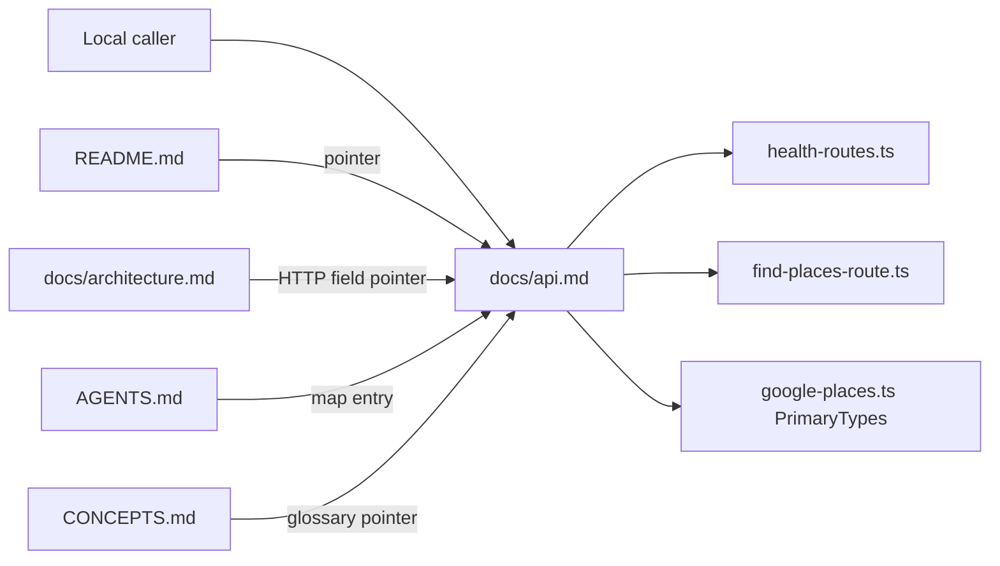

# Document live HTTP API as OpenAPI-style markdown

## Goal Capsule

**Objective:** Add a living markdown API reference that documents `GET /health` and `POST /find-places` the way an OpenAPI description would — paths, request fields, response fields, status codes, and examples — sourced from the live inbound adapters.

**Product authority:** This plan's Product Contract. After the pass, `docs/api.md` is the field-level HTTP contract. Living docs plus composition remain the layout recipe. Code plus package scripts win if the process and the new file disagree.

**Open blockers:** None.

**Execution profile:** Docs-only. `execution: code` means `ce-work` may edit files in this repo. It does not authorize adapter, domain, or test changes. Prove with a cold read of `docs/api.md` against the live routes. Run existing `npm run typecheck` and `npm test`; do not add, expand, or rewrite tests.

**Stop if:** Scope expands into OpenAPI YAML, Swagger UI, a served spec route, mapping domain errors in `find-places-route.ts`, changing the health probe, or rewriting snapshot plans under `docs/plans/` / `docs/solutions/`.

**Product Contract preservation:** Product Contract created in this bootstrap (no upstream brainstorm).

---

## Product Contract

### Summary

Give local callers a single OpenAPI-shaped markdown reference for the two public operations, using the live request and response bodies. Keep README as how-to-run. Keep architecture as layers and outbound adapters. Do not treat intended 502/500 JSON or health `checks` as the documented contract.

### Problem Frame

README and `docs/architecture.md` describe HTTP with a method/path/role table and thin examples. They omit field types, XOR rules, `primaryTypes` keys, `total`, and the 400 Zod envelope. They also describe an intended health `checks` object and find-places 502/500 JSON that the live routes do not return. Callers cannot reconstruct a request or response from living docs without reading the adapters.

### Key Decisions

- **Markdown OpenAPI-style reference, not a spec file** — (session-settled: user-directed — chosen over committed OpenAPI YAML/JSON and over both artifacts: static markdown is the living HTTP catalog) Governs R1, R8.
- **Static docs only** — (session-settled: user-directed — chosen over a served spec or Swagger UI: no new routes) Governs R9.
- **Live adapters are the HTTP source of truth** — (session-settled: user-directed — chosen over intended product-only and over dual specified-plus-live blocks on each operation: document what the process returns today) Governs R2, R3, R4, R5, R6, R10.
- **One field-level owner** — new `docs/api.md`; other living docs link instead of restating schemas. Governs R7.

### Actors

- A1. Local caller (curl or HTTP client) building a request and reading a response.
- A2. Future agent updating living docs after a route change.

### Requirements

- R1. A living markdown file documents the public HTTP surface in OpenAPI-like sections: info/servers, paths with operations, request bodies, responses by status, shared schemas, and JSON examples.
- R2. `GET /health` is documented from `src/health/adapters/health-routes.ts`: **200** `{ "status": "ok" }` and **503** `{ "status": "unhealthy" }`. No `checks` object.
- R3. Health semantics in this file match the live probe (`HEAD https://www.google.com`). The reference must not claim Place Details, Google Places auth, or that a healthy response means find-places will succeed.
- R4. `POST /find-places` request fields come from the live Zod schema: required `radiusMeters` (finite, positive, max 50000); exclusive location modes (non-empty trimmed `address` with lat/lng absent, or both `latitude` and `longitude` with address empty/absent); optional `primaryTypes` as catalog keys from `PrimaryTypes`.
- R5. Successful find-places **200** is `{ "places": [...], "total": number }` with place fields `id` (required) and optional `name`, `address`, `phone`, `types`, `primaryType`. No `website` / `websiteUri` on the public body. Omitted Google fields are omitted in JSON.
- R6. Documented JSON error for find-places is only the Zod **400** `{ "error": <Zod issue array> }`. After a valid body, adapter catch throws are **out of contract** (Express default), not architecture's 502/500 opaque JSON.
- R7. README keeps a short how-to-run pointer into the API reference. Architecture's HTTP surface is method/path/role plus a link — not a second field catalog. AGENTS.md lists the API reference as the HTTP field catalog and says to restate it when inbound HTTP fields change. CONCEPTS.md stays a glossary and points at `docs/api.md` for live JSON.
- R8. The markdown mirrors OpenAPI 3.1 *shape* (paths, requestBody, responses, components/schemas). It is not a valid OpenAPI document and is not consumed by codegen.
- R9. No new HTTP routes, no OpenAPI YAML/JSON file, no Swagger UI, no new dependencies.
- R10. A short drift note in `docs/api.md` only (not per-operation dual schemas) names the split: this file is live JSON; AGENTS recipe and CONCEPTS Health/Upstream are product intent, not the live wire.
- R11. Docs-only: no production code behavior changes and no new tests.

### Key Flows

- F1. A1 reads servers + `GET /health`, sends the request, matches 200/503 `{ status }`.
- F2. A1 sends coordinates mode `POST /find-places` and matches 200 `places` + `total`.
- F3. A1 sends address mode `POST /find-places` (address + `radiusMeters` only).
- F4. A1 sends an invalid body and matches 400 `{ error: issues }`.
- F5. A2 updates a route later and knows to change `docs/api.md` first, then pointers.

### Acceptance Examples

- AE1. Covers R2, R3, F1. Given the reference, when A1 looks up health, then the documented bodies are `{ "status": "ok" }` / `{ "status": "unhealthy" }` with 200/503, and the probe is described as HEAD to google.com, not Places.
- AE2. Covers R4, R5, F2. Given a valid geo body, when A1 follows the reference, then required `radiusMeters`, lat/lng ranges, optional `primaryTypes` keys, and 200 `{ places, total }` match the live mapper.
- AE3. Covers R4, F3. Given address mode, when A1 follows the reference, then mixed address+coordinates and missing origin are 400, not empty 200.
- AE4. Covers R6, F4. Given a Zod failure, when A1 follows the reference, then the body is `{ "error": issue array }`, not a string and not 502 JSON.
- AE5. Covers R7, R10. Given README and architecture after the pass, when A1 wants field types, then they land on `docs/api.md` rather than a duplicated contradicting table.

### Scope Boundaries

**In scope**

- Field-level living markdown for the two public operations.
- Pointers from README, architecture HTTP surface, and AGENTS.md.
- Shared schema tables (request, nearby place, health status, Zod 400 envelope).
- Out-of-contract notes: 32kb JSON limit, no auth, unknown paths, Express default errors, extra JSON keys stripped, website filter not applied, `HOST` bind not implemented.

**Out of scope**

- OpenAPI YAML/JSON, Swagger UI, codegen, Postman collections.
- Mapping find-places domain errors to 400/502/500 in code.
- Changing health to Place Details or adding `checks.googlePlaces`.
- Re-enabling the no-website filter.
- Enumerating Google leaf types each primary-type key expands to (outbound catalog, not the HTTP request schema).
- Snapshot rewrites under `docs/plans/` and `docs/solutions/`.
- Auth, CORS, pagination, public exposure.

### Deferred to Follow-Up Work

- When the route catch maps domain errors, restated `docs/api.md` responses for geocode-invalid 400 and upstream 502/500.
- When health becomes a Places connectivity/auth check, restated health operation and `checks` schema.

---

## Planning Contract

### Key Technical Decisions

- KTD1. **New file `docs/api.md` is the field-level owner** — Living-docs split already assigns README to run instructions and architecture to layers/HTTP role. A fifth living doc is correct only if architecture's HTTP table stops duplicating bodies. Governs R1, R7.
- KTD2. **Section map follows OpenAPI 3.1 objects in markdown** — Title/info, servers, paths (one H2 per path, operation method, requestBody field table, responses by status with examples), then components/schemas. Not YAML. Source: OpenAPI 3.1 Paths / Request Body / Responses / Components. Governs R8.
- KTD3. **Quote live adapters, not architecture JSON** — Health from `health-routes.ts`. Find-places from `findPlacesRequestSchema` and `mapFindPlacesResponse`. Catalog keys from `src/places/domain/google-places.ts` `PrimaryTypes` (not the stale `google.ts` path in a snapshot). Governs R2–R6.
- KTD4. **AGENTS 400/502/500 recipe stays an implementation recipe** — It tells agents how to map domain errors when writing adapters. It is not the live catalog. Do not rewrite it to match placeholder throws. Governs R7, R11.
- KTD5. **Primary type keys only** — Request schema lists the 20 catalog keys. Do not paste Google `includedPrimaryTypes` leaf lists into the API reference. Governs R4.
- KTD6. **One drift subsection in `docs/api.md` only** — After servers/info, name the split: product docs (CONCEPTS Health/Upstream, AGENTS recipe) describe intended Places health and mapped errors; this file is what the process returns today. Per-operation pages stay live-only. After U2, architecture must not keep a second field-level error or `checks` table. Governs R10.
- KTD7. **Three HTTP voices after this pass** — Live fields/status JSON: `docs/api.md`. Adapter error-mapping when writing code: AGENTS numbered recipe (KTD4). Product meaning of Health / Upstream / Nearby place: CONCEPTS and architecture **role**. The living-docs snapshot “do not document HEAD google.com” still applies to README identity, CONCEPTS, AGENTS Boundaries, and architecture role; it does not apply to `docs/api.md`. Governs R7, R10.

### Assumptions

- Extra JSON properties on find-places are stripped by Zod, not rejected.
- Geocode uses the first Google result; uniqueness is not an HTTP 400 today.
- Express 404/413/JSON parse failures are mentioned as out of contract without snapshotting Express HTML.
- README retains `npm run dev` and env copy; the API file's servers row uses default port 3000 and does not promise `HOST=127.0.0.1`.

### High-Level Technical Design

Living-doc ownership after this pass:



Markdown operation shape (directional, not a YAML spec):

```text
info / servers
drift (intended living docs vs live)
paths:
  GET /health
    responses 200, 503
  POST /find-places
    requestBody fields + XOR
    responses 200, 400
    out-of-contract after valid body
components:
  HealthStatus, FindPlacesRequest, NearbyPlace, ZodErrorBody
```

### Sequencing

U1 (create `docs/api.md`) then U2 (relink living docs so they do not contradict U1).

### System-Wide Impact

Future agents follow AGENTS.md, then architecture, then CONCEPTS. After this pass they will still see the 400/502/500 recipe, product Health (Places connectivity/auth), and a snapshot that forbids documenting HEAD google.com. Without KTD7 labels they will “correct” `docs/api.md` back to `checks` / 502 JSON. Callers who only read architecture will miss the field catalog if HTTP JSON tables remain.

### Risks and Dependencies

| Risk | Mitigation |
|------|------------|
| Next health or error-mapping change leaves `docs/api.md` stale | U2 Always line: restated `docs/api.md` in the same change as inbound HTTP field/status/body edits; Deferred lists the three triggers |
| Agents follow the hexagonal living-docs snapshot and strip HEAD from `docs/api.md` | KTD7 carve-out; labeled live catalog; do not rewrite that snapshot in this pass |
| Dual HTTP catalog | U2 removes architecture/README field JSON (KTD6) |
| CONCEPTS Health vs live JSON | Glossary pointer only; do not paste schemas into CONCEPTS |
| Recipe 502 vs live Express default | KTD4 + KTD7 labels; never rewrite the recipe to placeholder throws or `docs/api.md` to intended 502 |

### Sources and Research

- Live routes: `src/health/adapters/health-routes.ts`, `src/health/adapters/google-health.ts`, `src/places/adapters/find-places-route.ts`, `src/places/domain/google-places.ts`, `src/composition/build-app.ts` (`express.json` 32kb).
- Living split: `docs/plans/2026-08-12-003-docs-living-docs-hexagonal-plan.md`; `docs/solutions/documentation-gaps/living-docs-hexagonal-slices.md` (product health wording vs stub — this plan's R10 note, not dual schemas).
- Logger docs-only workflow: `docs/solutions/documentation-gaps/restate-logger-living-docs-when-code-diverges.md` (cold-read, do not expand tests).
- OpenAPI 3.1: https://spec.openapis.org/oas/v3.1 — paths, requestBody, responses, components/schemas.

---

## Implementation Units

### U1. Write the OpenAPI-style API reference

**Goal:** Create `docs/api.md` as the field-level live HTTP catalog.

**Requirements:** R1, R2, R3, R4, R5, R6, R8, R10

**Dependencies:** None

**Files:**

- create: `docs/api.md`

**Approach:**

1. Open with title, one-paragraph info, servers (`http://127.0.0.1:{PORT}`, default 3000), no-auth, `Content-Type: application/json` for POST, 32kb body limit.
2. Add the living-docs drift note (KTD6): product docs describe intended Places health and mapped errors; this file is what the process returns today.
3. Document `GET /health` from `health-routes.ts` / `google-health.ts`: 200/503 `{ status }`; probe HEAD google.com; healthy does not imply find-places.
4. Document `POST /find-places` from the Zod schema and mapper: field table (type, required, constraints), XOR rules and the three custom issue messages, `primaryTypes` enum of catalog keys, 200 example including `total`, 400 example as Zod issues.
5. State website exclusion is **not** applied (`filter` currently always includes).
6. State valid-body Google/geocode failures are Express default, not a JSON schema.
7. Add components tables for HealthStatus, FindPlacesRequest, NearbyPlace, ZodErrorBody.
8. Use CONCEPTS names (Request address vs Nearby place `address`; Primary type vs response `primaryType`).

**Patterns to follow:** Architecture tables for fields/status; README JSON fences for examples; living-docs R5 (this file owns fields). OpenAPI 3.1 object names as headings, not YAML.

**Execution note:** Cold-read the new file against the three source files above. Do not invent 502 JSON or `checks.googlePlaces`.

**Test scenarios:** Test expectation: none — docs-only, no behavioral code.

**Verification:** Every status and field in `docs/api.md` greps to a live adapter or `PrimaryTypes`. No documented 502/500 JSON body. No health `checks` schema.

---

### U2. Point living docs at the API reference

**Goal:** Make README, architecture, AGENTS.md, and CONCEPTS.md send callers to `docs/api.md` for live fields without a second JSON catalog.

**Requirements:** R7, R9, R10, R11

**Dependencies:** U1

**Files:**

- modify: `README.md`
- modify: `docs/architecture.md`
- modify: `AGENTS.md`
- modify: `CONCEPTS.md`

**Approach:**

1. README Docs list: add the API reference. Replace the two inline endpoint bullets with one-line method/path plus a link to `docs/api.md` (keep `.env` / `npm run dev` here). Do not rewrite README identity to HEAD google.com.
2. Architecture HTTP surface: keep two role rows (Health = Places connectivity/auth **product**; find-places = nearby search + XOR). Remove JSON blobs and the 400/502/500 **body** table. Link `docs/api.md`. Mark outbound Place Details / probe notes as intended product if they stay. Cite KTD6, KTD7.
3. AGENTS.md: map entry for `docs/api.md` as HTTP field catalog. Always: when inbound HTTP fields, status codes, or JSON bodies change, restated `docs/api.md` in the same change. Boundaries: code wins for behavior; `docs/api.md` wins for HTTP fields; this recipe wins for adapter error-mapping; architecture wins for layers/outbound role. Do not rewrite recipe step 3 or the Health Boundaries sentence to HEAD google.com. Cite KTD4, KTD7.
4. CONCEPTS Health (and optionally Upstream unavailability): one glossary line that live HTTP JSON is `docs/api.md`. Do not paste schemas. Do not edit snapshot solutions.

**Patterns to follow:** `docs/plans/2026-08-12-003-docs-living-docs-hexagonal-plan.md` (each living doc states only what it owns). Logger restatement: docs-only, no test expansion.

**Execution note:** After edit, architecture/README must not remain a field catalog. AGENTS Boundaries and CONCEPTS Health must still say Places connectivity/auth as product.

**Test scenarios:** Test expectation: none — docs-only, no behavioral code.

**Verification:** README, architecture, AGENTS.md, and CONCEPTS.md link to `docs/api.md`. Architecture HTTP section has no live-looking `"checks"` or `"places search unavailable"` bodies. AGENTS recipe 400/502/500 unchanged. `npm run typecheck` and `npm test` still pass on the unchanged code.

---

## Verification Contract

This pass does not add tests. Completeness is a cold read plus existing gates.

| Gate | What it proves |
|------|----------------|
| Cold read `docs/api.md` vs `health-routes.ts`, `google-health.ts`, `find-places-route.ts`, `PrimaryTypes` | Live contract, not intended architecture JSON |
| Grep living docs for leftover `checks.googlePlaces` as if live, and README find-places body missing `total` | U2 did not leave a second field catalog |
| `npm run typecheck` | Unchanged TypeScript still typechecks |
| `npm test` | Existing suite unchanged; do not add tests to make this gate exist |

---

## Definition of Done

- `docs/api.md` exists and an implementer can construct both location modes and parse 200/400/health without opening route source.
- Living pointers are in place; architecture is not a competing field catalog.
- No OpenAPI YAML, no new routes, no `src/` behavior diffs, no new test files.
- Abandoned draft spec fragments (YAML fences pretending to be the spec) are not left in the tree.
- Existing typecheck and tests still pass.

### Per-unit done

- U1: Field tables, XOR, catalog keys, examples, drift note, out-of-contract failures.
- U2: README, architecture, AGENTS.md, and CONCEPTS.md point at U1. Architecture is not a competing field catalog. AGENTS recipe and product Health wording remain.
